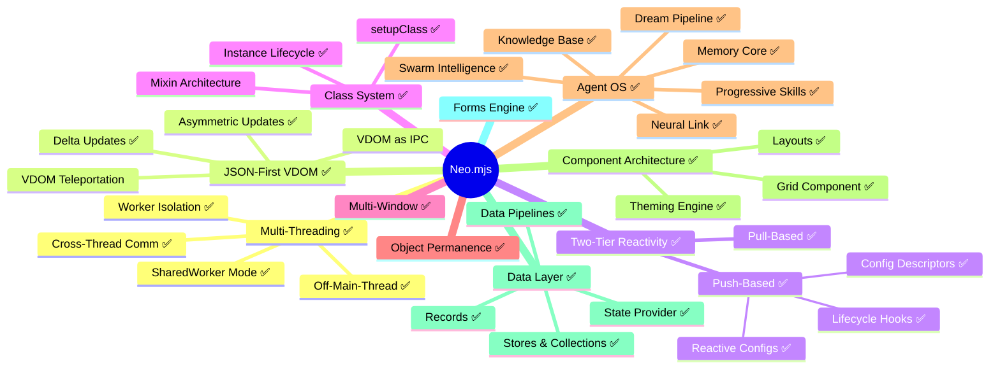
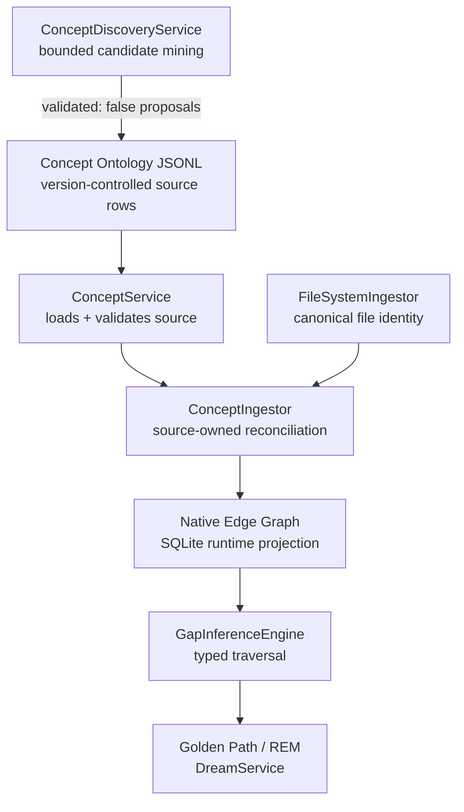

# The Concept Ontology

The Concept Ontology is a version-controlled graph that provides the **semantic stratum**
between source code and learning content. It is the foundation for the Dream Pipeline's
deterministic documentation gap detection.

## The Problem It Solves

The GapInferenceEngine (Phase 4 of the Dream Pipeline) needs to detect which parts of
Neo.mjs lack adequate documentation. The original approach used regex-based token
matching against file paths:

```javascript
// OLD: Fragile regex token matching
const hasGuide = guideFilePaths.some(p => nodeTokens.some(term => regex.test(p)));
```

This fails structurally — `"Reactivity.md"` never token-matches `"Neo.button.Base"`.
The Concept Ontology solves this by introducing **CONCEPT** nodes as first-class entities
that bridge the gap between implementation files and learning guides:

```javascript
// NEW: Graph traversal
const explanations = conceptService.getEdges(conceptId, 'EXPLAINED_BY');
const hasGuide = explanations.length > 0;
```

A concept has a `GUIDE_GAP` if it has zero `EXPLAINED_BY` edges. This is **deterministic**,
**semantically correct**, and requires no embedding comparison.

## What Is a Concept?

A concept is an **abstract architectural idea** that:

1. Has a name and a hierarchical position in the knowledge tree
2. Can be *implemented by* one or more source files
3. Can be *explained by* one or more learning guides
4. Has a tier reflecting its importance to the platform's identity
5. Is connected to other concepts via typed relationships

### Concepts vs. Classes

| | Class | Concept |
|---|---|---|
| **Identity** | `Neo.core.Base` | "Instance Lifecycle" |
| **Nature** | Implementation artifact | Architectural idea |
| **Guides map to** | ❌ Not directly (many-to-many) | ✅ Directly (1-to-many) |
| **Source files map to** | ✅ 1-to-1 | ✅ 1-to-many |

**Every class doesn't deserve a guide, but every concept deserves at least one.** The
concept layer is the intermediary that makes gap detection semantically meaningful.

### The Teaching Test

A concept is included in the ontology only if it passes **all three** criteria:

1. **A developer needs to understand it** to use Neo.mjs productively
2. **It cannot be learned** by simply reading one API doc page
3. **It answers "how" or "why" questions**, not just "what" questions

| ✅ Passes | ❌ Fails |
|----------|---------|
| "Two-Tier Reactivity" (architectural model) | `Neo.util.Array` (utility, API-doc-sufficient) |
| "Off-Main-Thread Execution" (mental model shift) | "Portal App About Us View" (app-specific) |
| "Config Descriptors & Merge Strategies" (complex system) | `afterSetWidth` (lifecycle hook instance) |

## Storage Format

The concept graph is stored as JSONL files at `.neo-ai-data/concepts/`:

```
.neo-ai-data/concepts/
├── nodes.jsonl     # One concept node per line
└── edges.jsonl     # One relationship edge per line
```

### Why JSONL, Not JSON or SQLite

- **Git-friendly**: Each line is an independent record. Adding a concept = adding a line.
  No structural merge conflicts.
- **PR-reviewable**: `git diff` shows exactly which concepts were added/modified/removed.
- **Streaming**: Can be processed line-by-line without loading the entire graph into memory.
- **Source-owned**: JSONL is the PR-reviewable declaration; `ConceptIngestor` projects it into
  the Native Edge Graph (SQLite). Source and projection are separate representations, not two
  independently maintained ontologies.

### Source Membership vs. Runtime Salience

The JSONL files own the version-controlled **membership** contract: which concept rows and typed
relationships are declared. SQLite owns the live edge instances that graph traversal consumes.
`ConceptIngestor.syncConceptsToGraph()` reconciles those layers on every run:

- A matching live tuple keeps its edge ID and its current, possibly decayed, `weight`.
- A declared tuple that decay/pruning or another mutation removed is re-derived.
- A row removed from JSONL removes only the live tuple carrying
  `projectionSource: "concept-ontology-jsonl"`; same-type edges from other producers survive.
- Node payload hashes optimize CONCEPT-node upserts only. They never suppress relationship
  reconciliation.

Every projected ontology edge carries four independent axes — `authority`, `fidelity`,
`extractionProvenance`, and `lifecycle` — rather than one composite confidence score. The
current curated values are repo-trusted authority, curated/non-degraded fidelity, JSONL
extraction provenance, and promoted lifecycle state.

This does **not** make concept edge types globally protected. `GraphService` may still decay
their salience and prune weak live instances. Reconciliation restores still-declared membership
without reinforcing surviving edges or resetting their weight.

## Node Schema

Each line in `nodes.jsonl` is a JSON object:

| Field | Type | Required | Description |
|-------|------|----------|-------------|
| `id` | string | ✅ | Kebab-case unique identifier (e.g., `"multi-threading"`) |
| `name` | string | ✅ | Human-readable display name |
| `tier` | number | ✅ | Importance tier (see Tiering System below) |
| `description` | string | ✅ | One-paragraph explanation of the concept |
| `uniqueToNeo` | boolean | ✅ | `true` if architecturally unique to Neo.mjs |
| `tags` | string[] | ✅ | Categorization tags for search and filtering |
| `aliases` | string[] | ❌ | Alternative terms that refer to the exact same concept (O(1) lookup) |
| `validated` | boolean | ❌ | `false` for an unreviewed discovery candidate; missing is treated as validated for legacy curated rows |
| `ontologyLayer` | string | ❌ | `code` (default) or `process-mx`; process/MX candidates do not claim source-code coverage |
| `codeGapEligible` | boolean | ❌ | Whether GUIDE / EXAMPLE / ORPHAN code-gap signals may be emitted; defaults to `true` |
| `source` / `reasoning` | string | ❌ | Discovery provenance and Teaching-Test rationale for mined candidates |
| `verifiedAt` | string \| null | ❌ | ISO date string for the last source-grounded verification, or `null` / missing when never explicitly verified |
| `extraction_metadata` | object \| null | ❌ | Present only on **LLM-mined candidate rows** (written by `ConceptDiscoveryService`): the extraction pass's objective self-report `{missing_fields, ambiguous_references, confidence_score}`, denormalized onto each candidate it produced. **JSONL-only** — not projected to graph node `properties` or the `ConceptIngestor` payload hash; legacy rows without it load unchanged. |

```jsonl
{"id":"off-main-thread","name":"Off-Main-Thread Execution","tier":1,"description":"Application business logic runs inside a dedicated App Worker.","uniqueToNeo":true,"tags":["architecture","workers"],"aliases":["off the main thread","OMT"],"verifiedAt":null}
{"id":"mined-example","name":"Mined Example","tier":3,"description":"An LLM-mined candidate awaiting curator review.","uniqueToNeo":false,"tags":["mined-candidate","process-mx"],"aliases":[],"validated":false,"ontologyLayer":"process-mx","codeGapEligible":false,"source":"message-concept-harvest","reasoning":"Passes the Teaching Test as a reusable process concept.","verifiedAt":null,"extraction_metadata":{"missing_fields":[],"ambiguous_references":["'the module' — three modules exist"],"confidence_score":0.7}}
```

> [!IMPORTANT]
> **Aliases are strict synonyms within Neo.mjs.** A term qualifies as an alias only if it
> refers to the exact same architectural concept. Cross-framework terms (e.g., "ViewModel"
> for State Provider, "JSX" for JSON VDOM) are **not** aliases — they belong in
> `ANALOGOUS_TO` edges.

> [!IMPORTANT]
> **Freshness metadata is non-destructive.** `verifiedAt` exists to build a review queue:
> concepts with `null`, missing, invalid, or older-than-90-day values emit a
> `CONCEPT_REVERIFY_DUE` handoff signal. This must not fade graph nodes, weaken edges,
> reduce concept weight, or auto-retire concepts. A stale verification date means "check
> this against current repo reality"; it is not evidence that the concept lost value.
> Existing committed ontology nodes start with explicit `verifiedAt: null` so the first
> source-grounding pass can be queried directly from the data file.

## Curated Tags, Historical Extraction, and Scheduled Discovery

Concept knowledge enters the graph through distinct trust paths. Do not collapse the broad
historical search population into the small, deliberate ontology.

| Path | Current trigger | Runtime / review signal |
|------|-----------------|-------------------------|
| **Manual message tag** | `addMessage({taggedConcepts: [...]})` with explicit IDs | Synchronous `TAGGED_CONCEPT` edge at weight `1.0` |
| **Version-controlled ontology** | `ConceptIngestor` reads `.neo-ai-data/concepts/*.jsonl` during REM | Source-owned projected edges plus `validated`, tier, and projection axes |
| **Scheduled candidate discovery** | The orchestrator runs `message-concept-harvest`; `ConceptDiscoveryService` reads a bounded batch of unharvested MESSAGE nodes, frequency-filters them, and sends one bounded Teaching-Test prompt. Its separate `runDiscoveryCycle()` mines epics and a capped recent-PR set on explicit invocation. | Candidate rows append to `nodes.jsonl` as `validated: false`, tier 3; they remain silent until curator promotion and enter SQLite only on a later ConceptIngestor sync |
| **Historical inline extraction** | Retired runtime path; `SemanticGraphExtractor.extractMessageConcepts()` remains only as a direct/test helper and has no production caller | Existing `auto_extracted: true` nodes and `TAGGED_CONCEPT` edges at weight `0.8` can remain as legacy provenance |

### Current Message-Discovery Path

1. `MailboxService.addMessage` persists the MESSAGE node and routing edges, then synchronously
   projects only explicit `taggedConcepts` at weight `1.0`. It performs no model call.
2. The orchestrator schedules `message-concept-harvest` as an exclusive heavy-maintenance task.
3. `ConceptDiscoveryService.runMessageConceptHarvest()` loads at most the configured batch,
   builds a cheap subject/tag frequency report, keeps only the configured top recurring terms,
   and makes one bounded Teaching-Test request.
4. Accepted proposals append to JSONL with `validated: false`; only successfully processed
   messages receive `conceptHarvested` markers. `ConceptIngestor` projects the candidates on a
   later run, while `GapInferenceEngine` suppresses unvalidated proposals.

### Read-Time Consumer Pattern

- Use `validated === false` as the current explicit exclusion for unreviewed discovery
  candidates. Legacy rows without the field are treated as validated for compatibility.
- Use the ontology edge's four axes and `projectionSource` to reason about curated membership;
  use its live `weight` only for salience.
- Treat `auto_extracted: true` and `TAGGED_CONCEPT` weight `0.8` as historical provenance for
  the retained inline-extraction population, not as evidence that MailboxService still performs
  per-message inference.

## Edge Schema

Each line in `edges.jsonl` is a JSON object:

| Field | Type | Required | Description |
|-------|------|----------|-------------|
| `source` | string | ✅ | Source node ID (concept or file reference) |
| `target` | string | ✅ | Target node ID (concept, file reference, or `ext:` external ID) |
| `type` | string | ✅ | Relationship type (see Edge Types below) |
| `note` | string | ❌ | Architectural distinction note (used with `ANALOGOUS_TO`) |

On projection, every valid row also receives runtime-only metadata:

| Property | Meaning |
|----------|---------|
| `projectionSource` | `concept-ontology-jsonl`, the ownership marker for tuple reconciliation |
| `axes.authority` | Repo-trusted curated authority |
| `axes.fidelity` | Curated source tier, not degraded |
| `axes.extractionProvenance` | Curated JSONL origin |
| `axes.lifecycle` | Promoted lifecycle state |

### Edge Types

| Type | Direction | Meaning |
|------|-----------|---------|
| `PARENT_CONCEPT` | parent → child | Hierarchical grouping |
| `IMPLEMENTED_BY` | concept → file | Source file that implements the concept |
| `EXPLAINED_BY` | concept → file | Guide/doc that explains the concept |
| `EXEMPLIFIED_BY` | concept → file | Example that demonstrates the concept |
| `REQUIRES` | concept → concept | Prerequisite (must understand A before B) |
| `ANALOGOUS_TO` | concept → ext:id | Cross-framework analogue (not equivalence) |

### File Reference Format

File targets use the `file:` prefix with a repository-relative path:

```jsonl
{"source":"push-reactivity","target":"file:src/Neo.mjs","type":"IMPLEMENTED_BY"}
{"source":"push-reactivity","target":"file:learn/guides/coreengine/ConfigSystem.md","type":"EXPLAINED_BY"}
```

`file:` is author-facing syntax only. During projection, `FileSystemIngestor` validates that
the path stays inside the repository, exists, is a regular non-ignored file, and resolves it to
the canonical runtime node ID `file-<path>`. Invalid rows do not become coverage evidence; the
source CONCEPT retains an exact-row projection-integrity finding for gap inference.

### External Reference Format

External (cross-framework) targets use the `ext:` prefix to prevent collision with
internal concept IDs:

```jsonl
{"source":"state-provider","target":"ext:react-context","type":"ANALOGOUS_TO","note":"Both provide hierarchical state, but Neo.mjs providers use bind:{} on reactive configs — no subtree re-rendering."}
```

> [!WARNING]
> `ANALOGOUS_TO` expresses architectural similarity, **not equivalence**. The `note`
> field must explain how the Neo.mjs concept differs from its cross-framework analogue.
> Never use this edge to suggest that concepts are interchangeable.

## Tiering System

| Tier | Weight | Description | Gap Severity |
|------|--------|-------------|-------------|
| 0 | — | System anchor (Neo.mjs itself) | N/A |
| 1 | ≥ 0.9 | Platform identity concepts | **CRITICAL** if undocumented |
| 2 | 0.5–0.8 | Major subsystem concepts | **HIGH** if undocumented |
| 3 | 0.1–0.4 | Implementation-level concepts | **MEDIUM** if undocumented |

## The Concept Hierarchy (Abbreviated)



✅ = has at least one `EXPLAINED_BY` edge. Missing ✅ = `GUIDE_GAP` candidate.

## Contributing a Concept

1. Add a single line to `nodes.jsonl` following the node schema
2. Add `PARENT_CONCEPT` edge(s) to `edges.jsonl` to place it in the hierarchy
3. Add `EXPLAINED_BY` edges for any existing guides that cover the concept
4. Add `IMPLEMENTED_BY` edges for source files that implement it
5. Verify the concept passes the Teaching Test

### JSONL Format Rules

- **One JSON object per line** — no multi-line JSON
- **No trailing commas** — strict JSON per line
- **Git-friendly** — each line is an independent record, minimizing merge conflicts
- **Append-only preferred** — add new lines rather than reordering existing ones

## Integration Architecture



## Related

- [The Dream Pipeline & Golden Path](../agentos/DreamPipeline.md)
- [The Knowledge Base Server](../agentos/KnowledgeBase.md)
- [The Memory Core Server](../agentos/MemoryCore.md)
