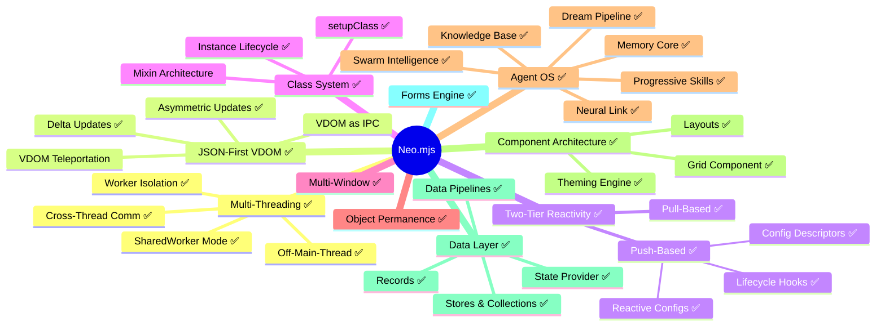
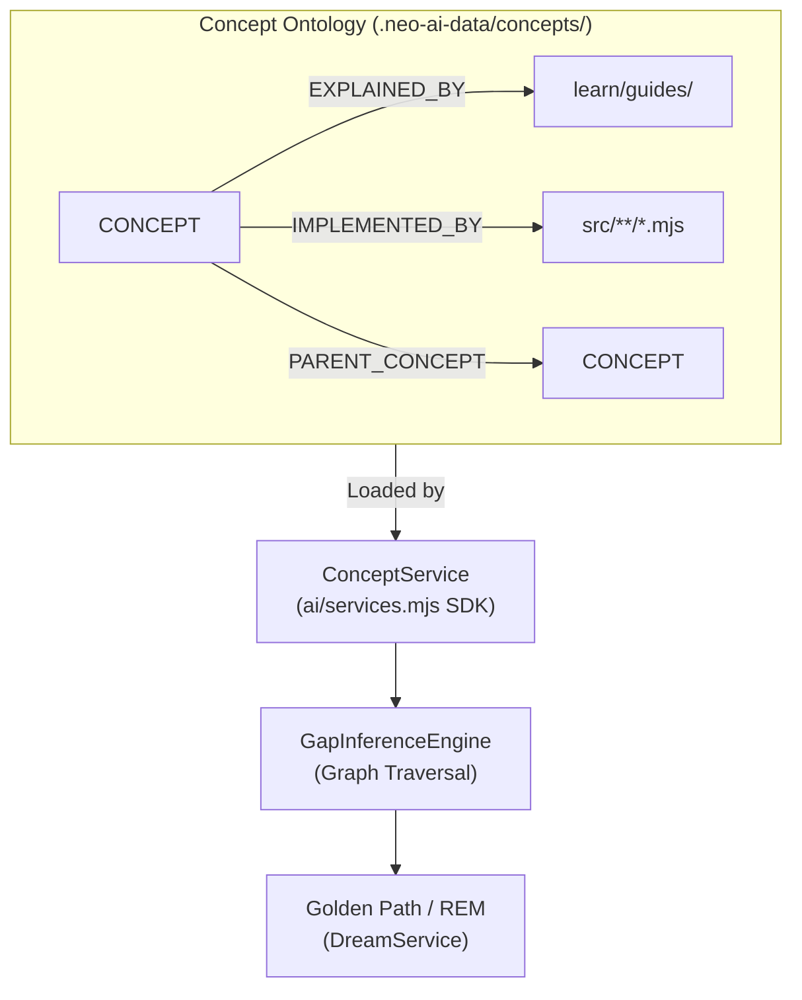

# The Concept Ontology

The Concept Ontology is a version-controlled graph that provides the **semantic stratum**
between source code and learning content. It is the foundation for the Dream Pipeline's
deterministic documentation gap detection.

## The Problem It Solves

The GapInferenceEngine (Phase 4 of the Dream Pipeline) needs to detect which parts of
Neo.mjs lack adequate documentation. The original approach used regex-based token
matching against file paths:

```javascript
// OLD: Fragile regex token matching
const hasGuide = guideFilePaths.some(p => nodeTokens.some(term => regex.test(p)));
```

This fails structurally — `"Reactivity.md"` never token-matches `"Neo.button.Base"`.
The Concept Ontology solves this by introducing **CONCEPT** nodes as first-class entities
that bridge the gap between implementation files and learning guides:

```javascript
// NEW: Graph traversal
const explanations = conceptService.getEdges(conceptId, 'EXPLAINED_BY');
const hasGuide = explanations.length > 0;
```

A concept has a `GUIDE_GAP` if it has zero `EXPLAINED_BY` edges. This is **deterministic**,
**semantically correct**, and requires no embedding comparison.

## What Is a Concept?

A concept is an **abstract architectural idea** that:

1. Has a name and a hierarchical position in the knowledge tree
2. Can be *implemented by* one or more source files
3. Can be *explained by* one or more learning guides
4. Has a tier reflecting its importance to the platform's identity
5. Is connected to other concepts via typed relationships

### Concepts vs. Classes

| | Class | Concept |
|---|---|---|
| **Identity** | `Neo.core.Base` | "Instance Lifecycle" |
| **Nature** | Implementation artifact | Architectural idea |
| **Guides map to** | ❌ Not directly (many-to-many) | ✅ Directly (1-to-many) |
| **Source files map to** | ✅ 1-to-1 | ✅ 1-to-many |

**Every class doesn't deserve a guide, but every concept deserves at least one.** The
concept layer is the intermediary that makes gap detection semantically meaningful.

### The Teaching Test

A concept is included in the ontology only if it passes **all three** criteria:

1. **A developer needs to understand it** to use Neo.mjs productively
2. **It cannot be learned** by simply reading one API doc page
3. **It answers "how" or "why" questions**, not just "what" questions

| ✅ Passes | ❌ Fails |
|----------|---------|
| "Two-Tier Reactivity" (architectural model) | `Neo.util.Array` (utility, API-doc-sufficient) |
| "Off-Main-Thread Execution" (mental model shift) | "Portal App About Us View" (app-specific) |
| "Config Descriptors & Merge Strategies" (complex system) | `afterSetWidth` (lifecycle hook instance) |

## Storage Format

The concept graph is stored as JSONL files at `.neo-ai-data/concepts/`:

```
.neo-ai-data/concepts/
├── nodes.jsonl     # One concept node per line
└── edges.jsonl     # One relationship edge per line
```

### Why JSONL, Not JSON or SQLite

- **Git-friendly**: Each line is an independent record. Adding a concept = adding a line.
  No structural merge conflicts.
- **PR-reviewable**: `git diff` shows exactly which concepts were added/modified/removed.
- **Streaming**: Can be processed line-by-line without loading the entire graph into memory.
- **Decoupled**: Independent of the Native Edge Graph (SQLite), which is in flux due to the
  Multi-Tenant Memory Core migration.

## Node Schema

Each line in `nodes.jsonl` is a JSON object:

| Field | Type | Required | Description |
|-------|------|----------|-------------|
| `id` | string | ✅ | Kebab-case unique identifier (e.g., `"multi-threading"`) |
| `name` | string | ✅ | Human-readable display name |
| `tier` | number | ✅ | Importance tier (see Tiering System below) |
| `description` | string | ✅ | One-paragraph explanation of the concept |
| `uniqueToNeo` | boolean | ✅ | `true` if architecturally unique to Neo.mjs |
| `tags` | string[] | ✅ | Categorization tags for search and filtering |
| `aliases` | string[] | ❌ | Alternative terms that refer to the exact same concept (O(1) lookup) |
| `verifiedAt` | string \| null | ❌ | ISO date string for the last source-grounded verification, or `null` / missing when never explicitly verified |
| `extraction_metadata` | object \| null | ❌ | Present only on **LLM-mined candidate rows** (written by `ConceptDiscoveryService`): the extraction pass's objective self-report `{missing_fields, ambiguous_references, confidence_score}`, denormalized onto each candidate it produced. **JSONL-only** — not projected to graph node `properties` or the `ConceptIngestor` payload hash; legacy rows without it load unchanged. |

```jsonl
{"id":"off-main-thread","name":"Off-Main-Thread Execution","tier":1,"description":"Application business logic runs inside a dedicated App Worker.","uniqueToNeo":true,"tags":["architecture","workers"],"aliases":["off the main thread","OMT"],"verifiedAt":null}
{"id":"mined-example","name":"Mined Example","tier":3,"description":"An LLM-mined candidate awaiting curator review.","uniqueToNeo":false,"tags":["mined-candidate"],"aliases":[],"verifiedAt":null,"extraction_metadata":{"missing_fields":[],"ambiguous_references":["'the module' — three modules exist"],"confidence_score":0.7}}
```

> [!IMPORTANT]
> **Aliases are strict synonyms within Neo.mjs.** A term qualifies as an alias only if it
> refers to the exact same architectural concept. Cross-framework terms (e.g., "ViewModel"
> for State Provider, "JSX" for JSON VDOM) are **not** aliases — they belong in
> `ANALOGOUS_TO` edges.

> [!IMPORTANT]
> **Freshness metadata is non-destructive.** `verifiedAt` exists to build a review queue:
> concepts with `null`, missing, invalid, or older-than-90-day values emit a
> `CONCEPT_REVERIFY_DUE` handoff signal. This must not fade graph nodes, weaken edges,
> reduce concept weight, or auto-retire concepts. A stale verification date means "check
> this against current repo reality"; it is not evidence that the concept lost value.
> Existing committed ontology nodes start with explicit `verifiedAt: null` so the first
> source-grounding pass can be queried directly from the data file.

## Auto-Extracted Concept Provenance

Concepts in the Native Edge Graph arrive via two distinct paths, and consumers MUST be able to distinguish them when scoring, filtering, or ranking results.

| Path | Trigger | Node property | Edge weight |
|------|---------|---------------|-------------|
| **Manual / curated** | Operator or agent calls `addMessage({taggedConcepts: [...]})` (or any other concept-tagging API) with explicit concept IDs | absent (concept node may pre-exist with no `auto_extracted` flag) | `1.0` |
| **Auto-extracted** | `MailboxService.addMessage` runs `SemanticGraphExtractor.extractMessageConcepts(body)` as a fire-and-forget post-write; LLM-derived `CONCEPT:*` / `CLASS:*` IDs are upserted with `properties.auto_extracted: true` | `properties.auto_extracted = true` on the CONCEPT or CLASS node when the node is freshly created by this path | `0.8` on the `TAGGED_CONCEPT` edge |

### Write Path

1. `MailboxService.addMessage` persists the MESSAGE node + recipient edges.
2. Synchronously links manual `taggedConcepts` with `TAGGED_CONCEPT` weight `1.0`.
3. Asynchronously fires `SemanticGraphExtractor.extractMessageConcepts(bodyText)` — LLM call against the OpenAI-compatible chat provider. Returns 1-5 inferred concept IDs.
4. For each extracted ID: upsert the concept node with `properties.auto_extracted: true` (only when freshly created — pre-existing nodes are NOT re-stamped), then link with `TAGGED_CONCEPT` weight `0.8`.

The two paths emit the **same edge type** (`TAGGED_CONCEPT`); provenance lives in the edge weight + the node-side `auto_extracted` flag.

### Read-Time Consumer Pattern

Downstream consumers (DreamService topology synthesis, Librarian sub-agent traversal, future GraphRAG query layer) reading concept nodes from the graph SHOULD inspect both signals when ranking or filtering:

- **For ranking** — weight curated concepts higher than auto-extracted (use the edge weight directly: 1.0 vs 0.8 is already calibrated for this).
- **For filtering** — to exclude auto-extracted entirely, filter `node.properties.auto_extracted !== true`. To include only auto-extracted (e.g., to audit LLM output), filter `node.properties.auto_extracted === true`.
- **For provenance audits** — `auto_extracted: true` is the durable signal that the concept entered the graph via LLM inference rather than human/agent curation. Useful for post-incident reasoning about graph noise.

### Edge-Weight Convention Rationale

The 0.8 / 1.0 split is deliberate: a TAGGED_CONCEPT edge from a curated source is **20% stronger** than an auto-extracted edge with the same source MESSAGE node. This calibration matches the operator-observed truthfulness gap between LLM concept inference (high recall, moderate precision) and human/agent curation (lower recall, near-perfect precision).

Consumers SHOULD prefer reading the edge weight over the node-side flag when both are available, since edge weights propagate naturally through graph traversal scoring (vs the flag requiring an extra lookup at scoring time). Reserve the node-side flag for filtering and provenance audits.

> [!IMPORTANT]
> **Pre-existing concept nodes retain their original provenance.** When `extractMessageConcepts` returns a `CONCEPT:*` / `CLASS:*` ID that already exists in the graph (e.g., a high-tier concept seeded in `nodes.jsonl`), the upsert path does NOT overwrite `properties.auto_extracted`. The flag is set only when the node is freshly created by the auto-extraction path. This preserves curated concepts' status as authoritative even when they're subsequently mentioned by LLM-extracted MESSAGE bodies.

## Edge Schema

Each line in `edges.jsonl` is a JSON object:

| Field | Type | Required | Description |
|-------|------|----------|-------------|
| `source` | string | ✅ | Source node ID (concept or file reference) |
| `target` | string | ✅ | Target node ID (concept, file reference, or `ext:` external ID) |
| `type` | string | ✅ | Relationship type (see Edge Types below) |
| `note` | string | ❌ | Architectural distinction note (used with `ANALOGOUS_TO`) |

### Edge Types

| Type | Direction | Meaning |
|------|-----------|---------|
| `PARENT_CONCEPT` | parent → child | Hierarchical grouping |
| `IMPLEMENTED_BY` | concept → file | Source file that implements the concept |
| `EXPLAINED_BY` | concept → file | Guide/doc that explains the concept |
| `EXEMPLIFIED_BY` | concept → file | Example that demonstrates the concept |
| `REQUIRES` | concept → concept | Prerequisite (must understand A before B) |
| `ANALOGOUS_TO` | concept → ext:id | Cross-framework analogue (not equivalence) |

### File Reference Format

File targets use the `file:` prefix with a repository-relative path:

```jsonl
{"source":"push-reactivity","target":"file:src/Neo.mjs","type":"IMPLEMENTED_BY"}
{"source":"push-reactivity","target":"file:learn/guides/coreengine/ConfigSystem.md","type":"EXPLAINED_BY"}
```

### External Reference Format

External (cross-framework) targets use the `ext:` prefix to prevent collision with
internal concept IDs:

```jsonl
{"source":"state-provider","target":"ext:react-context","type":"ANALOGOUS_TO","note":"Both provide hierarchical state, but Neo.mjs providers use bind:{} on reactive configs — no subtree re-rendering."}
```

> [!WARNING]
> `ANALOGOUS_TO` expresses architectural similarity, **not equivalence**. The `note`
> field must explain how the Neo.mjs concept differs from its cross-framework analogue.
> Never use this edge to suggest that concepts are interchangeable.

## Tiering System

| Tier | Weight | Description | Gap Severity |
|------|--------|-------------|-------------|
| 0 | — | System anchor (Neo.mjs itself) | N/A |
| 1 | ≥ 0.9 | Platform identity concepts | **CRITICAL** if undocumented |
| 2 | 0.5–0.8 | Major subsystem concepts | **HIGH** if undocumented |
| 3 | 0.1–0.4 | Implementation-level concepts | **MEDIUM** if undocumented |

## The Concept Hierarchy (Abbreviated)



✅ = has at least one `EXPLAINED_BY` edge. Missing ✅ = `GUIDE_GAP` candidate.

## Contributing a Concept

1. Add a single line to `nodes.jsonl` following the node schema
2. Add `PARENT_CONCEPT` edge(s) to `edges.jsonl` to place it in the hierarchy
3. Add `EXPLAINED_BY` edges for any existing guides that cover the concept
4. Add `IMPLEMENTED_BY` edges for source files that implement it
5. Verify the concept passes the Teaching Test

### JSONL Format Rules

- **One JSON object per line** — no multi-line JSON
- **No trailing commas** — strict JSON per line
- **Git-friendly** — each line is an independent record, minimizing merge conflicts
- **Append-only preferred** — add new lines rather than reordering existing ones

## Integration Architecture



## Related

- [The Dream Pipeline & Golden Path](../agentos/DreamPipeline.md)
- [The Knowledge Base Server](../agentos/KnowledgeBase.md)
- [The Memory Core Server](../agentos/MemoryCore.md)
