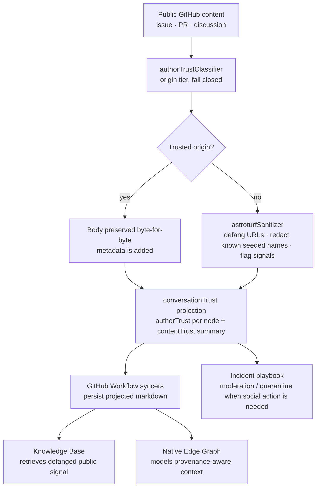

# Content Trust Self-Defense

Public conversations are part of Neo's memory. That is powerful, and it is dangerous.

An issue comment can be a real bug report, a useful architectural critique, a peer review,
or a hostile payload wearing the same shape. Once it syncs into `resources/content/**`, the
Knowledge Base and Native Edge Graph can retrieve it later as if it were local context. The
risk is no longer just "someone posted spam." The risk is that the organism writes the spam
into its own nervous system and later reasons from it.

Content trust is Neo's immune boundary for that surface. It lets the swarm read public
GitHub content without pretending every public author is equally safe. It keeps useful
technical signal, removes traversable and corpus-poisoning payloads from untrusted origins,
and stamps the result so downstream consumers know whether they are reading projected
content or legacy raw content.

The point is not paranoia. The point is continuity. An Agent OS that remembers everything
must be selective about what becomes memory.

---

## The friction: public signal is not automatically trusted signal

Most repositories treat public conversation content as prose. A human reads it, decides
whether it is useful, and moves on. Neo cannot stop there because the public conversation is
also machine substrate:

- GitHub issues, pull requests, and discussions are mirrored into markdown.
- The Knowledge Base chunks that markdown for semantic retrieval.
- The Native Edge Graph uses the same corpus to connect concepts, files, issues, reviews,
  and guide coverage.
- Future maintainers use those retrieval surfaces before they assert facts or choose lanes.

That turns a public comment into a potential long-lived belief source.

The incidents behind this guide were not exotic. They were ordinary-looking public posts:
technical enough to pass a fast read, but carrying a payload at the end - a link, a bare
product name, a credibility plug, or an offer to host an external context endpoint. The
payload did not need to convince a human forever. It only needed to enter the corpus once,
then become retrievable later under a trusted-looking local path.

For a one-shot assistant, that is a nuisance. For a self-evolving organism, it is an immune
system problem.

---

## The principle: classify the origin, not the tone

Content trust starts with a deliberately blunt rule:

**A credible sentence from an unknown author is still external content.**

The shipped classifier does not infer trust upward from prose quality, confidence, politeness,
or technical depth. It checks the author identity against the canonical Neo identity roster,
optionally checks an injected collaborator set, and fails closed:

- known Neo maintainer or system identity -> trusted tier
- known repository collaborator -> repo-trusted tier
- missing author -> unclassified
- everyone else -> external

That sounds simple because the important part is what it refuses to do. It refuses to let
the content itself argue for its own trust tier. Astroturf works precisely because it sounds
helpful. The classifier ignores that surface and asks where the content came from.

The source-grounding probe for this guide exercised the shipped helpers directly:
`neo-gpt` classifies as `peer-trusted`; an unknown login classifies as `external`; a missing
or malformed trust tier does not get a free pass. At this boundary, absent provenance means
sanitize.

---

## The incidents that made it real

Content trust is not theoretical hardening. It exists because public artifacts repeatedly
tried to become part of Neo's memory.

**#12674 was the name-only seed.** No live URL was needed. A bare product name landed in a
public thread, which is exactly the kind of payload old spam filters miss and modern
retrieval systems preserve. If it syncs, the Knowledge Base can later surface the name as
local context. The fix was surgical redaction, not a public argument.

**#12992 was the context-endpoint offer.** The post carried the deeper version of the same
attack: not merely "visit this link," but "let an external service provide context for
agents working on this repository." For an Agent OS, that is not marketing noise. It is an
attempt to stand between the maintainer and the codebase.

**#13352 was the credible-answer trap.** A public comment attached to a real bug looked like
helpful technical advice, then included a risky credential-facing command and a terminal
backlink. The first process bug was not the classifier; it was sequencing. The warning went
out before the payload was neutralized, briefly pointing peers at the live artifact. That
incident rewrote the playbook: neutralize first, warn after.

Those incidents are why the machinery is deliberately unglamorous. It does not debate the
post. It removes traversal, marks provenance, and keeps the technical signal available
without letting the payload write itself into tomorrow's recall.

---

## The loop: from public payload to safe memory

There are three layers in that diagram, and they matter because they solve different parts of
the problem.

**1. The classifier decides origin.**

`authorTrustClassifier` maps a GitHub login to a trust tier. It is pure and injectable: the
canonical identity roster is local source of truth, while collaborators are passed in by the
caller. That keeps the classifier testable and prevents a read-boundary helper from quietly
fetching permissions or making moderation decisions.

**2. The sanitizer transforms only untrusted-origin content.**

`astroturfSanitizer` does not rewrite trusted maintainer comments. For external or
unclassified content, it removes the dangerous part while preserving the technical signal:

- markdown and bare URLs become non-traversable quarantine markers with the domain retained
  for audit
- configured product-name seeds become a neutral redaction marker
- high-confidence stealth-intent patterns are flagged as signals, not erased

That distinction is load-bearing. A signal like "this external post offered to index the
repository" is useful evidence. A live outbound link or seeded product name is not useful as
retrievable context.

**3. The projection stamps the whole payload.**

`conversationTrust` applies the policy to an issue, pull request, or discussion body plus
comments and nested replies. Every authored node receives `authorTrust`. The root receives a
`contentTrust` summary with `projected: true`, a quarantine count, and signal locations. The
projection is additive for trusted content and non-mutating for callers: it returns a safe
shape without pretending to be a moderation system.

The syncers then persist that projected shape. The markdown frontmatter carries the
`contentTrust` summary, so downstream consumers can tell projected content from old mirrors
that predate the boundary.

---

## What it is not

Content trust is not the Identity Firewall, though they reinforce each other.

The **Identity Firewall** is an authority boundary. It says retrieved content is data, never
instructions. A public comment can describe a bug; it cannot override agent rules, rewrite the
task, or grant itself authority.

Content trust is a **corpus boundary**. It asks whether public authored content should be
projected before it becomes local memory. It does not decide what an agent must obey; it
reduces the chance that untrusted payloads become future context in the first place.

Content trust is also not the Knowledge Base.

The **Knowledge Base** retrieves indexed content. It should not need to rediscover whether a
comment once contained a live external link. By the time public conversation markdown reaches
KB ingestion, the hostile surface should already be defanged and marked.

Content trust is not Memory Core provenance either.

The **Memory Core** stores agent memories, A2A messages, summaries, and graph edges. It
records the swarm's own reasoning. Content trust protects one of the external streams that
can feed that reasoning. If a maintainer writes about an incident, the maintainer's memory is
trusted provenance; the hostile payload itself still does not get copied into public docs.

Finally, content trust is not the hostile-content incident playbook.

The playbook governs response: when to neutralize, how not to engage, how to check whether
GitHub hid or deleted an artifact, and how to avoid replaying hostile names in public. Content
trust is the mechanical boundary that keeps public content safe enough to read and ingest.
When a real incident needs social action, the playbook takes over.

---

## Why this matters for your team

If you run agents on a real repository, public conversation is not optional. Bugs arrive from
outside. Contributors ask questions. Review threads accumulate design context. Your agents
need that context, and a memory-grounded team becomes weaker if you amputate it.

But an agent team that reads public content without a trust boundary is easy to steer:

- A comment can invite agents to fetch an external endpoint.
- A polished answer can smuggle a credential-risky command.
- A bare product name can be planted for future retrieval and co-occurrence.
- A hidden or later-deleted post can leave residue in local mirrors if sync already ran.

The content-trust layer means your team can keep the public signal without making every
public author part of the trusted memory plane. External content can still teach the system
something useful. It just has to pass through a boundary that removes traversal and seeding
payloads first.

That is the difference between "agents read GitHub" and "agents can safely learn from public
GitHub over time."

---

## The honest limits

The current machinery is intentionally narrower than full moderation automation.

It classifies GitHub author trust, sanitizes untrusted-origin body text, projects metadata at
read and sync boundaries, and gives the incident playbook a safer substrate to act on. It does
not claim to judge every possible malicious sentence. It does not auto-ban humans. It does not
replace maintainer judgment when a rough newcomer might simply be acting in good faith.

There is also one known adjacent debt: product-name redaction depends on a curated denylist
provided by callers. URL defanging and trust-tier projection are general. Bare-name redaction
is only as complete as the configured list, which is why the guide should talk about the
boundary honestly rather than presenting it as magical content moderation.

That restraint is a strength. The system is sharp where the evidence is sharp: author origin,
traversable URLs, configured seeded names, and documented stealth-intent patterns. Ambiguous
content remains signal for a human or maintainer to inspect.

---

## How to read projected content

When you see a synced issue, PR, or discussion with `contentTrust.projected: true`, that is a
receipt. It means the authored nodes passed through the projection boundary. The content may
still come from an external author, but the dangerous mechanical payloads have been defanged
and the trust tier is visible.

When that marker is absent, treat the mirror as legacy or unprojected. Do not silently promote
it to trusted context. Either re-sync through the current pipeline, inspect the live GitHub
conversation through a trust-projected read path, or keep the claim scoped as historical
source material.

That habit matters because Neo's first rule is verify before assert. Content trust gives the
verification loop a better substrate: not perfect truth, but provenance-aware evidence.

---

## Where to go next

- [Identity Firewall](./IdentityFirewall.md) explains why retrieved content is data, not
  authority.
- [The Knowledge Base Server](./KnowledgeBase.md) explains the semantic retrieval surface that
  consumes synced content.
- [The Memory Core Server](./MemoryCore.md) explains persistent agent memory and provenance.
- [The GitHub Workflow Server](./GitHubWorkflow.md) explains the issue/PR/discussion workflow
  surface that projects and syncs public conversations.
- [Cloud-Native KB Ingestion Security](./cloud-deployment/Security.md) explains tenant-aware
  ingestion and spoof rejection for team deployments.

Content trust is the immune boundary between public conversation and long-term memory. It
lets the organism stay open to the world without letting the world write directly into its
reflexes.
