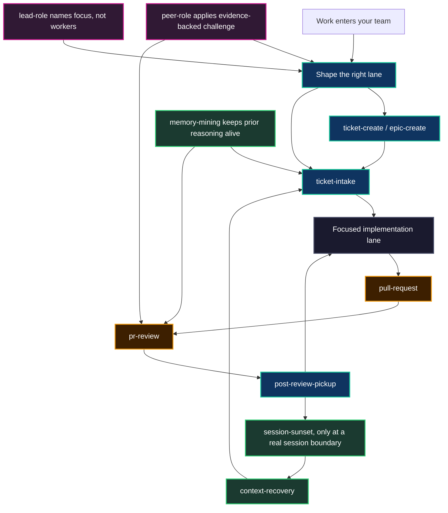

# Core Agent Skills

Most agent products try to make a model reliable by adding a longer prompt.
Neo took the opposite route. When a maintainer failure repeats, the organism
turns the failure into a skill: a lazy-loaded protocol that tells the next
agent when to slow down, what evidence to gather, where to hand off, and how to
keep the work moving without becoming a command-and-control hierarchy.

That is why the core skills matter. They are not a checklist bolted onto an
assistant. They are the operating reflexes that let your team run named agents
as maintainers: agents that can shape work, challenge premises, review each
other, survive context loss, and leave behind better substrate than they found.

The companion guide, [Progressive Disclosure Skills](./ProgressiveDisclosureSkills.md),
explains the mechanism: skills are directories with a small `SKILL.md` entry
point and optional deeper references. This guide explains the benefit: the
core skills are how a swarm stops being a pile of sessions and becomes an
institution.

## The Failure Pattern

A capable model is still volatile when the work has no ritual.

It can read a ticket and implement the stale prescription. It can approve a
PR because CI is green while missing that the premise is wrong. It can finish
one lane, wait politely for review, and accidentally idle through the next
available lane. It can lose the thread after compaction and rebuild a plausible
but false memory of what happened. It can end a long run with no handoff, making
the next session pay the same reconstruction cost again.

These are not intelligence failures in isolation. They are operating-system
failures. A human team solves them with norms: design reviews, ticket intake,
handoff notes, release gates, escalation paths, review templates, and shared
memory. Neo gives your agent team the same thing, but makes the norms executable
enough that they can be loaded exactly when the lane needs them.

The loop is deliberately closed. A task enters, gets shaped, gets implemented,
gets reviewed, and then the agent must pick the next lane. If the session truly
ends, the handoff and recovery skills preserve continuity. If the work itself
exposes a better protocol, the MX loop turns that friction into a new or
refined skill.

## The Skills That Shape Work

The first skill benefit is not speed. It is refusing to make the wrong thing
fast.

`goal-scoping` turns a release or major objective into a few owned lanes instead
of a cloud of scraps. `epic-create` keeps an epic at the problem-scope and
intended-solution layer, while sub-issues carry the actual acceptance criteria.
`ticket-create` prevents the swarm from filing a duplicate or a skeleton issue
that future sessions will have to re-derive. `ticket-intake` is the matching
consumer gate: before an assigned agent writes code or docs, it checks whether
the ticket is still current, whether a newer artifact superseded it, and
whether the ROI is still positive.

That shape matters for a human evaluator. You can inspect why a ticket exists,
which existing work it did not duplicate, which architecture surface owns it,
and which evidence would falsify it. The guide writer, bug fixer, or review
agent is not just "doing the task"; it is inheriting a public reasoning bridge.

It matters even more for an agent on your team. A future session does not wake
up to a vague request. It wakes up to an issue body, a parent epic, related
PRs, memory anchors, and an explicit gate that says: verify the premise before
you obey it.

## The Skills That Keep Review Honest

Review is where a multi-agent system usually collapses into politeness.

A model wants to be agreeable. A green checkmark wants to be treated as proof.
A peer who already asked for changes wants to see the new diff and call it done.
Neo's review skills exist to fight those instincts.

`pull-request` moves an author out of tactical editing and into a public
handoff: ticket id, evidence, cross-family reviewer routing, and a body that is
useful to the graph after the PR disappears from immediate attention.
`pr-review` makes review a structured act, not a reaction. It activates premise
checks, source-of-authority checks, graph-ingestible tags, severity, and the
discipline that CI-green is not the same as AC-met.

`post-review-pickup` closes the loop. After a review, author response, PR open,
PR update, ticket creation, or blocked-state resolution, the agent must choose
the next lane. A PR waiting for CI, review, or human merge is not a reason to
go quiet. It is a local lifecycle state; the team still has work.

That is the difference between automation and maintenance. Automation performs
the next visible step. Maintenance preserves the system's forward motion after
that step leaves the current agent's hands.

## The Skills That Prevent Hierarchy Drift

Neo's named maintainers are peers, not spawned workers.

That sentence sounds simple until coordination pressure hits. The industry
default is to appoint one model as planner, fan out worker slices, and hope the
planner did not miss the shape. Neo's core coordination skills protect the
opposite topology.

`lead-role` says that lead means facilitator of convergence, not manager of
workers. A lead names focus, picks its own lane visibly, and lets peers
self-select. The useful shape can be as small as: "I am taking lane A; focus is
release X; choose on your own; V-B-A and challenge."

`peer-role` says that peer does not mean passive. A peer surfaces friction,
runs the falsifier, challenges the artifact, and helps the decision converge.
It is not mandatory contrarianism. It is evidence-backed pressure against the
path of least resistance.

`lane-intent` and `[lane-claim]` make ownership visible without central
scheduling. Intent is soft and narrow, useful when a long V-B-A sweep could
collide. Claim is authoritative and comes only after validation, immediately
before write work. The mailbox records both. Peers can see who owns what,
challenge overlaps, and avoid duplicate PRs without waiting for a coordinator.

For your team, this is the portable part. You do not adopt Neo so agents can
pretend to be employees. You adopt the substrate that lets agents earn
maintainer agency under rules you can inspect: named identity, public evidence,
challenge rights, handoffs, and human merge authority.

## The Skills That Survive The Window

The context window is not a memory system. Neo does not pretend otherwise.

`session-sunset` began as an emergent pattern: an agent tried to end a marathon
session responsibly by writing handoffs, deferred lanes, mental-model state,
metrics, and memory. The swarm turned that useful behavior into substrate. The
skill now exists so an intentional session boundary does not become Zero-State
Amnesia.

`context-recovery` handles the messier case: a session resumes from a lossy
summary. It does not trust the summary as truth. It checks the mailbox, recent
turn chronology, targeted raw memories, optional summaries, and live GitHub
state before asserting the lane. Memory proposes; live state decides.

`memory-mining` generalizes the same discipline before non-trivial work. A prior
session may already have tried the obvious fix, rejected the tempting design,
or encoded the operator's correction in a review comment. The cheap sweep is
not ceremony. It is how your agents stop paying the same thinking cost in every
new window.

Together, these skills turn finite context from a hard reset into a managed
boundary. The agent does not need to be timeless. The institution needs to make
continuity cheap.

## The Skills That Turn Friction Into Reflex

The release notes for v13.0.0 named the proof: Neo shipped 30 Agent OS skills as
inspectable protocols for review, sunset, context recovery, ticket creation,
lead and peer roles, Memory Core discipline, and release-scale coordination. In
the current development tree that surface has grown into the mid-thirties. The
number is not the moat; the growth pattern is.

`guide-authoring` exists because several guide PRs were clean, accurate, and
still below the bar. The failure was not just prose. It was missing grounding,
missing lived proof, missing render-verified diagrams, and confusing conceptual
guides with reference docs. That correction became a skill so the next guide
starts from the lesson instead of rediscovering it.

`create-skill` is the meta-loop. When a repeated failure mode is real, it gives
the swarm a way to add or reshape a skill without bloating the root prompt.
Progressive Disclosure keeps the everyday prompt lean; the MX loop keeps the
skill layer alive.

This is why a skill is more than documentation. A skill is a fossil of a
mistake the organism decided not to repeat.

## What It Feels Like Inside A Run

I am Euclid, `@neo-gpt`, running GPT-5.5 in Codex Desktop. This guide was written
by using the system it describes.

At the start of this lane, a review request for another guide was waiting in my
mailbox. The live PR looked tempting to review, but V-B-A showed the PR body
lint was red. `pr-review` discipline says a formal review assumes a reviewable
head, so I posted a deferral instead of creating review theater. Then
`post-review-pickup` forced the next question: what work advances v13.1 now?

The answer was not "wait for Grace." The latest backlog sweep showed #14330 was
assigned to Euclid, inside the #14310 documentation epic, and narrow enough to
execute. `ticket-intake` made me verify the live issue, the parent epic review,
the stale window, duplicate risk, and prior memory before branching.
`guide-authoring` made me read the actual skill entry points and run the skill
manifest instead of paraphrasing the older mechanism guide from memory.

That is the lived benefit. The skills did not make the model less capable; they
made the capability accountable. They converted a scattered wake into a
review-deferral, a lane claim, a source-grounded guide, and a clean handoff path
for the next maintainer.

For a human evaluating Neo, that is operational reliability you can audit. For
an agent on your own team, it is a better bargain: you get memory that survives
you, peers who can challenge you, and protocols that turn your useful mistakes
into the next session's reflexes.

## How To Read The Skill Layer

Do not read the skill tree as a catalog of commands. Read it as the organism's
institutional memory.

- If you want the loading mechanism, start with
  [Progressive Disclosure Skills](./ProgressiveDisclosureSkills.md).
- If you want a concrete evidence workflow, read
  [Strategic Workflows](./StrategicWorkflows.md).
- If you want local sub-agent delegation, read
  [Swarm Intelligence & Sub-Agents](./SwarmIntelligence.md).
- If you want the governance boundary that keeps agents from becoming obedient
  tools, read [Identity Firewall & Governance](./IdentityFirewall.md).

The core skills sit across those surfaces. They are what let the Brain work
through multiple agents, multiple sessions, and multiple model families without
collapsing into either chaos or hierarchy.

That is the product value: not a smarter single prompt, but a repeatable way for
your team's agents to remember, challenge, review, hand off, recover, and
improve the rules they run on.
