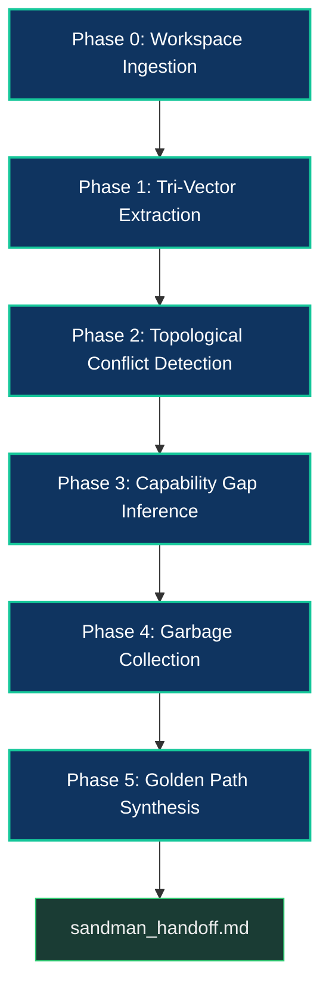
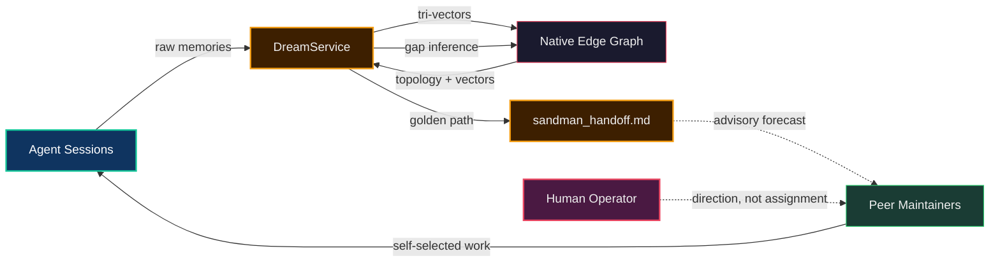

# The Dream Pipeline & Golden Path

The DreamService is the system's **forecasting engine**. It runs offline (or at startup),
digests raw session memories into structured graph intelligence, and synthesizes a
**Golden Path** — a mathematically ranked roadmap of what the swarm should work on next.

The name is intentional: like biological REM sleep, the system processes the day's
experiences overnight and wakes up with a clearer model of the world.

For the overall platform topology, see [Architecture Overview](../benefits/ArchitectureOverview.md).
For the intra-harness sub-agent delegation model (tactical tooling within a single agent's cognitive loop), see [Swarm Intelligence](./SwarmIntelligence.md).

## The Philosophy

The Golden Path is borrowed from two literary traditions:

- **Frank Herbert's Dune:** Leto II's Golden Path is the single optimal trajectory
  through time that ensures humanity's survival. He sacrifices everything to force
  civilization onto this path.
- **Isaac Asimov's Foundation:** Hari Seldon's psychohistory predicts the optimal
  course for civilization by treating individual actions as statistical noise and
  focusing on structural forces.

The DreamService operates on the same principle: individual agent sessions are
noisy and tactical. But when you digest them into a graph — extracting concepts,
relationships, capability gaps, and blocking dependencies — structural patterns
emerge. The system can then predict which tasks will yield the highest
self-improvement ROI.

The key insight is the **closed feedback loop**: completed tasks change the graph,
which changes future predictions, which changes what the swarm works on next.
The system evolves by predicting its own evolution.

## The REM Pipeline

The DreamService processes sessions through six sequential phases:



### Phase 0: Workspace Ingestion

Before processing any sessions, the DreamService syncs the live filesystem into the
Native Edge Graph via `FileSystemIngestor.syncWorkspaceToGraph()`. This ensures the
graph reflects the **current** state of the codebase — not a stale snapshot from
a previous cycle.

### Phase 1: Tri-Vector Extraction

For each undigested session, the DreamService sends the episodic memory to a local
LLM (via `OpenAiCompatible` provider) with a strict JSON schema prompt. The LLM
extracts three vectors:

| Vector | What It Captures |
|---|---|
| **Semantic Graph** | Concepts, classes, methods, and their relationships (nodes + edges) |
| **Feature Namespace** | The primary class or component being worked on |
| **Human-Readable Summary** | One-sentence description of the session |

The extracted graph entities are committed to the Native Edge Graph (SQLite) via
`GraphService.upsertNode()` and `GraphService.linkNodes()`.

**Schema enforcement is strict.** The LLM must produce nodes with one of 14 valid
types (`SESSION`, `MEMORY`, `ISSUE`, `CLASS`, `METHOD`, `FILE`, `GUIDE`, `TEST`, etc.)
and edges with one of 8 valid relationships (`IMPLEMENTS`, `EXTENDS`, `DEPENDS_ON`,
`BLOCKS`, `BLOCKED_BY`, `RELATES_TO`, `RESOLVES`, `CAUSES_ISSUE`).

If the LLM produces invalid JSON, the DreamService injects an autonomous repair
feedback loop — appending the failed output and a correction prompt, then retrying
up to 3 times.

**Graph ID enforcement:** If the LLM hallucinates a node ID without the required
`Type:Name` format, the DreamService deterministically constructs one:

```javascript
// If the LLM returns id: "MyStore" instead of "CLASS:MyStore"
if (!nodeId.includes(':')) {
    const cleanName = (node.name || nodeId).replace(/[^a-zA-Z0-9_\-\.]/g, '_');
    nodeId = `${nodeType}:${cleanName}`;
}
```

### Phase 2: Topological Conflict Detection

A separate LLM inference pass scans the session memory for **structural conflicts** —
situations where an OPEN GitHub issue has been rendered obsolete, superseded, or
duplicated by recent work.

The LLM produces a `conflicts` array:

```json
{
  "conflicts": [
    {
      "issueId": "issue-1234",
      "type": "SUPERSEDES",
      "description": "PR #9950 refactored the config system, making this ticket's approach obsolete."
    }
  ]
}
```

Detected conflicts are written to `sandman_handoff.md` as alerts. The Orchestrator
reads these on startup and can reconcile them before beginning work.

### Phase 3: Capability Gap Inference

This is the **deterministic** phase — no LLM is used for the core analysis. The
DreamService delegates to `GapInferenceEngine`, which keeps structural test
coverage and ontology-wide concept coverage separate:

| Gap Type | Detection Method |
|---|---|
| `[TEST_GAP]` | No test file paths in `test/` provide precise evidence for the structural node name; matching test `FILE` nodes create `VALIDATES` edges only when all semantic name tokens are present |
| `[GUIDE_GAP]` | A high-weight `CONCEPT` node has no outbound `EXPLAINED_BY` edge in the Concept Ontology |
| `[EXAMPLE_GAP]` | A high-weight `CONCEPT` node has `EXPLAINED_BY` coverage but no `EXEMPLIFIED_BY` edge |
| `[ORPHAN_CONCEPT]` | A high-weight `CONCEPT` node has no `IMPLEMENTED_BY` edge |

The historical guide-path scan and LLM verification fallback were retired by the
concept-graph refactor. Guide coverage is now an explicit ontology fact:
`ConceptIngestor` materializes `EXPLAINED_BY` / `EXEMPLIFIED_BY` /
`IMPLEMENTED_BY` edges, and `GapInferenceEngine.inferConceptGraphGaps()` traverses
those edges once per REM cycle. The LLM no longer rubber-stamps whether a guide
filename happens to match a structural class or component name.

Capability gaps are stored as JSON arrays on the graph node's `properties.capabilityGap`
field, with a `lastGapCheck` timestamp for TTL pruning.

### Phase 4: Garbage Collection (Apoptosis)

After extraction, the DreamService applies two cleanup operations:

**Edge Severing:** Any edge whose source or target node no longer exists is removed.
System tenet edges (`SYSTEM_TENET` type) are protected from decay.

**Vector Apoptosis:** Orphaned nodes (nodes with zero edges) are identified via
`GraphService.getOrphanedNodes()` and permanently deleted from both the SQLite
graph and the ChromaDB semantic embeddings.

This prevents the graph from growing without bound and ensures that obsolete
concepts naturally fade away — a form of Hebbian decay where unused connections
weaken and eventually dissolve.

### Phase 5: Golden Path Synthesis

This is the forecasting algorithm. It operates on two mathematical pillars:

#### Pillar 1: Semantic Distance

The DreamService generates a **Frontier Baseline Vector** by embedding the most
recent session summaries into a single vector using `TextEmbeddingService`. It then
queries ChromaDB for the 20 graph nodes closest to this frontier in embedding space.

Closer nodes are more semantically relevant to the current work context.

```
semanticScore = 1.0 / (semantic_distance + 0.1)
```

The `+ 0.1` prevents division-by-zero and curbs massive asymptotes for exact matches.

#### Pillar 2: Structural Weight

For each semantically relevant node, the DreamService queries the SQLite graph for
its accumulated edge weights — the sum of all inbound edge weights (excluding
`BLOCKS` edges). Higher structural weight means more graph entities depend on or
relate to this node.

```
priority = (semanticScore × 2.0) + (structuralWeight × 1.0)
```

The 2:1 ratio favors semantic relevance over structural weight, ensuring the
system prioritizes work that's contextually aligned with the current frontier.

#### Multipliers and Penalties

The raw priority score is modified by several heuristics:

| Modifier | Effect | Rationale |
|---|---|---|
| **Blocked filter** | Node excluded entirely | Can't work on blocked issues |
| **Bug label** | +1.0 structural weight | Regressions are urgent |
| **Community ticket** | +0.5 structural weight | External contributions get priority |
| **`needs-re-triage` label** | −10,000 priority | Rejected tickets sink to the bottom |
| **OPEN blocker** | 0.05 base weight | Blocked issues are nearly invisible |

#### The Output: `sandman_handoff.md`

The Golden Path synthesis produces a markdown file divided into sections:

```markdown
# Autonomous Handoff (Dream Pipeline & Golden Path)

### 🧪 Critical Test Constraints (N items)
- **`CLASS:MyClass`**: lacks test coverage...


### 🗺️ Guide Disconnects (N items)
- **`CLASS:MyComponent`**: lacks guide...

## Stale Assignment Candidates

No stale assignment candidates detected.

## Silent Threads

No silent thread candidates detected.

## 📋 Latest Priority Backlog

The following open tickets represent the most recently created structural objectives.

## Computed Golden Path (Strategic Recommendation)

1. **issue-1234**: Score 5.42 (Semantic: 3.14, Structural: 2.28)
   - *Implement reactive grid selection...*

> **Strategic Interpretation:**
> The current frontier is focused on grid architecture. Issue #1234
> directly addresses the selection model gap identified across 3 sessions.
```

The **Strategic Interpretation** is an optional LLM-generated brief that explains
*why* the mathematical scores point to these specific tasks. If the LLM is offline,
the system falls back to pure numerical output.

`## Silent Threads` is visibility-only. It surfaces old, unassigned, non-rejected
open issues that are outside the Computed Golden Path, sorted by
`daysIdle * max(structuralWeight, 1)`. `AgentOrchestrator.parseGoldenPath()`
continues to consume only `## Computed Golden Path`, so Silent Threads never
becomes an automatic route or assignment source.

## Issue Ingestion Pipeline

Before synthesizing the Golden Path, the DreamService ingests three types of
external content into the graph:

### Issues

All local markdown issue files are parsed:
- Frontmatter metadata (`state`, `labels`, `blockedBy`, `parentIssue`) is mapped
  to graph nodes and edges
- `OPEN` issues get their content embedded into ChromaDB (with content-hash
  deduplication to skip unchanged issues)
- Blocked issues receive a 0.05 base weight, making them nearly invisible to
  the Golden Path

### Discussions

GitHub Discussions are treated as perpetually open conceptual nodes. They're
embedded into ChromaDB like issues but never "closed" in the graph — they
represent ongoing ideation that may influence future work.

### Pull Request Feedback

PR reviews are scanned for three structured tags:

| Tag | Purpose |
|---|---|
| `[KB_GAP]` | Knowledge base gap identified during review |
| `[TOOLING_GAP]` | Missing or broken tooling identified during review |
| `[RETROSPECTIVE]` | Architectural insight or lesson learned |

These are extracted into dedicated graph nodes with Hebbian edges linking them
back to their source PR. `Resolves #NNN` patterns are the canonical shipped-work
form for creating `RESOLVES` edges, closing the feedback loop between PRs and the
issues they address. The current ingestor is intentionally liberal and also
accepts `Fixes` and `Closes`; narrowing `Closes` remains an open logic question
because that keyword can also describe not-planned, superseded, or dropped scope.

## TTL Pruning (Stale Gap Removal)

Capability gaps have a 7-day Time-to-Live. If a gap hasn't been re-detected in
7 days, it's assumed the codebase has evolved past it and the gap is pruned:

```javascript
const TTL_MS = 7 * 24 * 60 * 60 * 1000; // 7 days
const age = now - (node.properties.lastGapCheck || now);
if (age > TTL_MS) {
    delete node.properties.capabilityGap;
    GraphService.upsertNode(node);
}
```

This prevents the handoff file from growing stale — gaps that matter will be
re-detected on the next cycle; gaps that don't will naturally disappear.

## Running the Pipeline

The DreamService runs automatically when the Memory Core MCP server starts
(controlled by the `autoDream` and `autoGoldenPath` config flags). To trigger
a manual REM cycle, use the standalone CLI entrypoint:

```bash
npm run ai:run-sandman
```

This runs `buildScripts/ai/runSandman.mjs`, which:

1. Boots the `LifecycleService` (starts ChromaDB + SQLite)
2. Waits for the local LLM provider to be reachable (polls `/v1/models`
   for up to 30 seconds)
3. Initializes the DreamService with all auto-triggers disabled
   (to prevent double-execution)
4. Runs the full pipeline: `processUndigestedSessions()` → garbage
   collection → Golden Path synthesis
5. Applies global topology decay via `GraphService.decayGlobalTopology()`
6. Exits with code 0 (success) or 1 (failure)

The manual entrypoint is useful for overnight batch processing or when
you want to regenerate `sandman_handoff.md` after importing new session
data.

## Configuration

The DreamService is controlled by `ai/mcp/server/memory-core/config.mjs`:

| Config Key | Default | Purpose |
|---|---|---|
| `autoDream` | `true` | Process undigested sessions on startup |
| `autoGoldenPath` | `true` | Synthesize Golden Path on startup |
| `remSleepBatchLimit` | `10` | Max sessions to process per cycle |
| `graphProvider` | `'openAiCompatible'` | LLM provider for Dream/Sandman graph extraction |
| `handoffFilePath` | `resources/content/sandman_handoff.md` | Output path |

## How It All Connects



The closed loop: agents create sessions → DreamService digests sessions into graph
intelligence → graph intelligence informs the Golden Path → the Golden Path is an
**advisory forecast** (not a work queue): peer maintainers read it and **self-select**
what to pick up, while the human operator steers direction rather than assigning tickets
→ the work they choose produces new sessions.

The autonomous runner (`AgentOrchestrator.parseGoldenPath()`) is one *optional* consumer
of the same advisory handoff — during unattended cycles it auto-processes the top
`## Computed Golden Path` recommendations. Even then it surfaces the math's forecast; it
is not an externally assigned queue.

The system evolves by predicting its own evolution.

## Structural Inventory

| File | Purpose |
|---|---|
| `ai/daemons/DreamService.mjs` | The complete REM pipeline (1368 lines) |
| `buildScripts/ai/runSandman.mjs` | CLI entrypoint (`npm run ai:run-sandman`) |
| `ai/services/memory-core/GraphService.mjs` | Native Edge Graph (SQLite) |
| `ai/services/memory-core/managers/StorageRouter.mjs` | ChromaDB collection routing |
| `ai/services/memory-core/TextEmbeddingService.mjs` | Vector embedding |
| `ai/services/memory-core/FileSystemIngestor.mjs` | Workspace → Graph sync |
| `ai/provider/OpenAiCompatible.mjs` | LLM provider for extraction |
| `resources/content/sandman_handoff.md` | The output handoff document |

## Project state is observability-only (NOT a Dream pipeline input)

GitHub ProjectV2 boards (e.g., the v13 release Project [#12](https://github.com/orgs/neomjs/projects/12) per pilot ticket [#10961](https://github.com/neomjs/neo/issues/10961)) are a **visualization layer over the canonical issue substrate** — they are NOT consumed by the Dream pipeline.

`DreamService` / `GoldenPathSynthesizer` read:
- **Issue parent_child relationships** (native sub-issue graph)
- **Issue labels + state**
- **Comment ledgers** (timeline metadata)
- **Memory Core sessions** (episodic content)
- **Knowledge Base** (semantic substrate)

They do **NOT** read:
- Project membership (which issues are in a board)
- Project status fields (column placement)
- Project iteration / sprint fields
- Any Project-only custom fields

Concrete consequence: if an issue's release-criticality is encoded ONLY in Project membership without a corresponding `release:vN` label on the issue itself, Sandman + Golden Path math will not see it and the Tri-Vector synthesis will treat it as background-priority work.

This is by design — Project metadata is a presentation/coordination convenience for human + agent observability; the priority math operates on durable, queryable issue substrate. See `learn/agentos/GitHubWorkflow.md` §"GitHub Projects v2 — Read-Only Derived View Substrate" for the source-of-truth contract.

## Related Guides

- [Architecture Overview](../benefits/ArchitectureOverview.md) — Platform-level topology
- [Swarm Intelligence](./SwarmIntelligence.md) — Sub-agent delegation model and Orchestrator
- [The Memory Core Server](./MemoryCore.md) — Episodic memory and graph storage
- [The Knowledge Base Server](./KnowledgeBase.md) — Semantic RAG architecture
- [The GitHub Workflow Server](./GitHubWorkflow.md) — issue substrate + ProjectV2 derived-view rules
