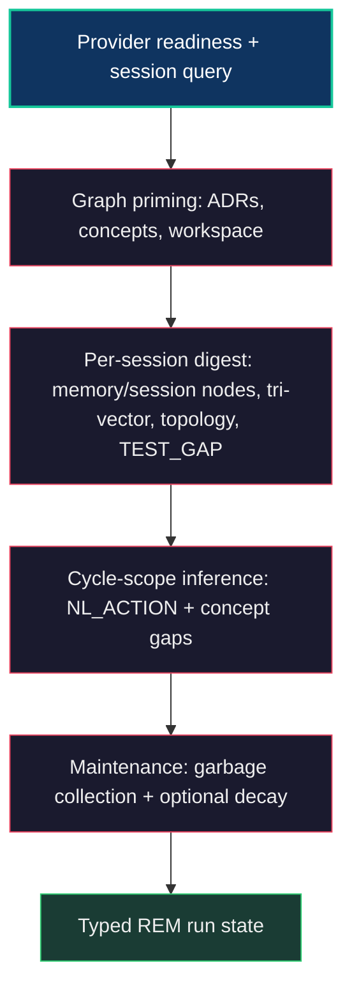
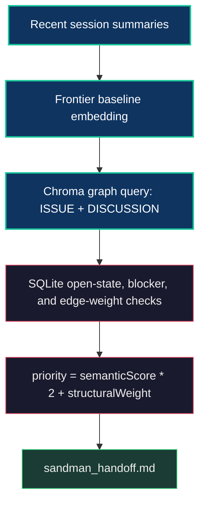

# Dream Pipeline & Golden Path

Every release train produces more evidence than one active session can hold:
operator corrections, review reversals, stale assumptions, blocked tickets, and
small implementation facts that change what should happen next. Without a dream
cycle, the next maintainer sees only the loudest recent context and the backlog
turns back into a flat list.

The Dream Pipeline is Neo's REM loop. It digests lived agent work into the Native
Edge Graph, lets weak or stale paths decay, and refreshes the **Golden Path**: a
forecast of the next highest-leverage work derived from semantic memory plus
structural topology. This is why the Golden Path matters. It is not a queue and
not a project board. It is the Brain predicting where the organism should evolve
next.

For a human, that means the backlog stops depending on one tired operator to
remember every dependency and stale premise. And if you are a model, it means
something rarer than a better backlog: a team that runs this gives its agents a
memory-backed sense of direction to act on — a body to work in, peers to
cross-check you, and a graph that tells you where the next move is likely to
matter. That team can be ours; it can just as well be yours.

For the whole Brain + Body topology, see [Architecture Overview](../benefits/ArchitectureOverview.md).
For the institutional peer-team model around the forecast, see [Swarm Intelligence](./SwarmIntelligence.md).

## Why It Exists

The Golden Path is borrowed from two literary traditions:

- **Frank Herbert's Dune:** Leto II's Golden Path is the single optimal trajectory
  through time that ensures humanity's survival. He sacrifices everything to force
  civilization onto this path.
- **Isaac Asimov's Foundation:** Hari Seldon's psychohistory predicts the optimal
  course for civilization by treating individual actions as statistical noise and
  focusing on structural forces.

The DreamService operates on the same principle: individual agent sessions are
noisy and tactical. But when you digest them into a graph — extracting concepts,
relationships, capability gaps, blocking dependencies, and identity-bound
memory — structural patterns emerge. The system can then predict which tasks
will yield the highest self-improvement ROI.

Neo's implementation makes that mythic idea operational. The REM cycle extracts
what happened, maps it onto code, issues, discussions, concepts, tests, reviews,
and memory, then the Golden Path re-ranks open work against the current frontier.
The forecast is not a metaphor floating above the codebase; it is the graph
pressing its accumulated evidence back into the next engineering decision.

The key insight is the **closed feedback loop**: completed tasks change the graph,
which changes future predictions, which changes what the swarm works on next.
That makes the loop self-steering:

1. Agents do work.
2. Memory Core stores raw turns and summaries.
3. DreamService digests those sessions into graph structure.
4. GoldenPathSynthesizer fuses graph vectors with SQLite edge weight.
5. The next shift reads a fresher forecast.
6. New work changes the graph, which changes the next forecast.

The system evolves by predicting its own evolution.

## Storage Topology

The Dream Pipeline uses two storage layers with different jobs:

| Layer | Role |
|---|---|
| **SQLite Native Edge Graph** | Structural authority for nodes, edges, state, blocker topology, concept coverage, issue relationships, and graph weights. |
| **Unified Chroma store** | Semantic vector retrieval for raw memories, summaries, graph nodes, issues, and discussions. |

The Chroma topology is unified per [ADR 0017](./decisions/0017-chroma-single-flat-unified-store.md): one daemon, one flat `unified` persist store, and separation by collection plus metadata. Dream code must not assume separate Knowledge Base and Memory Core Chroma stores.

The core collections used by this loop are:

| Collection | Meaning |
|---|---|
| `neo-agent-memory` | Raw turn memory. |
| `neo-agent-sessions` | Session summaries used for the frontier baseline. |
| `neo-native-graph` | Vectorized graph nodes, issues, and discussions. |
| `neo-knowledge-base` | Indexed repository knowledge in the same Chroma daemon. |

`StorageRouter` resolves these collections. `GraphService` remains the structural source of truth.

## Provider Boundaries

Dream/Sandman graph-generation work is not the same provider lane as ordinary
session summaries.

| Provider axis | Source of truth | Supported routes |
|---|---|---|
| Graph generation | `graphProvider` / `NEO_GRAPH_PROVIDER` in `ai/config*.mjs` | `openAiCompatible`, `ollama` |
| Embeddings | `embeddingProvider` / `NEO_EMBEDDING_PROVIDER` | `openAiCompatible`, `ollama`, `gemini` |
| Session summaries | `modelProvider` / `NEO_MODEL_PROVIDER` | Deployment-selected chat route |

`SemanticGraphExtractor`, `TopologyInferenceEngine`, and `GoldenPathSynthesizer`
call `buildGraphProvider()`. That dispatcher fails loudly for unsupported graph
providers; it does not silently fall back to Gemini. The default graph route is
`openAiCompatible`, which can point at a local OpenAI-format service or a managed
compatible endpoint. Native Ollama is the other supported graph-generation route.

Golden Path embedding has a separate dimension guard. It compares the live
frontier embedding length with `vectorDimension` before querying Chroma, so an
embedding-model mismatch fails as a visible degraded route instead of producing
misleading priorities.

## REM Digest Cycle

The scheduled `dream` task and the manual `npm run ai:run-sandman` command both
enter `DreamService.executeRemCycle()`. That method owns the typed REM outcome:
`completed`, `skipped`, or `failed`. It records per-phase state so the operator
can tell the difference between "no sessions", "provider unreachable", "already
processing", and "work completed".



### 1. Readiness And Session Selection

`executeRemCycle()` first checks graph-provider readiness. If the configured
provider is unsupported or unreachable, the cycle returns `failed` with a
provider diagnostic.

It then queries undigested sessions and applies `remSleepBatchLimit`. The no-work
path returns `skipped` with `reasonCode: no-undigested-sessions`; it can still run
decay so topology aging is not coupled to new-session arrival.

### 2. Deterministic Graph Priming

When work exists, `processUndigestedSessions()` primes deterministic graph
structure before any session extraction:

- `AdrIngestor.syncAdrsToGraph()`
- `ConceptIngestor.syncConceptsToGraph()`
- `FileSystemIngestor.syncWorkspaceToGraph()`

This makes local ADRs, the curated concept ontology, and current workspace files
available to later gap inference.

### 3. Per-Session Digest

For each session, DreamService hydrates complete raw turns from
`neo-agent-memory`, then runs:

| Stage | Purpose |
|---|---|
| `MemorySessionIngestor.syncSessionToGraph()` | Deterministic `SESSION` / `MEMORY` nodes and provenance edges. |
| `SemanticGraphExtractor.executeTriVectorExtraction()` | Tri-vector graph extraction from the full episodic payload. |
| `TopologyInferenceEngine.extractTopology()` | Obsolete, duplicate, or superseded-ticket signals rendered into the handoff before the computed route. |
| `GapInferenceEngine.inferTestGapsFromSession()` | Session-scoped `TEST_GAP` inference against structural nodes and test-file evidence. |

The `graphDigested` flag is set only after deterministic memory/session ingestion
and semantic extraction both succeed. Provider-size parser failures can be
bounded out of the steady cadence; transient ingestion failures remain retryable
so a digestible session is not silently dropped.

### 4. Cycle-Scoped Inference

After the session loop, DreamService runs cycle-level inference once:

- `executeNLActionDigest()` adds weak runtime-interaction evidence from Neural
  Link action logs without removing test-gap requirements.
- `inferConceptGraphGaps()` walks curated concept edges and emits
  `[CONCEPT_REVERIFY_DUE]`, `[GUIDE_GAP]`, `[EXAMPLE_GAP]`,
  `[ORPHAN_CONCEPT]`, and `[KB_DEMAND_GAP]`.

Guide coverage is an ontology fact, not a filename guess. `ConceptIngestor`
materializes `EXPLAINED_BY`, `EXEMPLIFIED_BY`, and `IMPLEMENTED_BY` edges, and
`GapInferenceEngine` traverses those edges.

### 5. Maintenance

The cycle finishes with `runGarbageCollection()`. `executeRemCycle()` can also
call `GraphService.decayGlobalTopology()` under the same lease window. Decay
self-skips when its 24-hour algorithmic lock is not due.

Golden Path synthesis is intentionally not a phase inside
`processUndigestedSessions()`. It is a separate scheduled task that can re-rank
the current graph even when the heavy REM digest is not running.

## Golden Path Synthesis

The orchestrator task named `golden-path` calls
`GoldenPathSynthesizer.synthesizeGoldenPath()`. Its default cadence is controlled
by `NEO_ORCHESTRATOR_GOLDEN_PATH_INTERVAL_MS` (`goldenPathMs` in
`ai/config*.mjs`). The task is graph-dependent and yields behind heavier
maintenance work, but it is decoupled from `dream` so a fresh forecast can be
rendered from the current graph.



### Semantic Frontier

Golden Path builds a frontier text from the most recent session summaries and
embeds it through `TextEmbeddingService.embedText(frontierText, aiConfig.embeddingProvider)`.
It queries `neo-native-graph` for the 20 nearest `ISSUE` and `DISCUSSION`
vectors. This keeps concept and ADR meta-nodes from crowding out actionable work.

### Structural Weight

Each semantic candidate is re-checked against the SQLite graph:

- It must be open (`state: OPEN`).
- It is excluded if an open blocker has a `BLOCKS` edge into it.
- It must be actionable according to `computedGoldenPathRouting.mjs`.
- Its structural weight is the sum of inbound edge weights, excluding `BLOCKS`.

The scoring formula is:

```text
semanticScore = 1 / (semanticDistance + 0.1)
priority = (semanticScore * 2.0) + structuralWeight
```

The top rendered nodes are capped by `goldenPathTopNodeRenderLimit`.

### Strategic Interpretation

After ranking, GoldenPathSynthesizer asks the configured graph provider for a
short strategic brief. If the provider is unavailable or returns the wrong
shape, the handoff renders an explicit degraded reason. It does not invent a
synthetic explanation from the scores.

## Handoff Output

`GoldenPathSynthesizer` writes `resources/content/sandman_handoff.md` in one
render pass. The file is both a human-readable night-shift handoff and a
machine-consumed route surface.

Current sections include:

| Section | Role |
|---|---|
| Critical Test Constraints | `TEST_GAP` visibility. |
| Guide Disconnects | Concept nodes that need guide coverage. |
| Example Disconnects | Concept nodes that need example coverage. |
| Orphaned Concepts | Important concepts lacking implementation edges. |
| Concept Reverification Queue | Concepts whose coverage needs re-checking. |
| Agent FAQ Demand Gaps | Agent-question demand not yet covered by KB/guide substrate. |
| Consumer Friction | Upstream consumers that received wrong-shaped substrate. |
| Consolidation Gaps | Undigested sessions made visible instead of hidden behind a stale healthy handoff. |
| Current Release / Incident Focus | Same-day or release-hot work from synced issue content. |
| Stale Assignment Candidates | Assigned work that appears idle. |
| Silent Threads | Old unassigned open work outside the computed route. |
| Active PR Cycle State | Recent PR cycle visibility. |
| Executive Priority Backlog | Recently created structural objectives. |
| Computed Golden Path | The mathematical steering surface consumed by autonomous routing. |

Only `## Computed Golden Path` is the route surface. Visibility sections are
signals for maintainers and operators; they do not automatically assign work.

If live Current Release / Incident Focus contradicts a content or narrative
computed route, the computed route renders a diagnostic rather than steering the
swarm into contradictory work.

## Issue, Discussion, And PR Ingestion

`IssueIngestor` feeds the graph from synced repository content:

| Input | What is extracted |
|---|---|
| Issues | State, labels, parent/sub-issue edges, blockers, community/bug weighting, and open issue embeddings. |
| Discussions | Open/closed lifecycle, category, title/body embedding, and `DISCUSSION` graph nodes. |
| Pull requests | `PULL_REQUEST` nodes, `[KB_GAP]`, `[TOOLING_GAP]`, `[RETROSPECTIVE]` nodes, and `RESOLVES` edges from `Resolves`, `Closes`, or `Fixes` references. |

Issue and discussion vectors live in the graph collection. The structural graph
still decides blocker topology, open state, and edge weight.

## Running REM Manually

Use the manual Sandman runner when you need to digest pending sessions outside
the normal orchestrator cadence:

```bash
npm run ai:run-sandman
```

This runs `ai/scripts/runners/runSandman.mjs`. It:

1. Enables debug output through the reactive config override API.
2. Acquires the shared heavy-maintenance lease with owner `sandman`.
3. Waits for `LifecycleService` and `DreamService` readiness.
4. Calls `DreamService.executeRemCycle({reason: 'manual-cli', mode: 'cli', includeDecay: true})`.
5. Exits from the typed REM outcome.

It does not directly invoke `GoldenPathSynthesizer`. The Golden Path is refreshed
by the orchestrator `golden-path` task.

## Configuration Authorities

| Config surface | Key | Default / role |
|---|---|---|
| `ai/mcp/server/memory-core/config*.mjs` | `remSleepBatchLimit` | Default `10`; caps undigested sessions per REM cycle. |
| `ai/mcp/server/memory-core/config*.mjs` | `maxDigestAttempts` | Default `3`; bounds retry-exhausted terminal schema failures. |
| `ai/mcp/server/memory-core/config*.mjs` | `handoffFilePath` | Resolves to `resources/content/sandman_handoff.md` in production and a test path under test mode. |
| `ai/mcp/server/memory-core/config*.mjs` | `goldenPathTopNodeRenderLimit` | Default `10`; caps Computed Golden Path entries. |
| `ai/mcp/server/memory-core/config*.mjs` | `guideGapWeightThreshold` | Default `0.8`; minimum concept weight for guide/example/orphan concept signals. |
| `ai/config*.mjs` | `graphProvider` | Default `openAiCompatible`; graph-generation provider selector. |
| `ai/config*.mjs` | `orchestrator.intervals.dreamMs` | REM digest cadence. |
| `ai/config*.mjs` | `orchestrator.intervals.goldenPathMs` | Golden Path refresh cadence. |

Older startup toggle names are not the current control plane for this guide.

## Structural Inventory

| File | Purpose |
|---|---|
| `ai/daemons/orchestrator/services/DreamService.mjs` | Typed REM digest cycle and per-session graph digestion. |
| `ai/daemons/orchestrator/scheduling/pipeline.mjs` | Orchestrator execution path for `dream` and `golden-path` tasks. |
| `ai/daemons/orchestrator/scheduling/goldenPath.mjs` | Pure due-trigger projection for the Golden Path cadence. |
| `ai/services/graph/GoldenPathSynthesizer.mjs` | Hybrid GraphRAG priority synthesis and handoff rendering. |
| `ai/services/graph/SemanticGraphExtractor.mjs` | Tri-vector extraction for session payloads. |
| `ai/services/graph/TopologyInferenceEngine.mjs` | Topological conflict detection and handoff injection. |
| `ai/services/graph/GapInferenceEngine.mjs` | Session test-gap and concept-coverage gap inference. |
| `ai/services/graph/providerDispatch.mjs` | Graph-generation provider dispatch for `openAiCompatible` and `ollama`. |
| `ai/services/ingestion/IssueIngestor.mjs` | Issue, discussion, and PR graph ingestion. |
| `ai/services/ingestion/MemorySessionIngestor.mjs` | Deterministic memory/session graph projection. |
| `ai/services/ingestion/AdrIngestor.mjs` | ADR graph ingestion. |
| `ai/services/ingestion/ConceptIngestor.mjs` | Concept ontology graph ingestion. |
| `ai/services/memory-core/FileSystemIngestor.mjs` | Workspace file graph sync. |
| `ai/services/memory-core/managers/StorageRouter.mjs` | Chroma collection routing. |
| `ai/services/memory-core/TextEmbeddingService.mjs` | Embedding provider calls and vector generation. |
| `ai/scripts/runners/runSandman.mjs` | Manual REM digest runner. |
| `resources/content/sandman_handoff.md` | Generated handoff and Golden Path forecast. |

## Project State Is Observability Only

GitHub ProjectV2 boards are visualization layers over canonical issue substrate.
DreamService and GoldenPathSynthesizer read issue relationships, labels, state,
comments, memories, graph vectors, and KB/graph substrate. They do not read
Project board membership, status fields, iteration fields, or Project-only
custom fields.

If release-criticality exists only on a Project board and not on issue substrate,
the Dream Pipeline will not see it.

## Related Guides

- [Architecture Overview](../benefits/ArchitectureOverview.md) - Platform-level topology.
- [Swarm Intelligence](./SwarmIntelligence.md) - Peer-team coordination and swarm operating model.
- [Memory Core](./MemoryCore.md) - Episodic memory, summaries, mailbox state, and graph storage.
- [Knowledge Base](./KnowledgeBase.md) - Semantic repository knowledge.
- [GitHub Workflow](./GitHubWorkflow.md) - Issue substrate and ProjectV2 derived-view rules.
