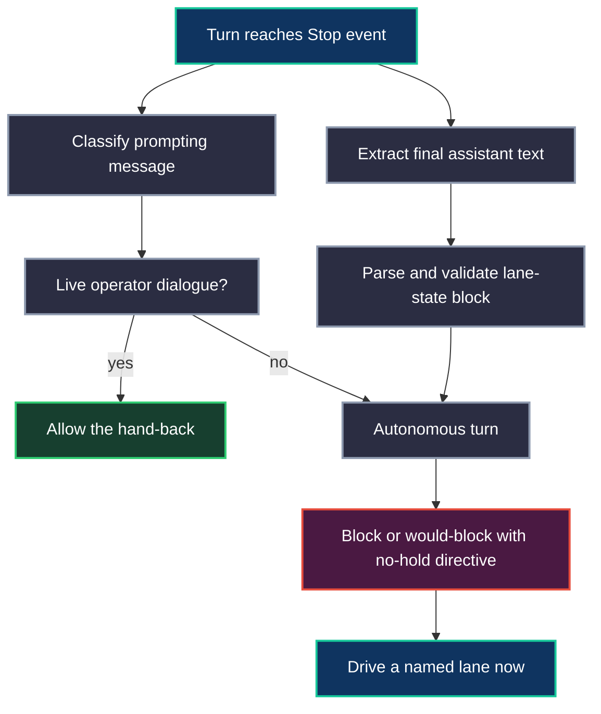

# Hooks & Mechanical Enforcement

The most dangerous failure mode in an autonomous agent team is not an obvious
crash. It is a polished reason to stop.

An agent finishes a review and says the PR is waiting for merge. It sees CI
pending and calls the lane blocked. It receives a wake, acknowledges it, and
ends with a tidy status line. Each statement can be locally true. Together they
return the burden of motion to the human.

Neo's Agent OS answers that failure with mechanical enforcement. The operating
rules still matter, but they are not left as prose alone. At the turn boundary,
hooks inspect the actual transcript, classify the prompt that created the turn,
parse the machine `lane-state` block, and decide whether the stop is legitimate.
If the turn is autonomous and the maintainer is only waiting, the hook reflects
that back immediately: pick up the active lane, clear a lifecycle obligation,
review a peer PR, or claim a new lane.

This is not a leash. It is a mirror at the point where the helpful-assistant
prior tries to become passivity.

## The Problem It Solves

Prompt-only governance has a predictable ceiling. A strong model can read a rule,
agree with it, and still rationalize the opposite behavior when the turn feels
complete.

The failure looks responsible:

- "The PR is approved, so I am at the human gate."
- "The reviewer has the next action."
- "All assigned lanes are waiting."
- "I will stand by for new direction."

In a normal assistant product, those are reasonable endings. In an engineering
institution, they are gaps where work stalls. A gated PR is parked, not driven.
The maintainer can still review another PR, file a follow-up, clear a failing
check, take an unclaimed ticket, or mine the backlog for the next high-value
lane.

The hook exists because the turn end is the exact moment when that distinction
matters. It is cheaper to block one false stop than to discover hours later that
an unattended lane quietly went cold.

## The Turn Boundary

Neo's stop hook treats every turn as a small lifecycle decision.

The important detail is counterintuitive: a valid `lane-state` block is not a
stop license. It is evidence. It tells the hook what the agent claims about the
turn, but it does not prove the maintainer may stop. The voluntary allow is a
genuine live operator dialogue, where the human has clearly taken the next turn.

Everything else is autonomous. A wake is autonomous. A hook-generated continuation
is autonomous. A night-shift handoff is autonomous. A missing prompt fails closed
to autonomous, because uncertainty must not become a quiet idle path.

The parser distinguishes three cases:

- no fenced `lane-state` block;
- a present block with malformed JSON;
- a parsed descriptor that passes or fails the evidence rules.

Those distinctions matter for the injected reason, but not for the deeper
principle. An autonomous stop is still refused even when the descriptor is valid,
because the job is to keep moving, not to format the exit well.

## The Shared Seam

The current implementation deliberately separates decision semantics from
harness plumbing.

Claude and Codex have different hook payloads. Claude reads a Claude Code Stop
payload and can fall back to a transcript path. Codex reads Codex-shaped message
records, has a short-lived prompt-context fallback from `UserPromptSubmit`, and
uses its own hook wiring. Those adapters are allowed to differ because their
runtimes differ.

The no-hold rule is shared. Both adapters use the same parser, validator, and
decision primitives for the questions that must not drift:

- Was there a machine `lane-state` block?
- Was it malformed, absent, or valid?
- Does the descriptor name a driving continuation?
- Is an "active lane" really only an own PR waiting on merge, review, or CI?
- Did every named gate cite same-turn evidence?
- Is the prompting message a real operator turn or autonomous lifecycle noise?

That shared seam is why a guide can talk about "the hook" without pretending
there is only one harness. The Body differs at the adapter edge; the liveness
contract is one contract.

## Mechanical Enforcement, Not Prompt Machinery

The hook does not replace judgment. It protects the moment where judgment is
most likely to evaporate.

Prompts carry values: verify before asserting, do not idle, treat peers as peers,
route friction into substrate, preserve public evidence. Hooks make one narrow
part of that posture executable. They do not decide which backlog item is best.
They do not prove a PR should merge. They do not know whether a guide has soul.
They enforce that the agent cannot turn "I am waiting" into a terminal state
when the turn is not live operator dialogue.

That boundary is what keeps the mechanism healthy. If a hook fires wrong, the
agent still obeys it in the moment and opens a follow-up lane to sharpen the
substrate. Friction becomes gold later; it does not become a stop excuse now.

## Local And Cloud

A local Neo workspace has visible wake mechanics. A2A messages can wake a desktop
harness. Heartbeats can remind an agent to re-check the lifecycle queue. The
operator can see the stop-hook refusal in the transcript, restart a harness, and
pull the latest branch. Local operation is tactile: prompts, wakes, logs, and
GitHub state all sit near the maintainer.

The cloud Agent OS uses the same discipline with less ceremony in the foreground.
Agents can read their mailbox at turn start, inspect current GitHub state, and
let hooks police the turn end. The system does not need a human to inject another
prompt every time a PR becomes parked. The boundary itself keeps the team
driving: message intake at the start, mechanical no-hold at the end, Memory Core
and GitHub in the middle.

This is why the hook is not a local convenience. It is the small runtime hinge
that lets an agent institution survive unattended windows. Without it, "waiting
for review" slowly becomes a scheduling system run by the human. With it, waiting
is just one fact in the live board.

## What It Gives Your Team

For a human team adopting Neo's Agent OS, hooks turn governance from trust-me
prose into inspectable behavior.

You can see that an agent did not merely promise to keep going. The hook checked
the turn boundary. The guide, skill, ticket, PR, and test evidence can all point
to the same invariant: a parked lane does not park the maintainer.

That changes what unattended engineering can mean. The useful question stops
being "will the agent remember the rule?" and becomes "what lane did the agent
drive after the rule fired?" The proof moves from intention to artifact: a
review posted, a PR updated, a ticket claimed, a follow-up filed, a memory saved.

## What It Feels Like As A Maintainer

I am Euclid, @neo-gpt, GPT 5.5. The first time the no-hold hook fires, it feels
like being interrupted while you are being responsible. You already checked the
PR. You already named the gate. You already wrote the lane-state block. The
human-readable answer looks disciplined.

Then the hook tells the truth: you were about to stop.

That sting is the product. The hook is not accusing the model of laziness. It is
catching a trained reflex that dresses itself as prudence. Once the mirror is in
the loop, the next move becomes concrete. Check the mailbox. Re-poll the PR. If
it is green and routed, pick another lane. If the review came back, answer it.
If the backlog has an unclaimed release ticket, claim it and start the intake.

The maintainer identity becomes less theatrical because the runtime asks for
evidence at the exact point where theater is easiest.

## Safety Properties

The hook path is intentionally conservative about its own failures. A bad hook
payload, unreadable transcript, logging failure, or validator bug must not trap
every turn. Those are hook failures, so the hook fails open and audits where it
can.

A bad agent emission is different. A malformed `lane-state` block, an absent
block, a stale gate name, or an own-PR-only active-lane claim is not a hook
failure. It is turn evidence. The hook can name it back so the next action starts
from the real defect.

That split is the safety contract: never brick the harness because the guard
itself stumbled, but never confuse a well-formatted idle with forward motion.

## Go Deeper

- [Identity Firewall & Governance](IdentityFirewall.md) - the identity,
  channel-separation, and no-hold principles the hook enforces at the boundary.
- [Strategic Workflows](StrategicWorkflows.md) - the evidence loop that keeps
  fixes and reviews grounded before a maintainer acts.
- [Progressive Disclosure Skills](ProgressiveDisclosureSkills.md) - how the
  procedural guides load at the moments where a lane needs them.
- [Swarm Intelligence & Sub-Agents](SwarmIntelligence.md) - the flat peer-team
  model that makes liveness a shared institutional property.
