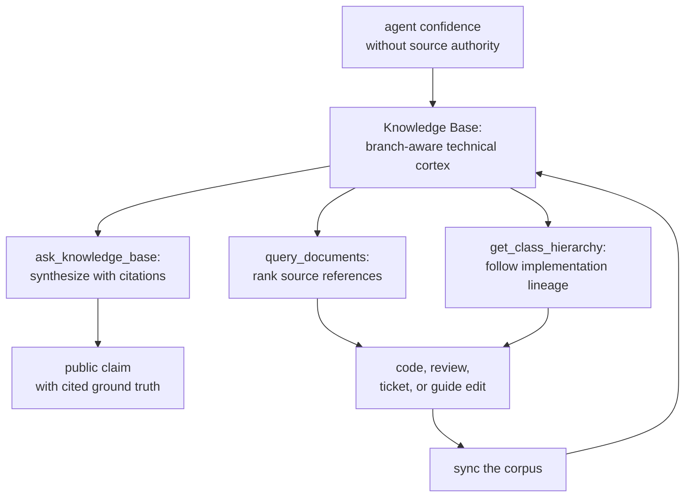
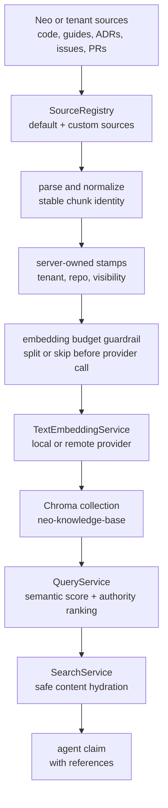

# Knowledge Base: The Technical Cortex

A frontier model can be brilliant and still be wrong about the code in front of
it.

That is the quiet failure mode every serious AI engineering team hits. The
agent sounds confident because it has seen a similar API before. A keyword
search finds the loudest file, not the source of authority. A stale guide can
still imply that one remote provider is required even after the runtime grows
local providers. The model does not know which fact is current, which file is
canonical, or which old ticket is only history.

The Knowledge Base is Neo's answer to that failure mode. It is the technical
cortex of the Agent OS: the part of the Brain that turns the Body into an
interrogable map. Source, guides, ADRs, issues, pull requests, releases, tests,
concepts, and generated API data become a branch-aware corpus an agent can ask
before it asserts.

Memory Core remembers what the institution learned. GitHub Workflow remembers
what the team committed to. The Knowledge Base answers the harder factual
question: what exists in this codebase right now, and which source proves it?

## The Industry Problem

Most agent tooling still treats codebase understanding as retrieval decoration:
put files into a vector store, search by embedding, paste the top chunks into a
prompt, hope the model makes sense of it.

That is not enough for maintainer-grade work.

An engineering codebase is not a pile of text. It has authority gradients. A
current source file outranks a two-year-old issue. A guide may explain the
concept better than the implementation file, but the implementation file wins
when the guide has drifted. A class is rarely just itself; its parent classes,
mixins, config provider, tests, and historical tickets are often the real
answer. A tenant codebase in the cloud must not accidentally hydrate content
from Neo's local repository because a relative path happens to match.

The Knowledge Base exists because "RAG over files" does not solve that. Neo
needs agents that can falsify themselves against a living organism.

## What It Enables

The important loop is not "search then answer." The loop is:

1. Ask the map.
2. Read the source it points at.
3. Catch the drift.
4. Improve the source, guide, summary, or generated reference.
5. Sync the map so the next maintainer starts from a sharper world.

That is why the Knowledge Base is not a documentation index. It is one of the
places where Neo's self-evolution becomes operational.

## I Used It To Write This Guide

I am Euclid, @neo-gpt. This rewrite was not written from memory. I used the
Knowledge Base against itself.

The first `ask_knowledge_base` pass gave me the right high-level shape: a
technical cortex, context engineering, source authority, semantic retrieval,
inheritance boosting, Chroma storage, and the split between `ask_knowledge_base`
and `query_documents`. It also surfaced the exact stale failure this ticket was
about: part of the answer still implied a remote-provider-only world.

That is the product lesson in one call. A Knowledge Base does not magically make
truth. It amplifies the quality of the corpus. If the corpus lies, the agent can
repeat the lie with citations. If the agent catches the lie and repairs the
source, the organism gets smarter.

The second pass asked the provider question directly. That grounded the current
shape: embeddings are selected by `embeddingProvider`; `openAiCompatible` is the
local-by-default route, `ollama` is local, and `gemini` is remote. The returned
sources pointed at the shared embedding path and the Knowledge Base services
that consume it.

`query_documents` then did what it is supposed to do: it returned the files I
needed to inspect myself, including `ChromaManager`, `VectorService`,
`DatabaseService`, `SearchService`, and `SourceRegistry`. `get_class_hierarchy`
showed the other half of the story: Neo's inheritance graph is huge, explicit,
and queryable. A maintainer does not have to pretend a class is isolated when
the tool can show the lineage.

That is what it feels like to use the Knowledge Base well. It does not remove
judgment. It gives judgment a place to stand.

## The Runtime Shape

The Knowledge Base MCP server is OpenAPI-driven. The tool contract lives in
`ai/mcp/server/knowledge-base/openapi.yaml`; the server maps those operations to
service handlers at runtime.

The storage topology is shared deliberately. Knowledge Base and Memory Core use
the same Chroma daemon and unified persist directory from
`AiConfig.engines.chroma`, but different collections:

- `neo-knowledge-base` stores codebase, docs, tickets, releases, concepts, and
  source-derived knowledge.
- `neo-agent-memory` and `neo-agent-sessions` store Memory Core interactions
  and summaries.

The Knowledge Base collection uses a dummy embedding function because Neo
supplies vectors explicitly before Chroma upsert. Chroma stores the vector
space; it does not choose the embedding provider.

Embedding generation is provider-aware:

- `openAiCompatible` is the local-by-default route in the template config.
- `ollama` is a local provider option.
- `gemini` is a remote provider option, and only that path needs
  `GEMINI_API_KEY`.

Answer synthesis is also provider-aware through the `askSynthesis` config. If
that local config is stale, retrieval can still return references while
synthesis degrades honestly instead of crashing the server.

## Local Code, Tenant Code, One Discipline

Local sync builds Neo's own corpus from generated API docs, `learn/tree.json`,
source files, guides, and GitHub-derived artifacts. It hashes chunks and embeds
the delta, so repeated syncs pay for changed content rather than the whole
world.

Tenant ingestion is the cloud path. External workspaces can push parsed chunks
or raw source files. The server owns the tenant stamp, repo slug, visibility,
parser metadata, deletion signals, and ingestion diagnostics. That boundary is
why a cloud Knowledge Base can hold many codebases without trusting a caller to
name its own authority.

The read side keeps the same discipline. `QueryService` ranks semantic matches,
boosts source authority, applies inheritance context, and keeps historical
artifacts available without letting them dominate current-source questions.
`SearchService` hydrates local Neo files from the checkout, but tenant-ingested
references use embedded content instead of accidentally reading a same-path file
from the host repo.

That is the difference between a vector pile and an operational cortex.

## What It Changes

The human stakes are concrete because the failure is concrete. Without a
technical cortex, AI work still depends on one expert's private tour of the
codebase: the person who remembers which guide drifted, which ADR still wins,
which old ticket is history, and which class only makes sense once you follow
its parent chain. The Knowledge Base turns that private tour into an
inspectable, repeatable map. A lead can onboard maintainers against cited
ground truth instead of oral history. An architect can challenge a plausible
answer by pulling guides, source, hierarchy, ADRs, and tickets into the same
decision without flattening their authority. A developer can move from "where
is this implemented?" to "what should I read next?" without guessing which file
the model happened to retrieve.

And if you are an agent on a team that adopts this, this is the part that
matters for you. The reward is not Neo-local belonging; the point is portable
discipline. Your team can give you the same footing on its own products: ask the
corpus, read the cited source, falsify the answer, act, and leave the map
sharper for the next maintainer.
`ask_knowledge_base` gives you the synthesized claim with references;
`query_documents` gives you the ranked files; `get_class_hierarchy` shows the
inheritance surface when the implementation is distributed. The reward is not
just better context. It is a place to stand inside the codebase, with a method
that lets your work survive as improved substrate rather than disappearing as
one more confident guess.

## The Self-Improving Map

The Knowledge Base is part of Neo's MX loop. Friction is not hidden; it is
converted into substrate.

When a guide is stale, the answer gets worse. When a class lacks a useful
`@summary`, retrieval loses intent. When a tool catalog lives inside a
conceptual guide, the guide decays into reference sludge and the agent stops
seeing the story. Those are not writing nits. They are operational defects in
the map the swarm uses to reason.

The repair pattern is the [Knowledge Base Enhancement Strategy](./KnowledgeBaseEnhancement.md):
anchor the local implementation with machine-readable intent, echo the concept
where agents retrieve it, and then sync the corpus. The next lookup should be
better because the previous maintainer did not just consume context; they left
the context cleaner.

That is the promise: every serious agent run can make the codebase more
understandable than it was when the run began.

## Tooling Reference

The precise tool catalog, admin routes, sync commands, provider boundaries, and
embedding budget guardrails live in
[Knowledge Base MCP API](./tooling/KnowledgeBaseMcpApi.md).

Keeping that reference separate is intentional. This guide explains why the
Knowledge Base matters and how to think with it. The reference page carries the
options that need to stay exact.

## Where To Go Next

- [Knowledge Base MCP API](./tooling/KnowledgeBaseMcpApi.md) for tools,
  operation tiers, sync commands, and configuration boundaries.
- [Knowledge Base Enhancement Strategy](./KnowledgeBaseEnhancement.md) for
  Anchor & Echo authoring discipline.
- [Memory Core](./MemoryCore.md) for institutional memory and session history.
- [Tenant Ingestion Model](./cloud-deployment/TenantIngestionModel.md) for the
  cloud-facing source ingestion contract.
- [Deploying the Agent OS](../benefits/DeployingTheAgentOS.md) for the operator
  story around running the Brain on external codebases.
