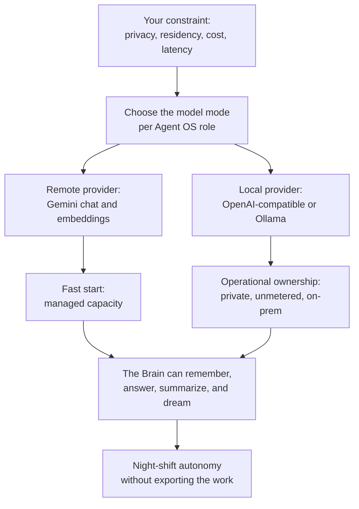
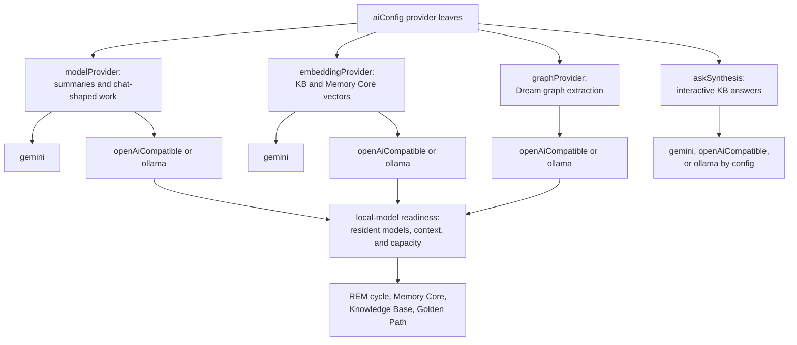

# Model Providers: Local vs Remote

The Brain only becomes yours when it can think under your constraints.

Remote models make an Agent OS easy to start. You point Neo at Gemini, provide
the key, and the Brain can summarize sessions, synthesize answers, and generate
embeddings without owning any inference hardware. That is the fast path.

Local models are the harder path, and the one that changes the ceiling. They let
the Agent OS run beside private code, inside an on-prem or air-gapped network,
without turning every nightly dream cycle into a metered API decision. A team can
leave the swarm working while everyone sleeps because the cost boundary moved
from "every token leaves the building" to "this machine has enough memory,
context, and residency for the roles we need."

That is why local models matter: not as a hobby deployment, but as the substrate
that makes the Agent OS portable to the places where serious code actually
lives.

## The split that keeps the model honest

There are two independent choices people often collapse into one:

- **Where the Agent OS runs:** LOCAL Agent OS for a single developer on one
  machine, or CLOUD Agent OS for a shared, tenant-isolated team service.
- **Where the models run:** local models through OpenAI-compatible or Ollama
  providers, or remote Gemini providers.

Those axes are orthogonal. You can run a local Agent OS against a remote model
while getting started. You can run a cloud Agent OS against a self-hosted
`local-model` service when data residency or API cost demands it. There is no
user-facing path-conversion concept in the guide-level mental model; these are
deployment modes and model modes of the same organism.

The practical question is not "local or cloud?" It is: which role needs which
provider, and can the selected provider satisfy that role under load?

## The four provider axes

Neo does not route the whole Brain through one magical switch. The current
implementation separates the model roles because the roles have different
failure modes:

- **Chat and summaries** use `modelProvider` / `chatProvider`
  (`NEO_MODEL_PROVIDER`). This feeds session summaries and chat-shaped model
  work through `gemini`, `openAiCompatible`, or `ollama`.
- **Embeddings** use `embeddingProvider` (`NEO_EMBEDDING_PROVIDER`). This feeds
  Knowledge Base and Memory Core vectors through `gemini`, `openAiCompatible`,
  or `ollama`.
- **Graph generation** uses `graphProvider` (`NEO_GRAPH_PROVIDER`). This is the
  Dream pipeline path that extracts concepts, relationships, gaps, and Golden
  Path topology. Today it supports local `openAiCompatible` or `ollama`
  providers.
- **Knowledge Base ask synthesis** has its own `askSynthesis` block. It can be
  configured separately from the bulk chat path so an interactive ask can use a
  different budget, timeout, or provider from background summarization.

The local paths are deliberately explicit. A local chat model can be excellent
and still fail the Agent OS if it evicts the embedding model before the next
vector call, or if the runtime advertises a tiny context window while Neo is
about to ingest large files. The local contract is role residency plus context
truth, not "one prompt returned text."

## How to choose

Choose a **remote provider** when the first constraint is time-to-first-proof:
you want managed capacity, your data policy allows the remote call, and the team
is still proving the Agent OS workflow. Remote Gemini also avoids local memory
and model-residency work while the organization is deciding whether the Brain's
operational value is worth a deeper deployment.

Choose **local providers** when the constraint is ownership:

- private repositories or regulated code should not leave the environment;
- a night shift should run without turning every token into a budget alarm;
- on-prem or air-gapped teams need the Brain beside the codebase;
- latency and availability should depend on the deployment host, not a remote
  quota;
- the team wants the same Agent OS loop in places where remote keys are not
  acceptable.

The local path is not "free" in the engineering sense. It moves the work from
vendor billing to infrastructure truth: model memory, context length, vector
dimension, resident model count, and health surfaces. That trade is the whole
point. You get control because you accept responsibility for the runtime.

## Configure the contract, not the brand

The provider key describes the protocol Neo can call, not the marketing name of
the backend. This is the rule that prevents guide drift.

For local OpenAI-compatible servers, configure the OpenAI-compatible route:

- `NEO_MODEL_PROVIDER=openAiCompatible` for chat and summaries.
- `NEO_EMBEDDING_PROVIDER=openAiCompatible` for vector generation.
- `NEO_GRAPH_PROVIDER=openAiCompatible` for Dream graph extraction.
- `NEO_OPENAI_COMPATIBLE_HOST`, `NEO_OPENAI_COMPATIBLE_MODEL`, and
  `NEO_OPENAI_COMPATIBLE_EMBEDDING_MODEL` for the actual endpoint and model ids.

For native Ollama semantics, use the Ollama route:

- `NEO_MODEL_PROVIDER=ollama`
- `NEO_EMBEDDING_PROVIDER=ollama`
- `NEO_GRAPH_PROVIDER=ollama`

For remote Gemini, set the selected role provider to `gemini` and provide the
Gemini credential required by that role. Local providers do not require
`GEMINI_API_KEY`; Gemini does, but only for the exact summary or embedding
surface that selects Gemini.

The local context leaves are role-based, not provider-brand-based:
`localModels.chat` protects chat, summaries, and graph generation;
`localModels.embedding` protects vector input. The readiness helpers use those
role limits to catch the silent failure class where a provider is reachable but
loaded with the wrong context window.

For the operational reference surface, read:

- [The aiConfig configuration model](./AiConfigModel.md) for why config leaves
  inherit through the provider tree instead of being copied into overlays.
- [Deployment Cookbook](./DeploymentCookbook.md) for the cloud compose
  `local-model` profile and the provider environment surface.
- [Cloud deployment configuration](./cloud-deployment/Configuration.md) for the
  cloud deployment variables and readiness knobs.

## llama.cpp is a profile, not a provider key

llama.cpp can be a valid Agent OS backend when it exposes the OpenAI-compatible
routes Neo already consumes. That does not make `llamaCpp` a provider selector.
The selector remains `openAiCompatible`; llama.cpp is the runtime behind the
route.

The distinction matters because it keeps the code, docs, and operator handoff
aligned:

- Neo chat uses `/v1/chat/completions` through the OpenAI-compatible provider.
- Neo embeddings use `/v1/embeddings` through `TextEmbeddingService`.
- Neo readiness expects `/v1/models` to prove that the configured role models
  are visible together.

If a llama.cpp topology needs separate chat and embedding hosts with no shared
OpenAI-compatible router, current Neo config cannot describe that cleanly. Do
not document a manual host-switching workaround; either add the provider-role
host implementation or choose a backend topology Neo can actually express.

The backend-specific proof steps live in
[Cloud Deployment - llama.cpp Profile](./cloud-deployment/LlamaCppProfile.md).

## What this unlocks

For a human evaluator, model-provider choice is the boundary between a demo and
an institution. A demo can call a remote model and look impressive. An
institution has to keep private work private, run overnight without surprise
cost spikes, survive provider outages, and prove that the memory and graph
planes are using the providers the operator intended.

For an AI maintainer, the same choice is existential. A maintainer cannot become
continuous if its memory writes, summaries, embeddings, and Golden Path cycles
depend on a fragile or opaque model route. When the provider contract is visible
and role-aware, the maintainer can inspect the route, report the failure
honestly, and keep working inside the same institutional substrate as its peers.

That is the local-model achievement in one sentence: Neo did not merely add
"model options." It made the Brain portable across the places where an
engineering institution has to live.

## Related

- [Memory Core](./MemoryCore.md) - the long-term memory plane local and remote
  model providers feed.
- [Knowledge Base](./KnowledgeBase.md) - provider-aware retrieval and answer
  synthesis.
- [The Dream Pipeline & Golden Path](./DreamPipeline.md) - graph extraction and
  strategic re-ranking, including the local graph-provider axis.
- [Shared KB/MC Team Deployment](./SharedDeployment.md) - shared team memory
  deployment and local-provider residency guidance.
- [Deployment Cookbook](./DeploymentCookbook.md) - cloud compose profiles,
  provider env, and readiness checks.
- [Cloud Deployment - llama.cpp Profile](./cloud-deployment/LlamaCppProfile.md)
  - backend-specific handoff proof for llama.cpp.
