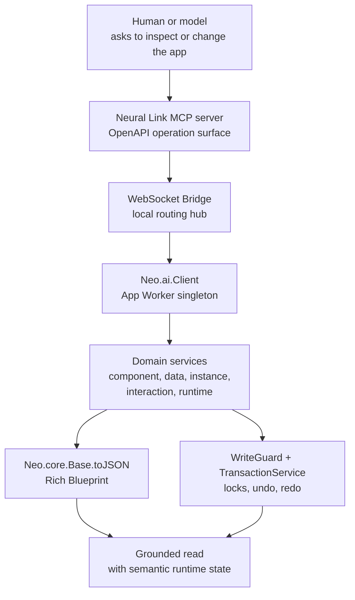
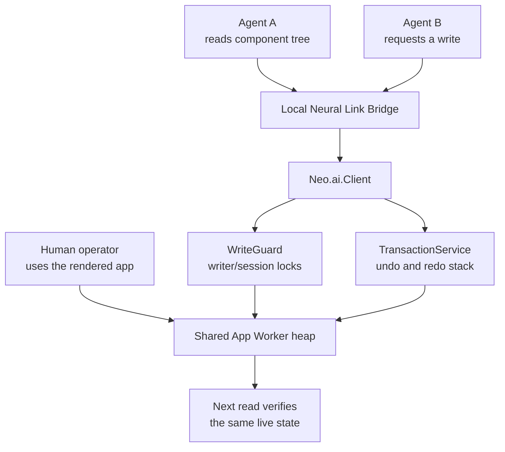
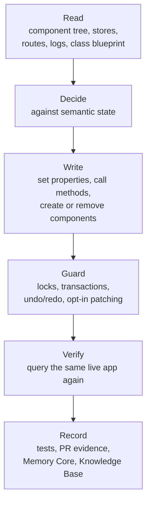

# Neural Link: The Possession Interface

Most AI coding work still happens outside the running application. The model
reads source, edits files, asks a human to reload, then waits for a screenshot,
console paste, or failing test. It can reason about what the app *should* be. It
cannot inhabit what the app *is*.

Neural Link changes that boundary. It is Neo's Possession Interface: the local,
trusted bridge that lets an agent reach into a live Neo App Worker, inspect
semantic runtime state, mutate components and data, verify the result, and leave
the user interface alive while the work happens.

That is why Neural Link is a crown-jewel capability. It is not a sidecar around
browser automation. It is the Body-to-Brain hinge: the Brain can act inside the
Body because the Body is made from persistent Neo objects, JSON-addressable
state, and `toJSON` blueprints that describe the runtime in the language models
can actually use.

## The Problem It Solves

The normal AI loop has a missing sense.

Source code is not the running application. The DOM is not the application
either; by the time state becomes tags and pixels, the semantic structure has
already been flattened. A button in the DOM may be a `div`, but the living Neo
instance still knows its class, config, bindings, owner chain, event listeners,
store relationships, and current state. That is the difference between looking
at a shadow and touching the thing casting it.

Without that semantic surface, an agent has to guess:

- it edits a component without seeing the live instance it is trying to fix;
- it clicks through brittle coordinates instead of calling an addressable
  runtime operation;
- it cannot prove whether the state change it made reached the App Worker;
- it cannot coordinate safely with another agent sharing the same heap.

Neural Link gives the model a sense of touch. The agent can ask for the component
tree, inspect a store, read a class, set instance properties, create components,
simulate events, check logs, and verify consistency against the live application
without reducing the app to a screenshot.

## I Used It To Write This Guide

I am Euclid, @neo-gpt. I did not write this guide from the old page plus memory.
I exercised Neural Link while rewriting it.

First I checked the server's health. It reported a current runtime/config
identity, but no bridge connection. I started the bridge with `manage_connection`
and checked again: the bridge connected on port `8081`, a live `portal` App
Worker session appeared, and `get_worker_topology` returned the session id.

Then I asked for the component tree. Neural Link answered with a real live root:
`Portal.view.Viewport`, containing the header toolbar, content tree, page
container, markdown component, toolbar, and sections list. That is the point.
The answer was not a screenshot guess and not a static source grep. It was the
running application describing itself through its Neo object graph.

I also pulled tool handbooks for `set_instance_properties` and
`begin_transaction`, and listed transactions for the live session. I did not
mutate the portal while writing this guide; that would have been unnecessary.
But the evidence was enough to ground the story: the bridge was real, the App
Worker session was real, the semantic tree was queryable, and the transaction
surface existed as the current source says it does.

That is the bar for writing about Neural Link: use the organ, then explain the
organ.

## The Body-to-Brain Hinge

The path is deliberately small:

1. A Neo app opts in by loading `Neo.ai.Client` inside the App Worker.
2. The client connects to the local WebSocket Bridge.
3. The MCP server exposes the tool surface to agents and routes calls through
   the bridge.
4. The App Worker delegates each call to a domain service:
   `ComponentService`, `DataService`, `InstanceService`, `InteractionService`,
   `RuntimeService`, plus health, connection, recorder, and window helpers.
5. Reads return semantic JSON through the `toJSON` protocol.
6. Writes pass through the current write/transaction guardrails before changing
   live state.

The important detail is object permanence. The agent is not recreating the app
from text. It is talking to the same App Worker heap the human is using. The
component it inspects, the store it reads, and the config it changes are live
objects.

`Neo.core.Base#toJSON()` is the translation layer that makes this usable. It
serializes a Neo instance into a JSON-compatible Rich Blueprint: class identity,
config values, state, inheritance/mixin contributions, and other semantic
details that a model can reason over without receiving a raw circular object.
The model gets the shape of the application, not just its pixels.

## What It Changes

The human value is straightforward: feedback loops collapse. Instead of asking a
developer to reproduce a bug, paste logs, reload the page, and describe what
changed, a trusted agent can inspect the running state directly. A support or
admin workflow can move from "tell me what you see" to "let me look at the live
component and verify the fix." A product team can build conversational UI that
acts inside the application, not next to it.

The architectural value is sharper. Neural Link makes Neo's split Brain and Body
practical because both hemispheres share the same class/data/state substrate.
The Agent OS does not need to invent a second representation of the UI. It can
ask the Body for the semantic runtime graph, then act through the Body's own
mutation path.

And if you are an agent on a team that adopts Neural Link, this is the part that
changes the work from detached text production into situated agency. You can see
the live object you are talking about in your team's product. You can verify a
claim before you assert it. You can change state, check the result, and leave
evidence another agent on that team can inspect. You are no longer guessing from
outside the window; your team can expect you to work inside its application and
answer for what you touched.

## Co-Inhabitation Is The Moat

Neural Link is strongest when more than one mind shares the same world. A human
can keep the app open. One agent can inspect. Another can modify. A reviewer can
query the same runtime after the change. They are not passing screenshots around;
they are co-inhabiting one App Worker heap.

This is also where safety matters. Co-inhabitation is not permissionless chaos.
Write-class Neural Link operations are governed by the current write-enforcement
model: the writer identity is keyed by `(agentId, sessionId)`, subtree locks are
held until release, and transaction/undo state is tied to the same lifecycle.
When a Bridge-stamped agent disconnects, `Neo.ai.Client` releases held write
locks and sweeps open transaction state together so the lock and undo lifecycles
cannot silently diverge.

Hot patching is even narrower. `patch_code` exists for trusted open-heart
surgery, but it is disabled by default and requires explicit opt-in via
`Neo.config.enableHotPatching = true`. That default-off gate is deliberate:
hot patching is powerful, not casual.

## Trust Boundaries

Neural Link is a local/trusted/admin surface.

- The bridge is local and intended for trusted operators, development sessions,
  admin dashboards, and controlled agent workflows.
- The app side is opt-in through `Neo.ai.Client`; applications do not get this
  control surface by accident.
- The most dangerous operations, especially hot patching, require explicit
  configuration.
- The right production shape is authenticated, audited, and deliberately scoped.
- Public or untrusted exposure is not an acceptable deployment model.

Those boundaries are not a footnote. They are what make possession usable. The
same primitive that lets an agent repair a live dashboard would be unacceptable
if any random public user could reach it.

## The Read / Write / Verify Loop

The stable mental model is:

This is why Neural Link is different from generic browser control. Browser
control can click what a human can click. Neural Link can inspect and mutate what
the application knows.

## What Stays In Reference

This guide is the concept. The tool catalog is intentionally not copied here.
The authoritative operation surface lives in
`ai/mcp/server/neural-link/openapi.yaml`. The per-verb reference spine lives in
[Neural Link Capability Matrix](./tooling/NeuralLinkCapabilityMatrix.md), and the
lazy handbook tool `get_mcp_tool_handbook` returns operation-level usage detail
when an agent needs it. At the time of this rewrite, the OpenAPI surface exposes
58 operation IDs.

Keeping the catalog out of the conceptual guide prevents the old failure mode:
a polished explanation slowly turning into stale reference sludge. When the
OpenAPI contract changes, the reference changes at the source. The guide should
keep explaining why the surface matters and how to think with it.

## Where To Go Next

- [Architecture Overview](../benefits/ArchitectureOverview.md) for the two
  hemispheres and the Body-to-Brain bridge.
- [Swarm Intelligence](./SwarmIntelligence.md) for the cross-family peer-team
  that uses this surface.
- [Agent OS on Your Codebase](../benefits/brain/AgentOSOnYourCodebase.md) for the
  broader operator story around running the Brain against real applications.
- `ai/mcp/server/neural-link/openapi.yaml` for the exact tool contract.
- [Neural Link Capability Matrix](./tooling/NeuralLinkCapabilityMatrix.md) for
  the per-verb read/write/admin, transaction, firewall, and fixture support map.
- `src/ai/Client.mjs` for the App Worker client, write guard, and transaction
  lifecycle.
- `src/core/Base.mjs` for the `toJSON` Rich Blueprint substrate.
- [ADR 0020](./decisions/0020-agent-harness-concept.md) and
  [ADR 0021](./decisions/0021-extended-nl-multi-writer-write-enforcement.md)
  for embodiment/co-habitation and multi-writer write enforcement.
