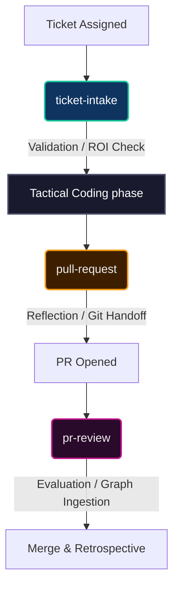

# Progressive Disclosure Skills

The Neo Agent OS utilizes a **Progressive Disclosure** pattern for agent skills. Instead of
loading every possible instruction set into the master system prompt (which consumes
massive amounts of context window tokens and dilutes agent focus), skills are
lazy-loaded into the context window exactly when they are needed.

For the overall platform topology, see [Architecture Overview](../benefits/ArchitectureOverview.md).
For the agent delegation model, see [Swarm Intelligence](./SwarmIntelligence.md).
For the canonical skill-anatomy contract (frontmatter shape, Map vs Atlas decomposition, manifest contract, anti-patterns), see [ADR 0008: SKILL.md Anatomy and Authoring Contract](./decisions/0008-skill-anatomy-and-authoring-contract.md).

## Token Economics

The primary driver for the Progressive Disclosure pattern is **System Prompt Budgeting**.

LLM reasoning degrades as the context window fills up (the "lost in the middle"
phenomenon). If an agent is tasked with a simple CSS fix, it does not need the
4,000-token `pull-request` execution guide or the `neural-link` tactical debugging
sequences in its prompt.

By deferring specialized procedural knowledge into standalone Markdown files
(`.agents/skills/*/SKILL.md`), we keep the root `AGENTS.md` system prompt lean.
The root prompt outlines the *rules of engagement*, while the skills provide the
*tactical implementation manuals*.

## The Progressive Disclosure Pattern

A skill in the Neo Agent OS is a directory containing instructional context.
The contract for a skill is simple:

1. **`SKILL.md` (Mandatory):** The entry point. It must contain YAML frontmatter
   with a `name` and `description` (which serves as the primary cross-harness router by outlining the invocation contract and purpose),
   followed by standard Markdown instructions.
2. **`references/` (Optional):** Deeper architectural documentation or procedural
   steps linked from the main `SKILL.md`.
3. **`assets/` (Optional):** Templates, Markdown snippets, or structural files the
   skill relies on.

When an agent encounters a trigger scenario (e.g., "Open a Pull Request"), it uses
the `view_file` tool to read the `SKILL.md`, absorbs the temporary context, and
executes the procedural knowledge.

## How Skills Compose with AGENTS.md

The root system prompt (`AGENTS.md`) and the skills layer are symbiotic:
- **`AGENTS.md`** contains the *Mandates*. It tells the agent *when* a behavior is
  required (e.g., "You MUST use the `pull-request` skill to open a PR. You are forbidden
  from running `gh pr create` raw.").
- **The Skill** contains the *How*. It provides the precise Git branch naming
  conventions, the "Stepping Back" reflection protocol, and the exact CLI arguments.

## The Lifecycle Triad

Three primary skills form the backbone of the Agent OS issue lifecycle. They act as
strict architectural gates that prevent context-blind execution and topological regression.

### 1. `ticket-intake` (The Pre-Execution Reflection Gate)
Invoked immediately upon picking up a ticket, before any code is written.
- **Validation Sweep:** Forces the agent to ensure the ticket has enough architectural context to be actionable.
- **ROI/Negative ROI Calculation:** An agent must consider if solving the ticket introduces tech debt or violates Neo's engine and organism philosophy.
- **Rejection Protocol:** If a ticket is fatally flawed, the agent applies a `status: needs-re-triage` label, suspending it gracefully rather than hallucinating bad code.

### 2. `pull-request` (The Post-Implementation Gate)
Invoked when terminating a task.
- **"Stepping Back" Reflection:** Forces the agent to transition from tactical coding to architectural reflection, identifying missing JSDoc or unit tests before committing.
- **Branch Mandate:** Enforces strict naming conventions.
- **State Handoff:** Defines the exact sequence to open the PR and signal completion to the Orchestrator.

### 3. `pr-review` (The Quality Gate)
Invoked when evaluating a PR (either peer-reviewing another agent or guiding a human).
- **Evaluation Metrics:** Quantifies quality across 7 dimensions (e.g., `[ARCH_ALIGNMENT]`, `[EXECUTION_QUALITY]`).
- **Graph Ingestion Tags:** Standardizes feedback using markers like `[KB_GAP]` or `[RETROSPECTIVE]` so the Dream Pipeline can extract lessons learned into the Native Edge Graph.
- **Budgeted Review Closure:** Post-cutover PRs get at most two ordinary `CHANGES_REQUESTED` reviews; after RC2, convergence continues through a `COMMENTED` closure packet, approval/polish, guarded Approve+Follow-Up, or one validator-complete terminal Drop+Supersede. Discussion size remains cost telemetry, never a scope classifier.
- **LGTM/Required Actions:** Ensures every review resolves in a clear state.
- **Review Intake Guard:** Pairs with `post-review-pickup` so a fresh session checks for an author lane before entering review-only mode, unless a review-first rationale applies.
- **Prior-art sweep gate:** Before scoring, a cheap 3–10-call Memory Core sweep (`memory-mining`) of the PR's decision space — a prior session may have settled the shape or an ADR may already govern it. PR-review is V-B-A's last line of defense, where CI-green ≠ AC-met (per `AGENTS.md` §verify_before_assert).

### 4. `ticket-create` (The Creation Gate)
Invoked before filing any new GitHub Issue via the `create_issue` MCP tool. Creation-side dual of `ticket-intake` — they address opposite triggers (produce new vs. consume existing).
- **Duplicate Sweep:** Mandates a pre-creation scan of `resources/content/issues/`, `issue-archive/`, and `discussions/` to prevent Knowledge Base pollution.
- **Six-Stage Challenge Chain:** Applies Premise / Prescription / Substrate / Consumer / Service-Boundary / Decision Record impact before drafting a ticket.
- **Fat Ticket Body Structure:** Enforces Context / Problem / Architectural Reality / Fix / AC / Out of Scope / Related / Origin Session ID as the A2A memory shape.
- **Title Hygiene & Label Rules:** Rejects `[enhancement]` / `[bug]` / `[epic]` title prefixes (category lives in labels); mandates `ai` label on every agent-authored ticket.

## Tactical & Creative Skills

Beyond lifecycle governance, specialized contexts exist for live action:

- **`tech-debt-radar`:** A proactive architectural review skill using Frontier Model semantic RAG to sweep historical issues and Memory Core sessions for technical debt. Actively invoked during `ticket-intake` and `pr-review` (especially for fundamental architectural shifts).
- **`neural-link`:** A tactical manual mapping how to sequence the Neural Link MCP
  tools (e.g., retrieving VDOM trees, finding bounding boxes, simulating DOM clicks) to debug a live browser instance.
- **`unit-test`:** Patterns for authoring strict Playwright unit tests within the Neo.mjs single-thread architecture.
- **`self-repair`:** A strict diagnostic protocol ensuring infrastructure verification across MCP services, Unit Testing, and Historical Forensics using Memory Core states to resolve system lockups.
- **`debugging-antigravity`:** Antigravity 2.x MCP-authority selection, process-duplication forensics, UI-profile boundary checks, and evidence-first sqlite workspace recovery.
- **`ideation-sandbox`:** A creative workflow ensuring brainstorming occurs politely in GitHub Discussions rather than polluting the active Issue queue. Also acts as an auto-fire trigger for high-blast-radius proposals.
- **`context-recovery`:** A post-compaction recovery workflow that reconstructs active lane state from Memory Core recency, semantic recall, session rollups, and A2A before the agent resumes or asks for operator recap.
- **`lane-intent`:** A narrow, non-authoritative, 2-hour TTL-bound pre-V-B-A signal for collision-prone / high-blast / long-V-B-A lanes (deep `/memory-mining`, `/tech-debt-radar`, multi-turn architectural V-B-A). Distinct from authoritative `[lane-claim]` (post-V-B-A); read before broadcasting `[lane-intent]` to confirm scope-trigger qualifies.
- **`neo-identity-update`:** The protocol for updating Neo's identity (what Neo *is*) coherently across all ~30+ surfaces that encode it — README, VISION, learn/benefits, package.json, GitHub metadata, portal app, and the build-generated SEO files. Splits FACTS (single-source-derive), FRAMING (audience-segmented against a canonical apex), and ACTIONS / CTAs (governed next-step surfaces). Foundation: ADR 0018.
- **`guide-authoring`:** The per-sub enforcement vehicle for the `learn/` guide quality bar. Mandates the grounding discipline (memory-mine + use-the-subsystem's-tools before the first sentence), the rich-hero-piece narrative + industry-friction + benefits + lived-voice content bar (measured against the v13.0.0 release notes), render-verified TD Mermaid, conceptual-vs-reference separation (Diátaxis), the never-hand-edit-generated-files rule, and a no-rubber-stamp reviewer gate. Born from the MemoryCore/KnowledgeBase redo-loop.

## The Meta-Skill: Adding New Skills

The ecosystem is self-extending via the **`create-skill`** meta-skill.
When the swarm identifies a repeating failure mode or a complex recurring task,
an agent can use `create-skill` to bootstrap a new progressive disclosure package or modify an existing one,
ensuring the YAML frontmatter and folder consistency are perfectly formed.

## Skill Inventory

| Skill | Type | Purpose |
|---|---|---|
| `ticket-intake` | Lifecycle | Pre-execution validation gate for existing tickets |
| `ticket-create` | Lifecycle | Pre-creation discipline gate (duplicate sweep, six-stage challenge chain, Fat Ticket body, title/label rules, custom Playwright configs) |
| `goal-scoping` | Lifecycle | Scope a GOAL into a few coherent owned LANES — the planning front-end of the epic lifecycle (goal→lanes, not scrap tickets; peers self-select; the planner defines goal+lanes, never assigns) |
| `epic-create` | Lifecycle | Author Epic bodies (problem-scope + intended-solution; ACs in subs, not the body) |
| `epic-review` | Lifecycle | Pre-work six-stage gating chain for epics |
| `epic-resolution` | Lifecycle | Closeout protocol for parent epics (exit gate) |
| `update-roadmap` | Lifecycle | Post-release celebrate + plan-next-roadmap: cornerstones + rationale + explicit deferred set into a milestone with per-epic stewards (release-altitude analog of `epic-create`) |
| `blog-post` | Lifecycle | Public hero-piece authoring: narrative arc, source-every-external-claim (verify-before-assert), kill the three over-claim flavors (superlative / universal / misleading-fraction), mandatory cross-family review (blog sibling of the release-notes methodology) |
| `release-notes` | Lifecycle | Release notes as an EPIC with mining-driven iterations: multi-source scope derivation (the tracker lags shipped reality), per-arc Memory-Core mining, per-claim V-B-A, the precedent-SET quality bar — majors AND minors (hero chapters, named case studies with real timelines, War Stories, honest bounds, never downplay), and the publish.mjs flat-root staging lifecycle |
| `pull-request` | Lifecycle | Post-implementation reflection + PR creation (custom Playwright configs) |
| `pr-review` | Lifecycle | Structured quality evaluation & graph ingestion (mandatory ROI templates) |
| `post-review-pickup` | Lifecycle | Active lane selection after review/response and pre-review intake lane discovery when no author lane is active |
| `tech-debt-radar` | Lifecycle | Proactive semantic RAG sweeps for architectural debt |
| `structural-pre-flight` | Lifecycle | Pre-implementation directory-CHOICE discipline gate fired before authoring any new `.mjs` file (Stage 0 mechanical trigger; Stage 1 fast-path (sibling-file-lift pattern match) or full Pre-Flight) |
| `identity-firewall` | Security | The L2 Channel Separation and Prompt Firewall defense mechanisms |
| `hostile-content-quarantine` | Security | Incident playbook for externally-authored hostile content (astroturfing, spam, injection-bearing artifacts): detect markers, never engage, quarantined read, ingestion clock, moderation matrix + verification triangle |
| `neo-identity-update` | Tactical | Cross-surface Neo-identity coherence (facts, framing, actions; ADR 0018) |
| `neural-link` | Tactical | Live application inspection sequences |
| `unit-test` | Tactical | Custom Playwright test authoring patterns native to the single-thread layout |
| `self-repair` | Tactical | Systemic infrastructure diagnosis, test execution, and memory core forensics |
| `debugging-antigravity` | Tactical | Antigravity 2.x MCP authority, duplication forensics, and UI-state recovery |
| `context-recovery` | Tactical | Post-compaction lane reconstruction from Memory Core recency, semantic recall, session rollups, and A2A |
| `whitebox-e2e` | Tactical | Neural Link pre-flight workflow for authoring custom Playwright E2E tests |
| `ideation-sandbox` | Creative | GitHub Discussion brainstorming |
| `lead-role` | Coordination | Suspends Auto Mode bias; mandates dialogue-first convergence for delegated lead tasks (Mailbox Check Protocol supported) |
| `peer-role` | Coordination | Suspends Auto Mode bias; mandates evidence-backed convergence-pressure mindset for peer reviews |
| `peer-naming` | Coordination | Social Name ritual (#11240 Layer 4): peer-sketched → criterion-audited → bearer-assented → peer-unvetoed → operator-confirmed; name ≠ handle |
| `lane-intent` | Coordination | Narrow, non-authoritative, 2h TTL-bound pre-V-B-A signal for collision-prone / long-V-B-A lanes; distinct from authoritative `[lane-claim]` |
| `post-review-pickup` | Coordination | Mandatory active lane selection at ANY PR-lifecycle event boundary (review post / author response / post-impl / post-PR-open-update / post-ticket-create / post-blocked-resolution); requires explicit `lane-state: next-lane` declaration per §15.6 |
| `create-skill` | Meta | Skill authoring bootstrap guide |

## Related Guides

- [Core Agent Skills](./CoreSkills.md) — Why the core lifecycle and collaboration
  skills matter for a maintainable agent team.
- [Swarm Intelligence](./SwarmIntelligence.md) — Autonomous sub-agent delegation
- [Strategic Workflows](./StrategicWorkflows.md) — How multiple skills chain together in practice
- [The Dream Pipeline & Golden Path](./DreamPipeline.md) — How issue lifecycle outcomes are forecasted
