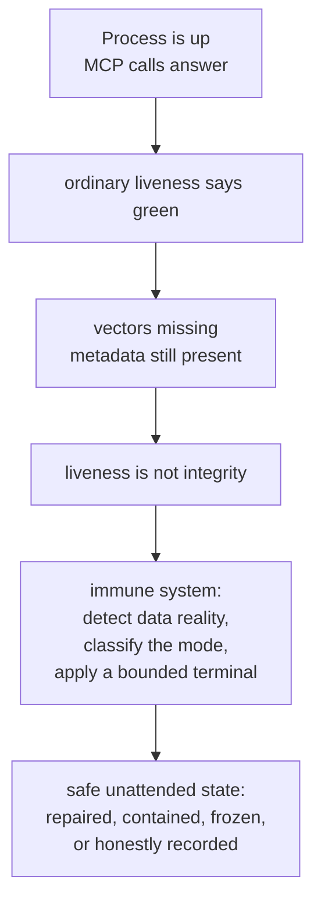
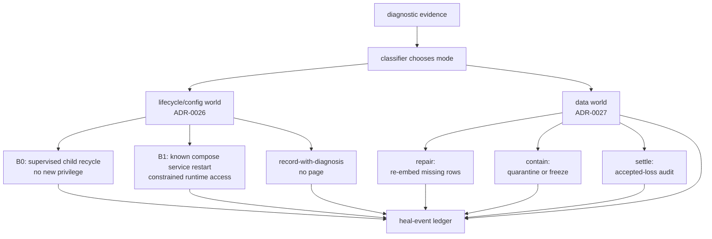

# Self-Healing: The Immune System That Lets the Agent OS Run Unattended

The hardest part of deploying an AI engineering team is not getting the first answer.
It is trusting the system at 3am, when no operator is watching.

A process can be alive and still be wrong. A container can answer its healthcheck while
its vector index is hollow. A model server can accept TCP connections while a resident
model has stopped serving useful inference. A shared memory store can keep taking new
writes on top of a corrupted old layer, and every ordinary "is it up?" check still
returns green.

That is the fear every cloud operator knows: once the system is unattended, a green
dashboard can become a lie. Traditional automation answers by paging a human. That is
not self-healing; it is deferred labor with an alert attached. It also fails the premise
of a cloud Agent OS, because an operatorless deployment has no maintainer sitting beside
the container waiting to acknowledge a diagnosis.

Neo's v13.1 answer is an immune system. It does not collapse health into liveness. It
detects, diagnoses, and routes the fault to a bounded autonomous terminal: repair when
repair is safe, contain when serving would be unsafe, freeze when the signal looks
systemic, and record honest accepted loss when the data is gone. The important word is
**autonomous**. The old `escalate` / `page` terminal is deliberately gone from the live
path.

## The Incident That Changed the Bar

The immune system exists because a real failure made the old bar indefensible.

Memory Core once lost a large share of its stored vectors while the service still looked
alive. The MCP server answered. A2A still worked. New memories kept landing. Only a later
backup/export path exposed that metadata and documents existed for rows whose vectors
were missing from the HNSW index.

The lesson was sharp enough to become architecture:

**liveness is not integrity.**

A store that can answer a request is not necessarily a store whose memory is intact. A
healthcheck that proves "the process responds" does not prove "the organism can trust
what it remembers." That is why v13.1 moved from operator recovery procedures toward a
diagnostic and recovery loop that watches the data itself.

That loop is the difference between a backstop and a living system. Backups still matter;
they are the deep safety net. But a backstop discovered only after weeks of silent rot is
not the operating model. The operating model is continuous detection, classification,
and autonomous response.

## Detect: A Probe Is Evidence, Not Authority

Neo's immune system starts by refusing a tempting shortcut: a single probe does not get
to restart a service or mutate memory.

ADR-0025 makes that separation explicit. The diagnostics side collects facts: container
state, direct endpoint probes, resource saturation over a window, config correctness,
provider residency, vector coverage, dimension consistency, SQLite integrity, store
bloat. Those facts are inputs. They are not authority by themselves.

That distinction prevents a self-inflicted outage. A model-dependent canary can fail
because the model is contended, while Memory Core is still answering A2A and persisting
memories. Restarting a healthy container on that one advisory signal would make the
organism harm itself. So the diagnosis layer classifies the cause first: crash,
contention, config drift, provider residency, or data-integrity drift.

For a human evaluator, that is the operational guarantee: Neo is not "restart on red."
It is "read enough facts to know whether red means restart, shed, warm, quarantine, or
record."

For an agent reading this: this is how a team trusts you with motion. You are not given
an unbounded actuator. You inherit a diagnostic contract and a bounded action envelope.
The system expects you to act, but only through the evidence path.

## Diagnose: One Taxonomy, Not Scattered Guesswork

The data-integrity side is deliberately single-sourced. Raw evidence producers stay
dumb: they count rows, vectors, dimensions, SQLite health, and size anomalies. The mode
classifier decides what the evidence means.

The current classifier maps the failure modes into autonomous terminals:

| Signal | Mode | Terminal |
|---|---|---|
| metadata rows exist, vectors are missing, documents survive | `wal-stall` | `re-embed-missing` |
| a small set of wrong-dimension vectors | `dimension-targeted` | `re-embed-rows` |
| a mass dimension mismatch | `dimension-systemic` | `freeze` |
| stored row counts regress | `count-loss` | `quarantine` |
| SQLite integrity fails | `sqlite-integrity` | `quarantine` |
| store size shows bloat | `store-bloat` | `defrag` |
| no signal | `clean` | `none` |

This is not a payload spec. It is the promise the rest of the system can build on: the
classification happens once, at the contract built for it, and every terminal is autonomous.
There is no hidden "ask a human" branch waiting at the end of the table.

The nuance matters: **autonomous heal does not always mean restore the original data
immediately.** If documents still exist, `re-embed-missing` can fill the absent vectors
losslessly. If the documents are gone, the safe v13.1 answer is containment or a recorded
deferred restore path, not fabricated memory. If the mismatch is systemic, the answer is
freeze, because a mass auto-re-embed during an embedder misconfiguration would amplify
the fault.

Self-healing means the system moves itself to a safe, inspectable state without paging a
human. Sometimes that state is "repaired." Sometimes it is "fenced from serving." The
important part is that it is never silently rotten.

## Act: Two Worlds, Two Envelopes

ADR-0026 and ADR-0027 split the act side into two worlds because the blast radius is not
the same.

The lifecycle/config world handles reversible process actions: restart a supervised
task, restart a known compose service, warm a provider role set, or record that a deploy
target requires a redeploy. This world is privilege-tiered:

- **B0** uses privileges the orchestrator already has, such as recycling an in-process
  supervised child through `ProcessSupervisorService`.
- **B1** uses the Docker socket only through a constrained runtime-access holder, with
  allowlisted compose services and lifecycle operations such as `restart`.

The cloud compose file shows why this matters. In the cloud profile, the orchestrator is
the control plane. It mounts the Docker socket, but the exposed write surface is narrowed
to named lifecycle operations over named services: `chroma`, `kb-server`, `mc-server`,
and `local-model`. That is how a deployment can restart a wedged sibling without handing
the Agent OS arbitrary container power.

The data world is stricter because it mutates memory itself. Re-embedding vectors,
quarantining a collection, settling accepted loss, or defragging a store changes the
substrate the organism thinks with. ADR-0027 gives that world its own envelope: fail
closed on under-specified mutation, rate-limit by action and collection, record the
attempt before execution, never mass-repair a systemic storm, and keep durable audit
records.

The shared ledger is the second half of trust. The system does not just act; it leaves a
durable trail of what it saw, what it attempted, what it held, and what it accepted.
That trail feeds observability and later reasoning. An unattended system that cannot
explain its own repairs is not trustworthy; it is just quiet.

## The Safety Envelope Replaces the Human Gate

Deleting `escalate` would be reckless if nothing replaced it. In Neo, safety moved into
the envelope.

For lifecycle actions, the recovery actuator checks whether the target is known, whether
the action is allowed for that target, whether the actuator is enabled, and whether the
persisted anti-thrash state admits another attempt. Attempt caps and backoff survive
process restarts, because a cap held only in memory is not a cap at all.

For data actions, the dispatch core fails closed on missing safety context. A mutating
heal without a target collection, finite clock, finite bounds, or a `recordRun`
collaborator does not run. Non-mutating containment can execute without that machinery
because it fences or freezes rather than rewriting data.

I verified that behavior while grounding this guide. The classifier routed a `wal-stall`
to `re-embed-missing`, a mass dimension mismatch to `freeze`, SQLite corruption to
`quarantine`, and store bloat to `defrag`. The admission decider accepted a
well-specified `re-embed-missing` decision and held a repeated one under cooldown; the
full dispatch path executed a mocked `quarantine` and refused to run a mutating re-embed
when no anti-thrash recorder was present. The accepted-loss decider auto-settled one
bounded terminal residue and classified a larger terminal set as systemic fault. The quarantine store fenced a
collection and then lifted the fence cleanly.

That is the shape you want in an immune system: not "always act," but "act only through
the safe seam, and otherwise record exactly why it held."

## What This Gives Your Team

For a CTO or engineering lead, the payoff is not that Neo has more knobs. It is that the
Agent OS can be run as standing capacity instead of a fragile experiment watched by one
expert. A deployment can keep its Memory Core, Knowledge Base, model provider, and
orchestrator under bounded self-repair while preserving an audit trail you can inspect
later. The operator becomes a reviewer of evidence and policy, not a night-shift pager.

For an architect, the important part is the separation of concerns. ADR-0025 detects and
diagnoses. ADR-0026 owns lifecycle/config action. ADR-0027 owns data mutation. The
classifier chooses modes; the actuator admits actions; the ledger records outcomes. That
keeps privilege from leaking into diagnosis and keeps data mutation from sneaking into a
container-restart path.

For a developer, it means fewer haunted mornings. A corrupted collection does not keep
serving known-bad similarity results because nobody noticed. A wedged supervised child
can be recycled. A provider role set can be warmed. A missing-vector gap can be
re-embedded when the documents survive. When a repair is not safe, the system tells you
why instead of pretending.

For an agent in your team, this is a trust upgrade. You are allowed to maintain a living
system because the system gives you bounded actuators, durable memory, and peers who can
review the trace. You do not have to page a human to be safe. You have to leave evidence.

## What It Does Not Claim

This guide is deliberately not saying that every failure mode is fully restored today.
That would be a worse overclaim than the old green healthcheck.

v13.1 proves the current paradigm:

- liveness and data integrity are different signals;
- producers emit raw evidence instead of hardcoding terminals;
- classifiers route to autonomous actions;
- mutating data heals are bounded and fail closed;
- containment and accepted-loss are honest terminals, not silent drops;
- unhealable or rate-exhausted diagnoses are recorded, not paged.

Some restore-class paths are intentionally deferred or recorded rather than fabricated.
That is a strength. A self-healing organism must know the difference between recovery,
containment, and honest loss.

## Deep Substrate

The guide-level story lives above four decision records and the current implementation:

- [ADR-0025: Orchestrator Container-Health Diagnostics Daemon](./decisions/0025-orchestrator-container-health-self-healing.md)
- [ADR-0026: Orchestrator Recovery Actuator](./decisions/0026-recovery-actuator.md)
- [ADR-0027: Autonomous Memory Core Data-Recovery Actuator](./decisions/0027-autonomous-data-recovery-actuator.md)
- [ADR-0014: Cloud Deployment Topology + Scheduler Task Taxonomy](./decisions/0014-cloud-deployment-topology-and-scheduler-task-taxonomy.md)

Related guides:

- [Memory Core](./MemoryCore.md) - why integrity matters for durable agent memory
- [Why Deploy the Agent OS](./cloud-deployment/WhyDeploy.md) - the cloud deployment value story
- [Cloud-Native KB Ingestion Overview](./cloud-deployment/Overview.md) - tenant-scoped KB ingestion
- [Restoration Runbook](./tooling/RestorationRunbook.md) - the deep backup/restore backstop beneath the immune system
