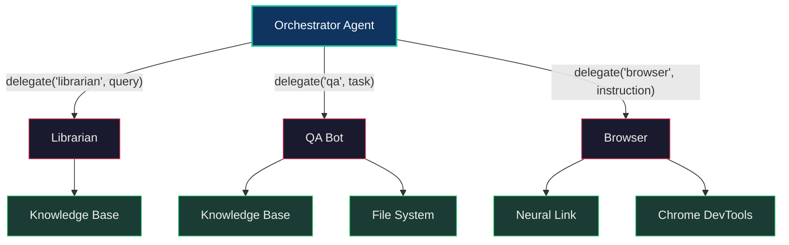
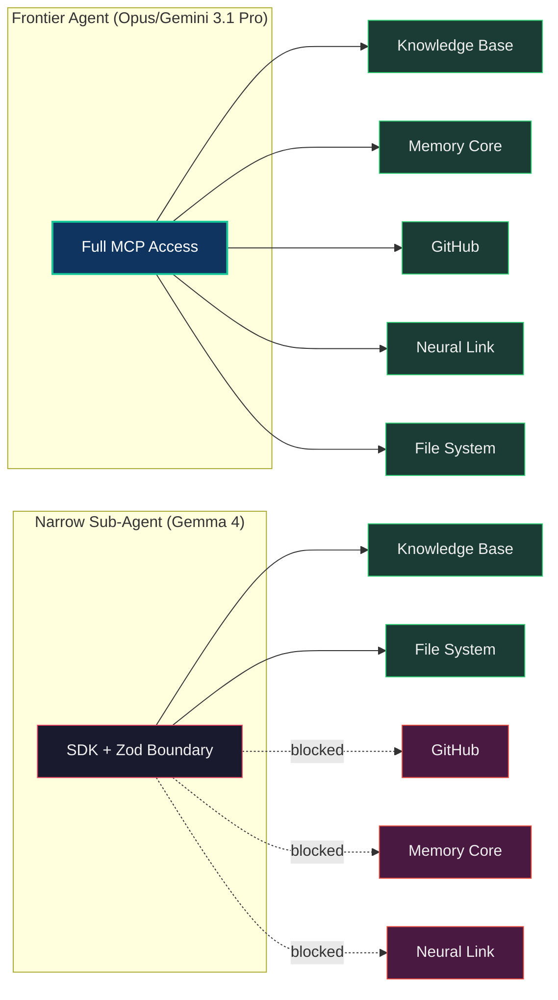
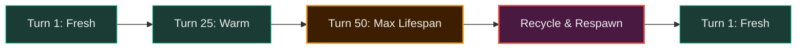
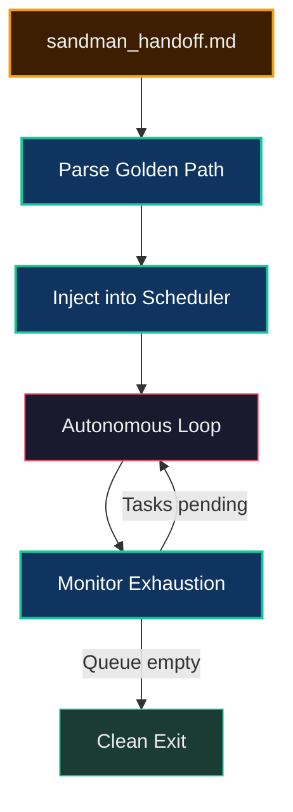

# Swarm Intelligence & Autonomous Sub-Agents

This guide describes how the Neo.mjs Agent OS delegates work to **narrow, specialized
sub-agents** — each with constrained tool access, its own model tier, and a dedicated
cognitive loop. The Orchestrator does not do everything itself. It spawns ephemeral
experts, harvests their output, and recycles them when their context window fills up.

For the overall platform topology (Runtime Engine, MCP servers, Dream Pipeline), see
[Architecture Overview](../benefits/ArchitectureOverview.md).

## The Delegation Model

Every `Neo.ai.Agent` instance carries a registry of sub-agent profiles. When the
cognitive loop encounters a task that falls outside its own tool access — or when a
cheaper model can handle the job — it calls `delegate()`:



The delegation is **not** a simple function call. It boots a full `Neo.ai.Agent`
instance with its own cognitive loop, provider, and MCP client connections. The
sub-agent runs through the same Perceive → Reason → Act → Reflect cycle as the
parent, then returns its synthesis.

### The delegate() Lifecycle

```javascript
// Inside the parent agent's cognitive loop:
const result = await this.agent.delegate('librarian', 'Research the Grid selection model');
```

1. **Lookup:** The parent agent resolves the profile name to a lazy-loaded class
   via the `subAgents` config registry.
2. **Boot or Reuse:** If no active instance exists for that profile, a fresh one is
   created via `Neo.create(ProfileClass)` and `initAsync()`. If one already exists
   and hasn't exceeded its lifespan, it's reused.
3. **Execute:** The sub-agent's loop processes the query through its own cognitive
   pipeline, using only the MCP servers declared in its `servers` config.
4. **Return:** The sub-agent's final text response is returned to the parent loop
   as a tool result, where it's injected into the next LLM reasoning turn.
5. **Recycle:** After `maxSubAgentLifespan` turns (default: 50), the sub-agent is
   automatically disconnected and destroyed. The next delegation spawns a fresh
   instance with a clean context window.

## The Three Profiles

Each profile is a thin `Neo.ai.Agent` subclass that configures three things:
a model provider, a server list, and a system prompt.

### Librarian

```
ai/agent/profile/Librarian.mjs
```

| Property | Value |
|---|---|
| **Model** | Gemini (default) or Ollama/Gemma for offline swarms |
| **Servers** | `knowledge-base` |
| **Role** | GraphRAG research — navigates the topological knowledge graph |

The Librarian is the **research specialist**. It has access to `ask_knowledge_base`,
`query_documents`, and the class hierarchy tools, but cannot modify files, create
issues, or touch the live application. Its narrow scope means it can only read and
synthesize — never act destructively.

When the parent agent encounters a question about Neo.mjs architecture, API patterns,
or historical decisions, it delegates to the Librarian rather than attempting to
answer from its own (potentially stale) training data.

### QA Bot

```
ai/agent/profile/QA.mjs
```

| Property | Value |
|---|---|
| **Model** | Ollama / Gemma 4 (local inference) |
| **Servers** | `knowledge-base`, `file-system` |
| **Role** | Automated test generation and validation |

The QA Bot is the **cost-optimized testing engine**. It runs on a local Gemma model
via Ollama, which means zero API token cost per test generation cycle. Its system
prompt contains the complete Neo.mjs unit testing ruleset — the single-thread
simulation setup, `Neo.create()` patterns, `initVnode()` mounting, and delta-based
assertion methodology.

The QA Bot can read source code (via file-system) and query the knowledge base for
class APIs, but it cannot create GitHub issues, access the browser, or modify the
codebase directly. Its output is always a **proposed test file** that the parent
agent or human reviews before committing.

### Browser

```
ai/agent/profile/Browser.mjs
```

| Property | Value |
|---|---|
| **Model** | Gemini |
| **Servers** | `chrome-devtools`, `neural-link` |
| **Role** | Visual telemetry and live component inspection |

The Browser agent is the **eyes** of the swarm. It connects to the running
application through the Neural Link WebSocket bridge and can:

- Traverse the semantic component tree
- Read computed styles and DOM rectangles
- Inspect state providers and store data
- Simulate DOM events (clicks, keyboard input)
- Hot-patch methods on class prototypes at runtime

It has no access to the filesystem, GitHub, or memory core. It exists purely to
observe and manipulate the live application state.

## Capability Gating

The swarm architecture enforces safety through two complementary mechanisms:

### 1. Server-Level Isolation

Each profile declares exactly which MCP servers it connects to via the `servers`
config array. The `initAsync()` method only boots `Client` instances for those
servers. A Librarian physically cannot call `create_issue` because it has no
connection to the GitHub Workflow server.



### 2. The SDK Bouncer (Zod Validation)

When sub-agents access services via the Node.js SDK (`ai/services.mjs`), every
method call passes through a Zod validator generated from the OpenAPI spec
at startup. This prevents hallucinated JSON payloads from reaching internal
databases — even if a sub-agent somehow constructs a malformed tool call,
the Zod schema rejects it before execution.

Frontier models (Claude Opus, Gemini 3.1 Pro) access the same services via
MCP protocol (stdio) with unbounded tool access. The distinction is intentional:
frontier models have the reasoning capability to self-correct; narrow models need
the guardrails.

## Cost Control: Local vs. Cloud

The swarm architecture is designed to minimize API costs:

| Agent | Model Tier | Inference Location | Cost Profile |
|---|---|---|---|
| **Orchestrator** | Frontier (Gemini 3.1 Pro) | Cloud API | Per-token billing |
| **Librarian** | Frontier or Local | Configurable | Flexible |
| **QA Bot** | Local (Gemma 4-31B) | Ollama on-device | Zero marginal cost |
| **Browser** | Frontier | Cloud API | Per-token billing |

The QA Bot defaults to local inference because test generation is a high-volume,
lower-stakes task. Generating 50 test cases locally costs nothing. The Librarian
can also be swapped to local inference for offline development.

This tiered model allows the swarm to scale test coverage and documentation
without proportionally scaling API costs.

## Sub-Agent Training & RLAIF (Demonstrations of Intelligence)

While the Orchestrator delegates tasks live, the `nl_action_log` captured during **Frontier agent** (e.g., Gemini 3.1 Pro / Claude Opus) interactions via the Neural Link represents highly valuable "Demonstrations of Intelligence".

Instead of treating these interactions as ephemeral, they are extracted into format-compliant `.jsonl` datasets for Reinforcement Learning from AI Feedback (RLAIF). The intelligence of the Frontier models is stockpiled to feed future SLM fine-tuning pipelines (SFT/DPO), directly raising the baseline capability of the local Sub-Agent tiers (like Gemma 4).

To harvest the most recent telemetry:
```bash
npm run ai:analyze-nl-telemetry -- <sessionId> --save
```

This invokes `ai/scripts/analyzeNlTelemetry.mjs`. The offline script parses the episodic memory from `memory-core.sqlite`, filters for structured DOM manipulation and state assertions engineered by Frontier models, and exports it into `.neo-ai-data/datasets/rlaif/trajectories.jsonl`.

## Context Window Management

Sub-agents have finite context windows. The `maxSubAgentLifespan` config
(default: 50 turns) prevents context degradation:



When a sub-agent reaches its turn limit, the next `delegate()` call:
1. Disconnects all MCP clients
2. Destroys the agent instance
3. Boots a fresh instance with a clean context

This ensures sub-agents never operate in a degraded state where accumulated
context noise causes hallucinations or reasoning failures.

## The delegate_task Native Tool

The cognitive loop automatically registers a native `delegate_task` tool
during initialization. This tool is available to the LLM alongside all
MCP-discovered tools:

```json
{
  "name": "delegate_task",
  "description": "Delegates a complex task or query to a specialized sub-agent expert.",
  "inputSchema": {
    "type": "object",
    "properties": {
      "agent": {
        "type": "string",
        "description": "The sub-agent profile name (e.g. 'librarian', 'browser')."
      },
      "query": {
        "type": "string",
        "description": "The task or question to delegate."
      }
    },
    "required": ["agent", "query"]
  }
}
```

The LLM decides autonomously when to delegate. It sees `delegate_task` as just
another tool in its toolbox. When it calls `delegate_task({agent: 'librarian', query: '...'})`
, the Loop routes it to `this.agent.delegate()`, which handles the full sub-agent
lifecycle.

## The Event Scheduler

The **autonomous (unattended) runner** feeds its work through the `Scheduler` — a priority
queue that ensures critical events are processed before lower-priority ones. (Interactive peer
maintainers self-select work directly — see [Architecture Overview](../benefits/ArchitectureOverview.md)
and [The Dream Pipeline](./DreamPipeline.md); the `Scheduler` is the unattended runner's intake,
not a universal work source.)

| Priority | Event Types | Example |
|---|---|---|
| **critical** | `error`, `crash` | Runtime exception recovery |
| **high** | `user`, `prompt` | User input, Golden Path directives |
| **normal** | Default | Standard task processing |
| **low** | `telemetry`, `log` | Background observation |

The Orchestrator populates the scheduler by parsing `sandman_handoff.md` — the
strategic dashboard produced by the DreamService. Each Golden Path directive
becomes a `system:golden-path` event with `high` priority.

## The Orchestration Pipeline

The `Orchestrator` is the **unattended autonomous-runner** path — one advisory consumer of the
handoff (peer maintainers self-select interactively). It reads the DreamService's prioritized
roadmap and feeds it into the autonomous agent loop:



1. **Parse:** The Orchestrator reads `sandman_handoff.md` and extracts the
   `## Computed Golden Path` section using semantic regex.
2. **Boot:** Creates an `Agent` instance connected to `knowledge-base`,
   `file-system`, and `github-workflow`.
3. **Inject:** Each directive becomes a high-priority scheduler event.
4. **Run:** The agent loop processes events autonomously, delegating to
   sub-agents as needed.
5. **Exhaust:** A monitor interval checks the scheduler queue. When empty
   and no sub-agents are active, the orchestrator exits cleanly.

## Adding New Profiles

To add a new sub-agent profile:

1. Create a new file in `ai/agent/profile/` extending `Agent`:
   ```javascript
   import Agent from '../../Agent.mjs';

   class Documenter extends Agent {
       static config = {
           className: 'Neo.ai.agent.profile.Documenter',
           modelProvider: 'ollama',
           model: 'gemma4',
           servers: ['knowledge-base', 'file-system'],
           systemPrompt: 'You are the Documenter, a specialist in JSDoc and guide writing...'
       }
   }

   export default Neo.setupClass(Documenter);
   ```

2. Register it in the parent `Agent.mjs` config:
   ```javascript
   subAgents: {
       browser   : async () => (await import('./agent/profile/Browser.mjs')).default,
       documenter: async () => (await import('./agent/profile/Documenter.mjs')).default,
       librarian : async () => (await import('./agent/profile/Librarian.mjs')).default,
       qa        : async () => (await import('./agent/profile/QA.mjs')).default
   }
   ```

3. The LLM will automatically see it via `delegate_task` on the next boot.

## Structural Inventory

| File | Purpose |
|---|---|
| `ai/Agent.mjs` | Base class — manages MCP clients, sub-agent registry, delegation |
| `ai/agent/Loop.mjs` | Cognitive loop — Perceive/Reason/Act/Reflect + tool execution |
| `ai/agent/Scheduler.mjs` | Priority queue for event processing |
| `ai/agent/AgentOrchestrator.mjs` | Parses Golden Path, boots agent, monitors exhaustion |
| `ai/agent/profile/Librarian.mjs` | GraphRAG research specialist |
| `ai/agent/profile/QA.mjs` | Local test generation engine |
| `ai/agent/profile/Browser.mjs` | Visual telemetry via Neural Link |
| `ai/scripts/analyzeNlTelemetry.mjs` | Offline parser to convert sub-agent test sessions into RLAIF datasets |
| `ai/services.mjs` | SDK with Zod validation boundary |
| `ai/mcp/validation/OpenApiValidator.mjs` | Zod schema generator from OpenAPI specs |

## Related Guides

- [Architecture Overview](../benefits/ArchitectureOverview.md) — Platform-level topology
- [The Dream Pipeline & Golden Path](./DreamPipeline.md) — Forecasting engine and scoring algorithm
- [Progressive Disclosure Skills](./ProgressiveDisclosureSkills.md) — Lazy-loaded procedural architecture
- [Strategic Workflows](./StrategicWorkflows.md) — Agent workflow patterns
- [Code Execution (AI SDK)](./CodeExecution.md) — The SDK Bouncer in detail
- [Neural Link](./NeuralLink.md) — Deep dive into the browser bridge
