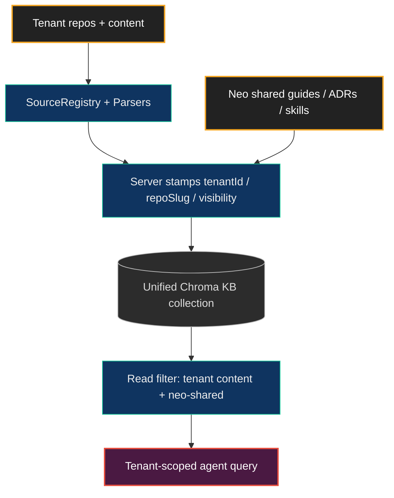

# Cloud-Native KB Ingestion — Overview

> **Status — Phase 3B operational substrate.** This guide describes the cloud-native Knowledge Base ingestion substrate (Epic #11624): tenant identity, ingestion contracts, server-side stamping, read-side filtering, and the Phase 2 push/bulk facades.

## What "cloud-native KB ingestion" means

Neo's Knowledge Base (KB) is a Chroma-backed vector index over source content — guides, ADRs, skills, API docs, tickets, PRs, test specs. In a single-repo deployment, the KB indexes exactly one repository: Neo's own.

A **cloud-native deployment** runs Agent OS as a service for external tenant workspaces. Each workspace is a distinct **tenant** with its own source content (its own repos, possibly in languages and layouts unlike Neo's). The cloud deployment must let every tenant ingest *its own* content into the KB while continuing to serve Neo's curated content (guides, ADRs, skills) to all tenants.

The substrate that makes this possible is the **per-tenant ingestion contract**: every chunk in the KB carries an authoritative identity tuple, content is server-stamped at write time, and reads are tenant-scoped. No tenant can read another tenant's `private` content; every tenant can read Neo's `team`-visible curated corpus.

Read this guide after [Why Deploy the Agent OS](./WhyDeploy.md), the
[Day-0 Tutorial](./Day0Tutorial.md), [Tenant Ingestion Model](./TenantIngestionModel.md),
[Configuration](./Configuration.md), and [Security](./Security.md). At that point
the reader already knows why the Brain exists, how to stand it up, and which
identity boundary protects it; this page explains the contract that keeps
arbitrary tenant content useful without letting it blur together.

## The contract split (Phase 0/1)

Phase 0/1 defines the data contracts cloud ingestion is built on. PRs #11647, #11659, #11661, and #11662 are merged:

| Contract | Ticket / PR | What it provides |
|---|---|---|
| `parsed-chunk-v1` schema | #11629 / PR #11647 | The ingest-side chunk shape every Source/Parser emits. Rejects records carrying an `embedding` field (that field belongs only to the restore-only `backup-record-v1` sibling). |
| Path-identity tuple | #11629 / PR #11647 | `{tenantId, repoSlug, rootKind, sourcePath}` in chunk metadata — replaces the legacy single-`neoRootDir`-relative `source` string. Neo's curated content uses `tenantId: 'neo-shared'`, `repoSlug: 'neo'`. |
| Deletion-signaling contract | #11629 / PR #11647 | Tombstone + manifest + revision-boundary mechanisms for propagating source deletions into the index. |
| `SourceRegistry` | #11658 / PR #11659 | Data-driven Source/Parser registration. `useDefaultSources` / `useDefaultParsers` gate Neo's curated sources; `customSources` / `customParsers` register tenant-supplied classes; `rawRepoSource` explicitly enables the built-in raw repo fallback. |
| Per-source path externalization | #11660 / PR #11661 | `aiConfig.sourcePaths` — each default Source class reads its input path from config, so a tenant whose layout differs from Neo's can reuse the curated Source classes. |
| Write-side tenant stamping | #11631 / PR #11662 | `VectorService.embed` server-stamps `{tenantId, repoSlug, visibility, originAgentIdentity}` from the authenticated ingestion context; client-supplied identity fields are overwritten or rejected. Tenant-aware Chroma IDs prevent byte-identical chunks from different tenants colliding. |

The split was deliberate: **contracts before transport**. The schemas and registry stabilized first; the Phase 2 ingestion endpoints were built against that frozen contract surface.

## Topology anchor — one unified Chroma store

A cloud deployment keeps all its vector data in **one** ChromaDB store named `unified`, with the same layout locally and in the cloud. A single Chroma daemon serves three collections — the Knowledge Base, your agents' memories, and their session summaries — and two MCP servers (Knowledge Base and Memory Core) read from it. Cloud ingestion only ever writes to the Knowledge Base collection.

The Memory Core's edge graph is **not** stored in Chroma — it lives in a separate SQLite database.

There is no separate Chroma instance per tenant. Every piece of content is tagged with its owner when it's written and filtered by owner when it's read, so each tenant sees its own content plus Neo's shared library — never another tenant's private data.

## Default-source inheritance

A zero-config Neo deployment behaves identically with or without the cloud-ingestion substrate: `useDefaultSources` defaults to `true`, `rawRepoSource` defaults to `false`, the `SourceRegistry` auto-registers Neo's 10 curated Source classes, and `aiConfig.sourcePaths` carries Neo's default layout. A cloud tenant opting out of Neo's curated content sets `useDefaultSources: false`; a tenant whose repo layout differs overrides only the `sourcePaths` keys it needs; a tenant with no known shape can opt into `rawRepoSource` as a day-0 fallback. Inheritance is the default; divergence is opt-in and granular.

## Registry contract split — Source vs Parser

- A **Source** locates and reads content from a territory (a directory tree, an external workspace) and emits knowledge chunks into the full-corpus build.
- A **Parser** transforms a specific file format into chunk content (e.g. a `.proto` parser, an ES5-aware parser).

`SourceRegistry` holds both. Neo's curated Sources auto-register; tenant Sources/Parsers register declaratively via `aiConfig.customSources` / `aiConfig.customParsers` or programmatically via `SourceRegistry.registerSource(...)`. The Phase 2 ingestion facades can invoke a registered Parser during an ingestion call; with no parser match, the raw-text fallback ingests the whole file as one chunk.

## Relationship to Neo's curated content

Neo's own guides, ADRs, skills, and API docs remain in the KB under `tenantId: 'neo-shared'`, `visibility: 'team'` — readable by every tenant. A cloud tenant's content is stamped with the tenant's own `tenantId` and a `visibility` of `team` (tenant-internal) or `private`. Read-side filtering (#11632) resolves each query against the requester's authenticated identity: a tenant sees its own content plus `neo-shared`, never another tenant's `private` chunks.

## Where to go next

- **[Security](./Security.md)** — tenant-isolation invariants, write-side stamping + spoof-rejection, parser-execution boundary framing, and the KB-as-cache vs MC-as-store recovery model.
- **[Day-0 Tutorial](./Day0Tutorial.md)** - linear PoC walkthrough for a fresh operator or agent: remote MCP healthcheck, MC/KB connection, tenant ingestion, client-side parsing, bulk path, and backup/redeploy handoff.
- **[llama.cpp Profile](./LlamaCppProfile.md)** - OpenAI-compatible cloud-provider profile for self-hosted llama.cpp, including chat+embedding residency and handoff smoke.
- **[Migration Path](./MigrationPath.md)** — how an existing single-repo Neo deployment upgrades to the cloud-ingestion substrate with zero config changes.
- **[Tenant Ingestion Model](./TenantIngestionModel.md)** — the operator-facing model for tenant repo identity, credential boundaries, parser dispatch, source-family inventory, and push-vs-bulk ingestion choices.
- **[Configuration](./Configuration.md)** — the `aiConfig` keys and the `KnowledgeBaseTenantConfig` / `kb-config.yaml` tenant-config storage.
- **[Custom Sources](./CustomSources.md)** / **[Custom Parsers](./CustomParsers.md)** — authoring a Source for the full-corpus build, or a Parser for the push path.
- **[Hook Wiring](./HookWiring.md)** — the `ingest_source_files` / `ai:ingest-tenant` facades and git-hook patterns; runnable companions live under [`ai/examples/cloud-deployment/`](../../../ai/examples/cloud-deployment/).
