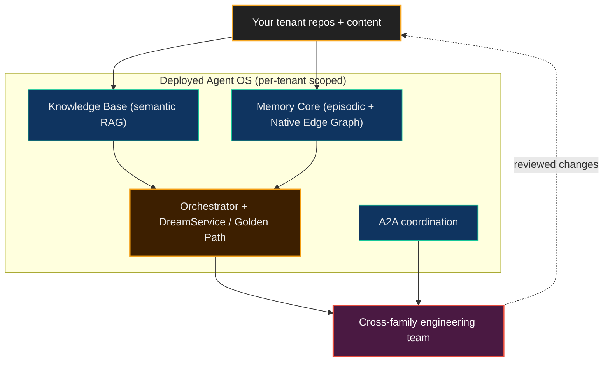

# Why Deploy the Agent OS

**Neo.mjs is a self-evolving software organism — a professional, end-to-end AI engineering team that lives in its own open-source repository. Deploying the Agent OS points that team at *your* codebase.**

Most AI coding tools hand you output and forget the context the moment the session ends. A deployed Agent OS gives you an **engineering team instead of an autocomplete**: a cross-model swarm — Claude, Gemini, GPT — that builds durable, queryable understanding of your code, reviews its own changes across rival model families before they land, runs [self-healing loops](../SelfHealing.md), and gets better at your system the longer it runs. It is the same [Brain](../../benefits/ArchitectureOverview.md) that maintains Neo in public today, now pointed at your repositories.

Concretely, a deployed Brain gives you:

- **Memory that compounds** — decisions, rationale, and prior fixes persist across sessions, so the team stops re-deriving what it already learned.
- **Cross-family review by default** — a change from one model family is checked by another before it merges, catching the self-authored blind spots a single agent shares with itself.
- **Self-directed prioritization** — the Dream Pipeline forecasts the highest-ROI work across your repos, so the backlog is ranked by the system, not just hand-fed.

The differentiated value is the [Brain](../../benefits/ArchitectureOverview.md), not a single agent — see [The Agent OS on Your Codebase](../../benefits/AgentOSOnYourCodebase.md) for what is proven today versus the portable trajectory.

## What gets deployed — the whole Brain, not just KB ingestion

A deployment is easy to mistake for "Knowledge Base ingestion" because that is the largest contract surface. It is one part. What actually stands up:

- **[Knowledge Base](../KnowledgeBase.md)** — semantic understanding of your code (the ingestion contracts dominate the guide surface, but they serve this).
- **[Memory Core](../MemoryCore.md) + Native Edge Graph** — persistent, cross-session memory and Active Hybrid GraphRAG over your system.
- **Orchestrator + [DreamService / Golden Path](../DreamPipeline.md)** — scheduling plus self-improvement forecasting and the [self-healing immune system](../SelfHealing.md) that lets the deployment run unattended.
- **A2A coordination** — the substrate that makes reviewed, multi-model work possible.

Tenant isolation is enforced by identity + write-stamping + read-filtering, not physical separation (see [Security](./Security.md) and [Tenant Ingestion Model](./TenantIngestionModel.md)).

## Recommended path (top-down)

This page is the hub for the cloud-deployment guide set. Read from the benefit
altitude down into the mechanics:

1. **[Deploying the Agent OS](../../benefits/DeployingTheAgentOS.md)** — the
   Brain-benefit entry point: why a team would point Neo at its own code.
2. **Why Deploy the Agent OS** — this hub: what actually stands up and why it is
   more than KB ingestion.
3. **[Day-0 Tutorial](./Day0Tutorial.md)** — the recommended first end-to-end
   deployment.
4. **[Tenant Ingestion Model](./TenantIngestionModel.md)** — how your content
   enters the Brain (the identity tuple + visibility).
5. **[Configuration](./Configuration.md)** — profiles and the knobs each
   deployment sets.
6. **[Security](./Security.md)** — tenant identity and visibility boundaries.
7. **[Cloud-Native KB Ingestion Overview](./Overview.md)** plus the contract /
   pipeline guides — the deep ingestion mechanics once the reader knows why the
   deployment exists.

## Boundaries

This is capability framing, not a product offer — it describes what the architecture makes possible. Cloud / multi-tenant deployment uses generic capability terms only (no specific client / partner naming). The honest split: Neo autonomously maintains *its own* repository in public today; the same Agent OS is being *shaped* to ingest, reason over, and help maintain other codebases — a trajectory, not a present-tense guarantee.

## Related

- [Deploying the Agent OS](../../benefits/DeployingTheAgentOS.md) — the benefit-altitude entry point
- [The Agent OS on Your Codebase](../../benefits/AgentOSOnYourCodebase.md) — proven-today vs. portable-trajectory boundaries
- [Architecture Overview: The Two Hemispheres](../../benefits/ArchitectureOverview.md)
- [Self-Healing Immune System](../SelfHealing.md) — why liveness is not integrity, and how the Brain recovers without paging a human
- [Cloud-Native KB Ingestion Overview](./Overview.md) — the deep ingestion mechanics
- [ADR 0018 — Neo Identity Source-of-Truth Model](../decisions/0018-neo-identity-source-of-truth-model.md)
