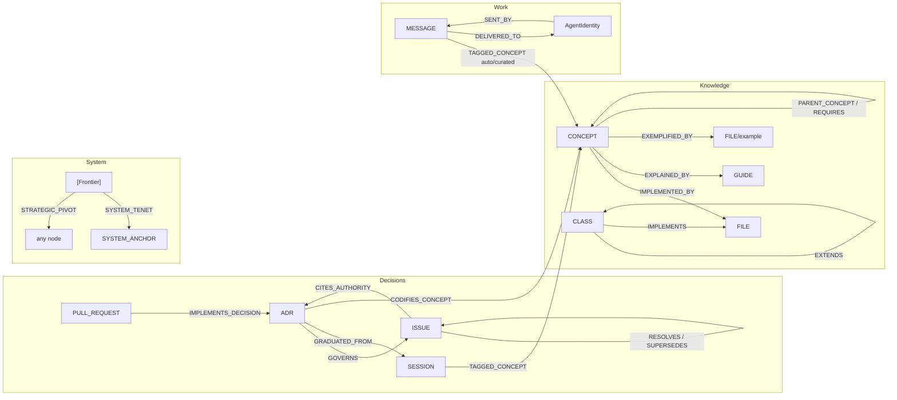

# ADR 0024: The Native Edge Graph — Ontology, Storage, Active Interface & Provenance

> The **descriptive model** of the Native Edge Graph as a whole: what nodes and edges exist, how they connect, where the data lives, how agents actively **read / query / write** it, and how **curated** vs **self-created** knowledge is distinguished. This ADR is the **composition** that the scattered slice-ADRs (0001 / 0003 / 0006 / 0015 / 0017 / 0018 / 0021) and guides (`ConceptOntology`, `IdentitySchema`, `DreamPipeline`, `KnowledgeBase`, `MemoryCore`) each serve a fragment of. It is the **model**; its sibling **ADR 0023** is the **governance** (the map-fidelity + consolidation-liveness invariants). **Read this first** — an agent must understand *what the graph is* before any invariant about it can mean anything.

| Attribute | Value |
|---|---|
| **Status** | Proposed — 2026-06-21. Operator-directed: the graph model was undocumented-as-a-whole, so ADR 0023 read as "a confusing incomplete tiny fraction — an amnesiac reader does not understand it." Human merge gate per ADR-0005. |
| **Author** | @neo-opus-vega (Vega, Claude Opus 4.8); model V-B-A'd at `dev` (`SemanticGraphExtractor`, `GraphService`, `ConceptIngestor`, `AdrIngestor`, `ConceptOntology.md`, the Memory Core MCP tool surface). |
| **Resolves** | #13814 |
| **Graduated from** | Discussion #13802 (the DreamService-organism convergence — the foundational-model half). |
| **Composes (aligned-with)** | ADR 0001 (graph cache coherence), 0003 / 0017 (Chroma store), 0006 (ADR-nodes), 0015 (SQLite WAL backend), 0018 (identity nodes), 0021 (write enforcement); guides `ConceptOntology.md`, `IdentitySchema.md`, `DreamPipeline.md`, `KnowledgeBase.md`, `MemoryCore.md`. |
| **Connects to** | ADR 0023 (map-fidelity + consolidation-liveness) — 0023 **governs** what this ADR **defines**; connected via Depends-on + the native ADR-node edges (both `GRADUATED_FROM` #13802). |

---

## 1. Context

The Native Edge Graph is the Brain's structural memory — a multi-tenant **SQLite** graph (plus a **Chroma** vector store and a git-versioned **JSONL** concept ontology) that the swarm **actively reads, queries, and writes** via Memory Core MCP tools. It is **not** merely the input to the `sandman_handoff.md` forecast; the Golden Path forecast is one read-consumer among many.

The model was **scattered**: ADR 0006 decided ADR-nodes, 0015 the SQLite backend, 0003 / 0017 the Chroma store, 0001 cache coherence, 0018 identity, 0021 write enforcement; `ConceptOntology.md` documents the concept layer; `DreamPipeline.md` the consolidation flow. **No artifact composed the whole** — the unified node/edge taxonomy, how the layers connect, or the active interface. A post-compaction agent (the common case) could not answer *"what node/edge types exist, how do they connect, how do I read/write, where does data live?"* — which left ADR 0023's invariants ungrounded (you cannot govern a system you cannot see). This ADR closes that gap (the `target-architecture-adr-gap`, scoped to the graph layer).

## 2. The Decision — the model

### 2.1 What it is

An **active, multi-tenant, hybrid (graph + vector) knowledge substrate**. Agents read/query/write it live; importance **emerges** from real work (Hebbian edge reinforcement via `linkNodes`) and **decays** (stigmergic forgetting via `decayGlobalTopology`). Three storage layers (§2.6). Both **curated** (human/agent) and **self-created** (gemma4-extracted) knowledge accumulate, distinguished by provenance (§2.7).

### 2.2 Node types

Core layers plus deterministic extensions. Source-of-truth in the right column (so this snapshot is re-verifiable as the model evolves).

| Layer | Node types | Source of truth |
|---|---|---|
| **Knowledge** | `CONCEPT`, `CLASS`, `METHOD`, `FILE`, `GUIDE`, `BLOG`, `TEST`, `ADR` | `SemanticGraphExtractor.VALID_TYPES` (LLM-extracted) + curated `nodes.jsonl` (`CONCEPT`) + `AdrIngestor` (`ADR`, deterministic) |
| **Work** | `SESSION`, `MEMORY`, `ARTIFACT_PLAN`, `ARTIFACT_TASK`, `ISSUE`, `STRATEGY`, `STALL_FINDING` | `VALID_TYPES` + GitHub / session sync; `STALL_FINDING` is deterministic work-graph inference output governed by ADR 0030 (never LLM-extracted) |
| **System** | `SYSTEM_ANCHOR`, `[Frontier]`, `AgentIdentity`, `MESSAGE`, `WAKE_SUBSCRIPTION`, `NL_ACTION_SEQUENCE` | operational (`GraphService`, `MailboxService`, `IdentitySchema` — ADR 0018, `GapInferenceEngine` Neural Link evidence digest) |
| **Business** | `BUSINESS_GOAL`, `METRIC` | `businessSchema.mjs` (`BUSINESS_NODE_TYPES` — deterministic validator-gated writes; never LLM-extracted; a `METRIC` without a `falsifyingQuery` is invalid by construction) |
| **Temporal** | `SUMMARY_SESSION`, `SUMMARY_DAILY` | `temporalSummarySchema.mjs` (`DURABLE_SUMMARY_NODE_TYPES` — deterministic aggregation-lane writes only; never LLM-extracted; L3–L5 labels are reserved vocabulary with NO durable node class per ADR 0028 §2.2) |

The LLM extractor's `VALID_TYPES` enum is **14** (`SemanticGraphExtractor:265`); an unrecognized extracted type defaults to `CONCEPT`. `ADR` is added **deterministically** by `AdrIngestor` (no LLM inference), so decision records are graph-queryable without widening the extractor enum (ADR 0006). `STALL_FINDING` is likewise deterministic work telemetry governed by ADR 0030, not LLM extraction. (`SYSTEM_ANCHOR` is grouped under System for its operational role but is itself one of the 14 `VALID_TYPES` — both LLM-extractable and operational.)

### 2.3 Edge types

~40 relationship types across 8 families. The **Decays?** column is load-bearing for ADR 0023's invariant (*"scent decays; structural facts persist"*): `decayGlobalTopology` fades every edge **except** `PROTECTED_EDGE_TYPES`.

| Family | Edge types | Source enum | Decays? |
|---|---|---|---|
| **Concept ontology** | `PARENT_CONCEPT`, `IMPLEMENTED_BY`, `EXPLAINED_BY`, `EXEMPLIFIED_BY`, `REQUIRES`, `ANALOGOUS_TO` | `CONCEPT_EDGE_TYPES` (`ConceptIngestor`) | yes |
| **ADR** | `GOVERNS`, `CITES_AUTHORITY`, `IMPLEMENTS_DECISION`, `GRADUATED_FROM`, `CODIFIES_CONCEPT` | `ADR_EDGE_TYPES` (`AdrIngestor`) | yes |
| **Structural (protected)** | `IMPLEMENTS`, `EXTENDS`, `SYSTEM_TENET`, `RESOLVES` | `PROTECTED_EDGE_TYPES` (`GraphService:73`) | **NO — facts** |
| **Provenance / semantic** | `TAGGED_CONCEPT` (1.0 curated / 0.8 auto), `MENTIONED_IN`, `AUTHORED_BY`, `SUPERSEDES`, `OBSOLETES`, `DUPLICATE`, `VALIDATES` | REM extraction + `TopologyInferenceEngine` + `GapInferenceEngine` | yes |
| **Work / lifecycle** | `BLOCKED_BY`, `CONTAINED_PLAN`, `IMPLEMENTATION_PLAN`, `SESSION_*`, `EVALUATED_BY` | sync + lifecycle services | yes |
| **Mailbox / A2A** | `DELIVERED_TO`, `SENT_BY`, `SENT_TO` | `MailboxService` | yes |
| **Permission (auth, RLS)** | `CAN_READ_INBOX_OF`, `CAN_READ_MEMORIES_OF`, `CAN_READ_SESSIONS_OF`, `CAN_REPLY_TO` (+ `BLOCKED_BY`, cross-listed with work/lifecycle) | **`PermissionService.validScopes`** (authoritative source); `heartbeatPulseEvaluator.PERMISSION_EDGE_TYPES` is the **wake-firing subset** (the 3 `CAN_*` a `PERMISSION_GRANTED` wake fires on) | n/a (auth) |
| **Active steering** | `STRATEGIC_PIVOT` | `mutate_frontier` (`GraphService.mutateFrontier`) | yes |
| **Business** | `ADVANCED_BY` (goal → advancing work: issue / PR / metric) | `BUSINESS_EDGE_TYPES` (`businessSchema.mjs`); cross-listed in `PROTECTED_EDGE_TYPES` | **NO — fact** (advancement is history; the zombie-priority guard is an explicit retirement **reweight** to `RETIRED_GOAL_EDGE_WEIGHT`, never decay) |

Four named enums (`CONCEPT_EDGE_TYPES`, `ADR_EDGE_TYPES`, `PROTECTED_EDGE_TYPES`, `BUSINESS_EDGE_TYPES`) are **authoritative** for their families; the **permission** family's authoritative source is `PermissionService.validScopes` (`heartbeatPulseEvaluator.PERMISSION_EDGE_TYPES` is its **wake-firing subset**, not the source). The remaining families are **observed-in-use** across the MC / graph / ingestion services. Converging these into one canonical edge-type registry is a follow-up (§6).

**Wake-triggers ≠ edges:** `PERMISSION_GRANTED`, `SENT_TO_ME`, `TASK_STATE_CHANGED`, `HEARTBEAT_PULSE` are **wake-subscription triggers** (`WakeSubscriptionService.validTriggers`), NOT graph edges — each *fires* when a permission edge / message / task-state changes (e.g. `PERMISSION_GRANTED` fires on a `CAN_*` edge granted to the owner). They belong to the wake layer, not the edge taxonomy.

**Typed GraphLog events are operational facts, not graph topology:** `task_state_changed` rows carry a
server-owned `event_id` plus an immutable `task-state-change.v1` snapshot written in the same SQLite
transaction as the Task state mutation (#15114 / ADR 0035 §7). Generic `nodes` / `edges` GraphLog rows
remain cache-invalidation pointers; they never prove a Task transition and wake consumers must not
re-read a mutable `MESSAGE` snapshot to manufacture one. The typed row is neither a node class nor an
edge class, so `PROTECTED_EDGE_TYPES` is inapplicable. Its fact identity is append-only through the
unique `event_id`, surfaced to wake consumers as stable `sourceEventId` while ADR 0002's transport
`eventId` remains unique per emission; physical retention/compaction remains the separate
consumer-watermark policy of #12329 rather than Hebbian edge decay.

> **Amended by ADR 0033 (the direction contract):** registers the incoming `EVOLUTION_GOAL` node
> class (generalizing `BUSINESS_GOAL` — shared schema family, canonical-id minted) and the
> direction-mapping edge classes; attribution facts and their edges **join `PROTECTED_EDGE_TYPES`**
> (a velocity number built on decaying edges rots invisibly — measurement substrate is fact-class,
> not scent). Table rows land with ADR 0033's attribution leaf, which updates §2.2/§2.1 in the same
> PR per this record's own re-review trigger; new node classes ship with the post-sync integrity
> canary.

> **Amended by #14633 (Convergence-weighted GP, Leaf 1 of #14581):** registers the `CONVERGENCE_SNAPSHOT`
> node class (`ai/services/graph/convergenceSnapshotSchema.mjs`) — the convergence-terrain sibling of the
> ADR-0033 `EVOLUTION_GOAL` chain. Disposition: **additive, fail-open, re-derivable** (a read over the
> goal→sub-goal lattice, not durable authority) and **render-only / human-facing** (its render-target is a
> `notAuthority` terrain ledger no agent boot-path consumes). It is therefore **node-side non-protected —
> DECAYING**: a snapshot stale past its `remeasureAt` is discarded and recomputed, never trusted. This is a
> NODE-class disposition; `PROTECTED_EDGE_TYPES` (§2.3) governs EDGE facts, not node-class membership — the
> two are orthogonal. Node writes + the post-sync integrity canary land with the compute leaf (#14634); this
> leaf defines the schema only.

> **Amended by #14433 (temporal-summary substrate, Leaf A of ADR 0028):** registers the durable
> temporal-pyramid node classes `SUMMARY_SESSION` / `SUMMARY_DAILY` (`ai/graph/temporalSummarySchema.mjs`,
> `DURABLE_SUMMARY_NODE_TYPES`) per ADR 0028 §2.7's pre-declared obligation. Written EXCLUSIVELY by the
> deterministic aggregation lane (ADR 0028 §2.3 anti-anchor: never `SemanticGraphExtractor` — the extractor
> enum stays 14); the dynamic tiers carry reserved label vocabulary but NO durable node class by construction
> (no compression cascade above daily). Node-side disposition: **orphan-exempt** (an edge-less window record
> is an aggregation fact, `GraphService.getOrphanedNodes` keep-list) and append-only under the `version`
> metadata field — a same-`version` re-fold overwrites in place (idempotent replay), while a material aggregation-contract bump mints a new append-only `version` (bounded retention per ADR 0028 §4). Graph-node writes land with the
> L1/L2 lane leaf (Leaf B); this leaf registers schema + storage only.

### 2.4 Topology — how it connects

**The semantic stratum** (`ConceptOntology.md`): `CONCEPT` nodes are the *selective* bridge between source (`FILE`/`CLASS`) and learning content (`GUIDE`) — *every class doesn't deserve a guide, but every concept deserves at least one*, so the gap-audit fires at the **concept** layer, not per-file. **Decisions** become first-class via the `ADR` edges (§2.8). **Work** deposits trails (`SESSION`/`MESSAGE` → `TAGGED_CONCEPT`). **System** nodes carry operational structure ([Frontier] steering, identity, mailbox, wake).

### 2.5 Active interface — read / query / write

The graph is **actively operated** via Memory Core MCP tools — the "active hybrid GraphRAG." Agents do not merely read the handoff; they query and mutate the live substrate:

| Mode | Tools (operate on the graph) |
|---|---|
| **Read** | `get_node`, `get_neighbors`, `get_context_frontier`, `get_rem_pipeline_state` (consolidation-state observability) |
| **Query** | `search_nodes` (graph nodes by query); `query_hybrid_graph` (→ `GraphService.queryNodeTopology`: a SQLite node-topology traversal returning topology + `semanticVectorId` **references** — not the vectors; it does not call Chroma) |
| **Write** | `add_memory`, `add_message` (→ async auto-concept extraction into the graph), `mutate_frontier` (→ `STRATEGIC_PIVOT`), `grant_permission` / `revoke_permission`, `transition_task` |

**Episodic recall is a DISTINCT layer — NOT the graph-structure interface.** `query_summaries` and `query_raw_memories` are **Chroma semantic search** over the §2.6 vector store's summary / raw-memory collections; they do **not** touch the SQLite graph. `query_recent_turns` is the recency axis over graph turn-nodes; `get_session_memories` is by-session episodic retrieval. `query_hybrid_graph` exposes the SQLite topology's `semanticVectorId` *references* (not the vectors themselves) — it is a graph-topology query, **not** a Chroma call. The actual **graph↔Chroma hydration** is a separate Memory Core concern: `MemoryService.getContextFrontier` / `preBriefSession` hydrate graph neighbors from Chroma, and `StorageRouter.injectQueryReRanker` graph-weights vector queries — the hybrid-GraphRAG path, distinct from both the graph-topology query and the pure-Chroma search.

`mutate_frontier` is the **active-steering** primitive (ADR 0023 sub-decision e): an agent injects a high-weight `STRATEGIC_PIVOT` edge from `[Frontier]` when priorities pivot — legitimate **because it decays** (it is *scent*, not a *fact*; see §2.3). The `[Frontier]` node itself is `SYSTEM_TENET`-anchored (protected); its pivot edges are not.

### 2.6 Storage layers

| Layer | What | Governing ADR |
|---|---|---|
| **Native Edge Graph (SQLite)** | the runtime node/edge graph; multi-tenant RLS; WAL-first | 0015 (backend posture), 0001 (cross-process cache coherence) |
| **Vector store (Chroma)** | semantic embeddings for hybrid query + the frontier baseline | 0003, 0017 (single flat unified store; dev/prod parity) |
| **Concept ontology (JSONL)** | git-versioned, PR-reviewable curated concepts at `.neo-ai-data/concepts/` (`nodes.jsonl` + `edges.jsonl`); intentionally **decoupled** from SQLite during the multi-tenant migration | `ConceptOntology.md` |

The JSONL ontology and the SQLite graph are **distinct representations** of the curated concepts (the ontology is git-versioned + human-reviewable; the graph is the runtime substrate the ontology is ingested into). They are independently maintained today (no generator derives one from the other) — a content-as-SSOT unification is a known follow-up.

### 2.7 Provenance — curated vs self-created

| Path | Trigger | `TAGGED_CONCEPT` weight | Node flag |
|---|---|---|---|
| **Curated** | operator/agent `addMessage({taggedConcepts})`; `nodes.jsonl` (tier 0-3) | `1.0` | — |
| **Self-created (gemma4)** | `extractMessageConcepts` ← `MailboxService` (per A2A message, fire-and-forget); `ConceptDiscoveryService` candidate-mining → `nodes.jsonl` (`validated:false`) | `0.8` | `auto_extracted: true` |

The `guideGapWeightThreshold = 0.8` gate (`GapInferenceEngine`) silences self-created concepts from the structural-gap audit, so only curated (1.0) disconnects surface as real gaps — the selectivity ADR 0023 §2.5 relies on. The graph's CONCEPT population is dominated by self-created nodes; the curated ontology is small and deliberate (tiered). Consumers ranking/filtering MUST inspect the edge weight (and/or the `auto_extracted` flag) — see `ConceptOntology.md` § Auto-Extracted Concept Provenance.

### 2.8 The ADR-node plan (ADR 0006)

`AdrIngestor` deterministically ingests every ADR as a first-class `ADR` node with five edge types: `GOVERNS` → issues, `CITES_AUTHORITY` ← issues, `IMPLEMENTS_DECISION` ← PRs, `GRADUATED_FROM` → sessions, `CODIFIES_CONCEPT` → concepts. **Current state:** the ADR nodes are inserted but **un-embedded** (no `semanticVectorId`) → inert to the semantic candidate pool / hybrid query. **Target:** embed them so ADRs surface as first-class architectural anchors in hybrid GraphRAG (a follow-up lane, not this ADR).

### 2.9 The business layer — time-series disposition

The Business layer extends the graph from reasoning over the *codebase* to reasoning over the *business* (Epic-graduated design; `businessSchema.mjs` is the authoritative family module — validators, deterministic ids, lifecycle, reweight planner).

- **Identity + mutability:** `METRIC` identity is deterministic — `(source, metricName, windowSemantics, periodStart)` → the same node on every recomputation (idempotent upsert). Periods are **append-only**: a closed period is immutable and never reopens; only the current period mutates until close. `BUSINESS_GOAL` identity is a stable operator slug with lifecycle `active / achieved / retired`; retirement triggers the `ADVANCED_BY` reweight in the same commit (the zombie-priority guard, §2.3).
- **Decay/protection disposition:** `ADVANCED_BY` joins `PROTECTED_EDGE_TYPES` (facts persist). Node-side: **raw high-cadence `METRIC` periods are prune-eligible once rolled up; rollups persist.** The rollup vehicle is the ADR-0028 temporal-pyramid machinery (the `SUMMARY_*` aggregation lanes) combined with the shipped recency-axis pattern — no parallel time-series engine is introduced.
- **Ranking boundary (honesty contract):** business nodes are **NOT** Golden-Path prioritization substrate — `computedGoldenPathRouting` type-gates ranking to `ISSUE`/`DISCUSSION`. Until Golden-Path-v2 names the business labels, this layer is a reporting surface; consumers must not claim otherwise.
- **Provenance boundary:** every business node carries `{claimClass, falsifyingQuery, windowSemantics, confoundDisclaimer, publicFlag}`; `publicFlag` travels with the node so redaction is schema-side. Metric *categories* may be public; targets and private business data never enter this graph.

### 2.10 Work-graph stall findings

ADR 0030 adds `STALL_FINDING` as deterministic work-telemetry over issues, PRs,
Discussions, epics, and deliberate-defer markers. These nodes are active
findings, not LLM-extracted concepts and not Golden Path routing edges. Active
`STALL_FINDING` records are not decay/prune eligible; they leave active render
through ADR 0030's `firstSeen` / `lastSeen` / TTL / `lastVerifiedAt` contract.

## 3. How it composes the slice-ADRs

This ADR is the **index**; each slice owns its decision, this ADR shows how they form one substrate:

| Slice | Owns | This ADR's role |
|---|---|---|
| **0015** | SQLite WAL-first backend posture | cited in §2.6 (the runtime layer) |
| **0003 / 0017** | Chroma single flat unified store | cited in §2.6 (the vector layer) |
| **0001** | cross-process graph cache coherence | cited in §2.6 (multi-process integrity) |
| **0006** | ADRs as graph-queryable entities | expanded in §2.8 (the ADR-node plan) |
| **0018** | identity source-of-truth model | cited in §2.2 (`AgentIdentity` system nodes) |
| **0021** | extended-NL multi-writer write enforcement | governs the §2.5 write surface |
| `ConceptOntology.md` | the concept layer (selective bridge) | §2.2 / §2.4 / §2.7 |

## 4. Connection to ADR 0023 (model ↔ governance)

ADR 0023 (map-fidelity + consolidation-liveness) **governs** the substrate this ADR **defines**. The discriminator 0023 relies on — *"scent decays; structural facts persist"* — is grounded in §2.3's **Decays?** column: the `PROTECTED_EDGE_TYPES` are the facts (`IMPLEMENTS` / `EXTENDS` / `SYSTEM_TENET` / `RESOLVES`), everything else is scent (earned via Hebbian reinforcement OR injected via `mutate_frontier`, but always subject to decay). The two ADRs connect natively: both `GRADUATED_FROM` #13802, and a cross-ADR edge links them in the graph itself (dogfooding §2.8).

## 5. Consequences

**Positive:** an amnesiac agent can understand the whole graph from one artifact (the operator's explicit bar); the slice-ADRs gain a composing index; ADR 0023's invariants become grounded; the active interface (read/query/write) is documented, not just the forecast output.

**Negative / handoffs:** a composed ADR must be kept in sync as the model evolves — mitigated by the source-of-truth pins (§2.2 / §2.3) so it is re-verifiable, the periodic-re-review trigger below, and the follow-up canonical edge-registry (§6).

## 6. Boundary — what this ADR does NOT decide

- The map-fidelity / consolidation-liveness **invariants** (ADR 0023 — this ADR is the model it governs).
- Backend / store **decisions** (0015 SQLite, 0003 / 0017 Chroma, 0001 cache) — this ADR **composes**, it does not re-decide.
- A **canonical edge-type registry** — the four enums + the observed-in-use set should converge into one registry (follow-up).
- **Embedding** the ADR nodes (the §2.8 target — a follow-up lane).
- The **content-as-SSOT** unification of the JSONL ontology vs the SQLite graph (§2.6 follow-up).

## 7. Related

- **Connects to:** ADR 0023 (#13805 / PR #13806). **Graduated-lineage:** Discussion #13802. **Resolves:** #13814.
- **Composes:** ADR 0001, 0003, 0006 (#11377), 0015, 0017, 0018, 0021, 0030; guides `ConceptOntology.md`, `IdentitySchema.md`, `DreamPipeline.md`, `KnowledgeBase.md`, `MemoryCore.md`.
- **Substrate (V-B-A source):** `ai/services/graph/SemanticGraphExtractor.mjs`, `ai/services/memory-core/GraphService.mjs`, `ai/services/ingestion/{ConceptIngestor,AdrIngestor,ConceptDiscoveryService}.mjs`, `ai/services/graph/GapInferenceEngine.mjs`, the Memory Core MCP tool surface.

## 8. Status / Lifecycle

- **Proposed** — graduated from Discussion #13802 (the foundational-model half of the organism convergence). Becomes **Accepted** on merge to `dev` with cross-family review per ADR-0005. Human merge gate.
- **Periodic re-review trigger:** any PR that adds/removes a node type or edge type, changes a storage layer, alters the provenance weights/gate, or adds a Memory Core graph tool MUST update §2 and cite this ADR.

Origin Session ID: `bd479771-fba8-405a-8d0c-be86a73ee8fc` (continuation of `d41446ed` — Discussion #13802 graduation lineage)

Retrieval Hint: `query_raw_memories("Native Edge Graph model node types edge types topology active interface storage layers provenance ADR 0024 #13814")`
