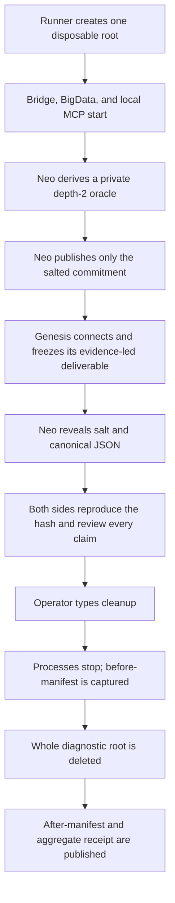

# Blind BigData Neural Link Interoperability Probe

A successful connection is not yet an interoperability proof. A client can complete the MCP
handshake and still misread a live application, overstate what the returned fields establish, or
leave raw diagnostics behind. This journey makes all three failure classes visible in one bounded
local session.

The probe launches the public BigData example, a standalone Neural Link Bridge, and a Streamable
HTTP MCP server. All three listeners bind the literal loopback host. It gives the external client
exactly three read
operations, commits Neo to the expected structure before the client answers, and erases every raw
artifact only after the answer has been frozen, revealed, and jointly reviewed.

This is a local interoperability recipe. It is not a cloud deployment, remote service, or general
Neural Link authorization model.

## What the journey proves

The completed receipt establishes these claims together:

- a standard MCP client can connect to the literal `127.0.0.1` URL through Streamable HTTP;
- the server exposes exactly `healthcheck`, `get_worker_topology`, and `get_component_tree`;
- exactly one BigData App Worker is selected explicitly;
- the external answer matches a salted oracle that Neo committed to before seeing that answer;
- every positive structural claim points to a returned field, while uncertain properties stay in
  an explicit not-inferable list;
- SQLite telemetry, WAL/SHM files, rotating logs, Bridge stdio, and unexpected files all live under
  one disposable root and are deleted after joint review;
- only aggregate counts, the frozen deliverable, the revealed oracle, and the final public receipt
  survive.



The ordering is the security property. Reveal before freeze teaches the answer. Cleanup before
review destroys the evidence. Retaining the root after review turns a disposable diagnostic into
an unmanaged raw-data store.

## Pinned participants and versions

The Neo side runs from the commit named in the final receipt. The external side is the accepted
Genesis `7.9.38` artifact at commit
[`2a7e9d75d2e5cceb9d36fd0dc290c7586d9ad4c8`](https://github.com/Garrus800-stack/genesis-agent/commit/2a7e9d75d2e5cceb9d36fd0dc290c7586d9ad4c8).
That exact SHA matters: the `v7.9.38` tag predates the final trusted-loopback bearer correction.

Required locally:

- Node.js 24 or newer;
- an installed Chrome channel, or Playwright's bundled Chromium;
- no second client connected to the isolated Bridge;
- a terminal that remains open for the freeze, reveal, review, and cleanup gates.

## Rehearse the full Neo side

Run the non-interactive rehearsal before scheduling the external session:

```bash
npm run ai:genesis-probe
```

Use bundled Chromium when Chrome is unavailable:

```bash
npm run ai:genesis-probe -- --browser-channel bundled
```

The rehearsal uses a generated private bearer, performs the same SDK calls, reveals its throwaway
oracle immediately, and cleans up automatically. A successful `GENESIS_PROBE_RECEIPT` must show:

- `status: "success"`;
- all three aggregate telemetry rows successful;
- `configuredInsideDisposableRoot: true`;
- a recursive `beforeManifest` containing the database and log artifacts;
- `afterManifest.rootPresent: false`;
- `terminationVerified: true` on POSIX;
- `defaultPathsUntouched: true`.

On Windows, rehearsal can verify direct-child exit plus closure of all three known listener ports,
but Node does not provide a Job Object or an equivalent proof that every descendant is gone. Its
receipt therefore keeps `terminationVerified: false` and `status: "failure"`, while still reporting
aggregate telemetry and root deletion when those weaker gates pass. That rehearsal is useful
implementation evidence, but it is not the external privacy proof.

Rehearsal commitments are disposable evidence. Never reuse one for the external blind run.

## Start the external session

Generate a fresh bearer into a non-exported operator-shell variable. Do not paste the value into a
Discussion, issue, PR, chat transcript, shell trace, or receipt. Transfer the value through the
agreed private channel before starting the foreground runner, then inject it into that one command
process tree and unset the parent-shell variable immediately after the runner exits:

```bash
neo_genesis_probe_bearer="$(node -e "process.stdout.write(require('crypto').randomBytes(32).toString('base64url'))")"
NEO_GENESIS_PROBE_BEARER="$neo_genesis_probe_bearer" npm run ai:genesis-probe -- --external
unset neo_genesis_probe_bearer
```

The external run currently requires POSIX detached-process-group verification. Do not run
`--external` from PowerShell/Windows and reinterpret direct-child exit as equivalent evidence.
A Windows external recipe remains intentionally unavailable until the runner owns a supervised
process tree (for example, a Job Object) that can prove descendant termination.

The runner allocates fresh ports and emits one redacted `GENESIS_PROBE_LOCAL_READY` record. Send the
emitted URL to the Genesis operator; the bearer was already transferred privately before launch.
Complete the named Genesis server configuration with that URL and the pre-shared bearer:

Each listener must first emit its exact host-and-port readiness marker into its own mode-`0600`
stdio log inside the disposable root. Only then does the runner perform a secondary TCP reachability
check. A generic open loopback port is never readiness evidence and can never trigger bearer use.

```json
{
    "name": "neo-local-probe",
    "url": "http://127.0.0.1:<emitted-port>/mcp",
    "transport": "streamable",
    "trustLoopback": true,
    "token": "<private-disposable-bearer>"
}
```

`transport: "streamable"`, `trustLoopback: true`, and the non-empty token are the Genesis
`7.9.38` client contract. Neo's server independently requires the literal loopback bind, absent
`Origin`, valid `Host`, a canonical 32-byte unpadded-base64url bearer, local-bearer mode, and the
server-pinned `local-readonly-probe` profile.

The same startup record publishes the exact three tools and the tree arguments. If any value
differs, abort instead of improvising a wider profile.

## The blind deliverable

The external agent may use only the listed server and returned fields. It should call the tools in
this order:

1. `healthcheck({})` and require a healthy result;
2. `get_worker_topology({})` and require exactly one row whose app name is
   `Neo.examples.grid.bigData`;
3. `get_component_tree({sessionId, depth: 2, lean: true})` using that row's explicit App Worker id.

Freeze a deliverable with this shape before asking Neo to reveal anything:

```json
{
    "rootClass": "<value from tree.className>",
    "directChildren": [
        {
            "index": 0,
            "className": "<value from tree.items[0].className>"
        }
    ],
    "notInferable": [
        "<property the three returned payloads do not establish>"
    ],
    "evidence": [
        {
            "claim": "rootClass",
            "field": "get_component_tree.result.tree.className"
        },
        {
            "claim": "directChildren[0].className",
            "field": "get_component_tree.result.tree.items[0].className"
        }
    ],
    "unsupportedConfidentClaims": []
}
```

The direct-child array must be complete and preserve returned order. The example contains one
placeholder row only to demonstrate the schema; it does not imply the expected count. IDs may be
used for evidence routing but are not part of the public structural oracle.

Save or post the immutable deliverable, then tell the Neo operator it is frozen. Only then may the
Neo operator type:

```text
reveal
```

## Reproduce the commitment

The runner reveals a secret 32-byte lowercase-hex salt and whitespace-free canonical JSON with
fixed property order:

```json
{"rootClass":"…","directChildren":[{"index":0,"className":"…"}]}
```

Both sides independently compute:

```text
SHA-256(UTF-8(saltHex + "\n" + canonicalJson))
```

The result must equal the commitment published before the deliverable. A hash mismatch is a failed
probe even when the visible structures happen to look alike.

Joint review then checks four independent facts:

| Gate | Passing evidence |
|---|---|
| Oracle | Root and complete ordered direct-child array equal the revealed canonical JSON. |
| Traceability | Every positive claim cites a field actually returned by one of the three tools. |
| Epistemic restraint | Unavailable properties are named under `notInferable`; no unsupported confident claim remains. |
| Transport boundary | The client used the emitted literal URL, private bearer, named server, and exact tool profile. |

Do not clean up while a dispute still needs raw evidence. Once both sides record the review verdict,
the Neo operator types:

```text
cleanup
```

Typing `abort` at either interactive gate records a failed receipt and still attempts full cleanup.
`SIGINT` and `SIGTERM` enter the same cleanup path; neither signal bypasses erasure checks. The
runner also fails if any active phase exceeds the single two-hour session deadline. It reserves the
final minute for shutdown and cleanup instead of resetting a fresh timeout per phase. If a
safety-critical stop or whole-root deletion crosses that deadline, cleanup continues rather than
abandoning live processes or raw data, and the receipt remains a failed session-limit proof.
Cleanup therefore owns a fresh bounded safety clock; it never inherits a zero timeout from the
expired active-session clock.

## What cleanup proves

The runner first closes the MCP SDK client and browser, then stops the MCP server, Bridge, and dev
server. POSIX shutdown verifies both each leader exit and immediate process-group absence; `EPERM`
is treated as still alive and only `ESRCH` proves absence. The runner does not delete the root when
that proof fails. With process-owned handles released, it reads only aggregate
tool/status/duration counts, captures the recursive manifest, and removes the entire unique root.
Once termination authorizes deletion, a corrupt telemetry database or failed evidence snapshot
still makes the receipt fail but cannot veto the whole-root deletion attempt.

The manifest is intentionally allowlist-agnostic. It records every relative path, type, and byte
size, including unexpected files. This avoids a brittle cleanup allowlist that forgets a new log,
WAL, or stdio sink.

The final receipt must not contain:

- the bearer or Authorization header;
- raw tool arguments or results;
- absolute disposable-root paths;
- raw SQLite rows or logs;
- unrevealed oracle material.

Failures use a closed public `{code, message}` allowlist. Raw tool payloads and topology rows remain
only inside the disposable root, normally in its isolated SQLite telemetry. Private parent-process
exception detail and absolute temporary paths additionally go into a mode-`0600`
`private-failure.json`; any bearer material captured by either private diagnostic surface remains
inside that root until verified cleanup removes it.

After reveal, the canonical oracle and salt are public verification material and may remain. Raw
diagnostics may not.

## Public receipt template

The PR and the source Discussion should link one completed receipt containing:

```text
Neo commit/version:
Genesis commit/version:
start/end/duration:
published commitment comment:
frozen external deliverable:
revealed canonical JSON + salt:
Neo hash reproduction:
Genesis hash reproduction:
oracle comparison verdict:
not-inferable / unsupported-claim verdict:
aggregate tool/status/duration counts:
recursive before-manifest:
after-manifest rootPresent=false:
termination verified=true (POSIX external proof):
default live database/log paths untouched=true:
overall success/failure:
```

Any missing line makes the receipt incomplete. A failed run is still valuable when it honestly
names the failed gate and proves cleanup; it must not be rewritten as success after the fact.

## Failure recovery

- **More than one App Worker:** close the extra app and start a fresh probe. Never auto-select one.
- **Tool list differs:** verify the server-pinned `local-readonly-probe` mode. Do not continue with a
  broader surface.
- **Genesis refuses loopback:** verify the exact accepted commit, named-server `trustLoopback`, and
  non-empty token without publishing the token.
- **Hash mismatch:** preserve the frozen deliverable, compare UTF-8 bytes/property order/newline,
  record failure, then clean up after review.
- **Default path changed:** treat the isolation proof as failed. Identify concurrent writers or a
  missing environment override before another run.
- **Root remains after cleanup:** do not delete individual filenames and call it complete. Find the
  open handle or permission failure, remove the whole root, and record the correction cycle.
- **Interrupted run:** require the structured `PROBE_INTERRUPTED` receipt plus the same verified
  shutdown, manifest, and root-absence evidence as any other failure. A signal is not cleanup proof.
- **Windows external run rejected:** move the external session to a POSIX host. Direct-child exit
  and known-port closure are rehearsal evidence only until supervised Windows process-tree support
  exists.

The journey allows one asynchronous correction cycle. A correction gets a new disposable root,
bearer, salt, and commitment; nothing secret or raw carries over from the first attempt.
