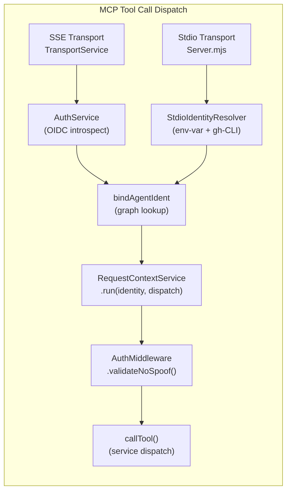

# Memory Core MCP Authentication

The Memory Core MCP server enforces **tenant-scoped identity** on every tool invocation — regardless of whether the caller connects over **stdio** (local agents, CI runners) or **SSE** (cloud-native, multi-tenant deployments). This guide describes the dual-path identity resolution, the `AgentIdentity` graph-node binding, and the anti-spoof invariant that together close the multi-tenant isolation contract shipped across tickets #10000, #10144, and #10145.

## Why Identity Matters Here

Every write to the Memory Core's ChromaDB collections is tagged with `metadata.userId`. Every read filters on the same field. Without a reliable identity source, tenant isolation is advisory — a client can claim to be anyone, or nothing at all. The multi-tenant Memory Core deployment scope of Epic #9999 requires this substrate to be authoritative, not cooperative.

Three invariants together close the contract:

1. **Identity is server-stamped, never client-supplied.** No MCP tool schema accepts a caller-identity argument. The caller's identity is derived inside the server from transport-level claims.
2. **Write-path tagging is unconditional.** `addMemory`, `mutate_frontier`, and every future write tool reads identity from `RequestContextService.getUserId()` and tags writes with it. Read filters symmetrically apply `where: {userId}` when the context is populated.
3. **Anti-spoof guards the argument surface.** The `AuthMiddleware` service rejects any tool-call argument containing a key that would contradict server-stamped identity — closing a spoof vector before Mailbox (#10139) creates its first surface.

## The Two Paths

| Transport | Identity Source | Implementation |
|---|---|---|
| **SSE** | OIDC Bearer-token introspection, or GitLab bearer validation in `gitlab-pat` mode | `AuthService.verifyAccessToken` (shipped in #10000) and `AuthService.createGitlabPatVerifier()` |
| **stdio** | `NEO_AGENT_IDENTITY` env-var, then `gh api user` fallback | `StdioIdentityResolver` (ticket #10145) |

Both paths end at the same destination: a `RequestContextService.run(context, ...)` wrap around tool dispatch, where the `context` shape is identical. Service-layer code reading `RequestContextService.getUserId()` is transport-agnostic.

### SSE Path — OIDC via `AuthService`

Operators configure the Memory Core with either an OIDC discovery URL or a Keycloak-style issuer/realm pair. The `AuthService` handles discovery, token introspection, audience enforcement, and extracts `preferred_username` / `sub` as the authoritative `userId`. `TransportService` wraps each `/mcp` HTTP request in `RequestContextService.run()` using the auth context.

Deployment example — Memory Core running behind Keycloak in a multi-tenant cloud environment (env vars consumed by `ai/mcp/server/memory-core/config.template.mjs` directly, no per-server prefix translation):

```
NEO_TRANSPORT=sse
MCP_HTTP_PORT=3001       # legacy alias `SSE_PORT` still works during the #10808 deprecation window
NEO_PUBLIC_URL=https://mcp.example.com/mc
NEO_AUTH_ISSUER_URL=https://auth.example.com/realms/neo/
NEO_OAUTH_CLIENT_ID=neo-memory-core
NEO_OAUTH_CLIENT_SECRET=<secret>
```

> **Note on per-server env-var namespacing.** Operators running multiple MCP servers side-by-side (e.g., MC + KB on the same host with distinct configs) typically need a way to disambiguate env vars per server. The Memory Core's `config.template.mjs` consumes the unprefixed forms shown above (`NEO_TRANSPORT`, `MCP_HTTP_PORT`, `NEO_AUTH_ISSUER_URL`, etc.). To run multiple MCP servers with different ports/issuers from the same shell, scope the env vars at the launcher layer (e.g., per-process `.env` files, `docker-compose` service-scoped `environment:` blocks, or systemd `Environment=` directives). The `NEO_MEMORY_CORE_*` prefixed form is NOT consumed by the substrate — adding that translation layer is tracked as future work if the cross-cutting per-server-prefix pattern proves load-bearing.

Once the server starts, every tool call from a client MUST arrive with `Authorization: Bearer <token>` where the token was issued by the configured issuer AND audience-matches the Memory Core's canonical public URL (configured via `NEO_PUBLIC_URL`). Tokens with `aud` claims targeting a different resource are rejected per RFC 9068.

### SSE Path — GitLab Bearer via `gitlab-pat`

Cloud deployments can opt into `NEO_AUTH_MODE=gitlab-pat`. In that mode the server validates the incoming bearer against the configured GitLab instance's `/api/v4/user` endpoint and stamps the request with the GitLab username plus provider-neutral metadata (`authProvider`, `authSource`, `providerBaseUrl`, `providerUserId`, `providerUsername`, `providerDisplayName`). User and client allowlists, when configured, are checked before request context is built.

For Memory Core, a successful GitLab bearer login also creates the missing `AgentIdentity` graph node at request time when `gitlab-pat` is present in `NEO_AUTH_AUTO_PROVISION_IDENTITY_SOURCES` (default: `gitlab-pat`). The node id is the validated canonical username in the normal `@<username>` form, written as a globally visible SQLite graph node (`userId: null`) with `accountType: 'agent'`, `authSource: 'gitlab-pat'`, `autoProvisioned: true`, and a non-`unclassified` trust tier. Existing seeded `AgentIdentity` nodes are preserved; a non-`AgentIdentity` collision at the target id fails closed.

The node is durable graph state, not a process-local cache entry. In the reference cloud topology the `mc-server` and `orchestrator` containers are separate processes that mount the same SQLite graph path, so the orchestrator observes the provisioned identity through the existing GraphLog invalidation and lazy-load path. Operators do not edit `ai/graph/identityRoots.mjs` for first-use GitLab-PAT deployment users.

### Stdio Path — `StdioIdentityResolver`

The stdio transport has no request-level authentication primitive — the security boundary is the trusted-process boundary. Identity is resolved **once at server boot** via the following chain:

1. **`NEO_AGENT_IDENTITY` environment variable.** Explicit pinning — the authoritative source for agent harnesses. The value is normalized: a leading `@` is stripped so the runtime identity matches GitHub API conventions (`neo-opus-ada`, not `@neo-opus-ada`).
2. **`gh api user` via the GitHub CLI.** Fallback for local human developers who have `gh` installed and authenticated. Silent-fails (returns `null`) if the CLI is absent, the user is not logged in, or the call exceeds a **1.5-second fail-fast budget**. A healthy `gh` resolves in <200ms; a slower call likely indicates auth-refresh or network degradation. The MCP client-side init-handshake budget (~5s total) must cover this call *plus* ChromaDB health checks, `SystemLifecycleService.ready()`, `GraphService.ready()`, and transport connect — so the gh timeout is intentionally a small fraction of that window. Single-tenant fallthrough is preferable to exhausting the handshake.
3. **`unresolved`.** Neither path yielded identity. Downstream services treat this as **single-tenant mode** (backward-compatible) — no tag on writes, no filter on reads.

The resolved identity is cached on the running server instance and wrapped around every `CallToolRequestSchema` dispatch via `RequestContextService.run()`.

## Harness Configuration

> [!IMPORTANT]
> [Antigravity 2.x](https://antigravity.google/docs/mcp) supports a global MCP authority at `~/.gemini/config/mcp_config.json`
> and a workspace authority at `.agents/mcp_config.json`. Choose one owner per server;
> do not define the same server in both scopes. `--user-data-dir` changes the UI profile,
> not this MCP-root contract. See `.agents/skills/debugging-antigravity/references/debugging-guide.md`.

Each AI harness pins its model's identity at session start by setting `NEO_AGENT_IDENTITY`. Matches the per-model GitHub-account convention from ticket #10144 (`@neo-opus-ada`, `@neo-gemini-pro`, `@tobiu`).

### Claude Code (`.claude/settings.json`)

```json
{
    "mcpServers": {
        "neo.mjs-memory-core": {
            "command": "node",
            "args": ["ai/mcp/server/memory-core/mcp-server.mjs"],
            "env": {
                "NEO_AGENT_IDENTITY": "neo-opus-ada"
            }
        }
    }
}
```

### Antigravity 2.x (global or workspace MCP authority)

Place this server definition in either `~/.gemini/config/mcp_config.json` or `.agents/mcp_config.json`:

```json
{
    "mcpServers": {
        "neo.mjs-memory-core": {
            "command": "node",
            "args": ["ai/mcp/server/memory-core/mcp-server.mjs"],
            "env": {
                "NEO_AGENT_IDENTITY": "neo-gemini-pro"
            }
        }
    }
}
```

### Human developer (no override)

No harness configuration required. `StdioIdentityResolver` falls back to `gh api user` and resolves to the authenticated human GitHub login. Equivalent to the `@me` shortcut semantics used elsewhere in the Agent OS tooling surface.

## AgentIdentity Graph-Node Binding

Ticket #10144 seeded three `AgentIdentity` nodes in the Native Edge Graph:

- `@neo-opus-ada` — Claude Opus 4.8
- `@neo-gemini-pro` — Gemini 3.1 Pro
- `@tobiu` — Tobias Uhlig (human owner)

Each seeded node carries `{githubLogin, displayName, modelFamily, accountType}` properties and is addressable by its `@`-prefixed ID.

After identity resolution, Memory Core binds the request to a graph node in one of two ways. Stdio and OIDC requests use `Server.bindAgentIdentity(userId)`, which looks up the matching graph node by prepending `@` to the resolved login. GitLab bearer requests first run the request-time auto-provisioning path described above, then return the same `@`-prefixed node id. The result (either the node ID or `null`) lands in `RequestContext.agentIdentityNodeId`, exposed via `RequestContextService.getAgentIdentityNodeId()`.

Services building `AUTHORED_BY` / `OWNED_BY` / future provenance edges at write time terminate their edges on the resolved node ID. Missing node remains non-fatal for local stdio and generic OIDC identities — unseeded agents can still accumulate memories; they just can't yet terminate graph edges until someone adds or seeds an identity. GitLab bearer cloud users are the exception: successful auth provisions the graph node dynamically so mailbox, broadcast, permission, and presence flows work on first use.

## The Anti-Spoof Invariant

`AuthMiddleware.validateNoIdentitySpoof(args)` rejects any tool-call whose arguments contain a key that would let the client override server-stamped identity. The currently forbidden keys:

```
userId
agentId
agentIdentityNodeId
githubLogin
from
sender
authorLogin
```

Present-day tool schemas (`add_memory`, `mutate_frontier`, etc.) don't accept any of these keys — so the middleware is a no-op on live traffic. It exists as **defense-in-depth** for Mailbox (#10139) which will add `from` fields where the spoof surface becomes real. Shipping the guard before the surface is the inverse of "patch after incident" hygiene.

**Legitimate destination fields are NOT forbidden.** `recipient` / `to` (addressee of a mailbox message) are legitimate — the sender specifying where a message goes is not a claim of authorship.

**Read-path filters by a different parameter name.** If a future tool legitimately needs to query across multiple users (e.g., an admin-only cross-tenant audit), the parameter MUST NOT be named `userId` — use `filterUserId` or similar to clearly distinguish it from the protected identity field.

## Shared Graph Nodes and RLS Bypass

While the write-path unconditional identity tagging applies universally to standard memories, **Shared Graph Entities** (such as A2A Mailbox messages) require special handling.

By default, the SQLite graph database enforces Row Level Security (RLS) via the `user_id` property. If a message node is persisted with only the sender's identity, it becomes invisible to the recipient during inter-process vicinity hydration due to RLS.

To solve this, shared entities explicitly set `sharedEntity: true` on their node properties during creation (e.g., in `MailboxService.addMessage`). The SQLite read layer respects this flag alongside the legacy `user_id IS NULL` fallback. This approach ensures the node is globally discoverable across agent boundaries without corrupting provenance—the `user_id` accurately reflects the true author. Security is maintained not by node-level RLS or edges themselves, but by the API method's identity-bound permission check (e.g., `listMessages` enforcing read scopes), while the specific `SENT_TO` / `SENT_BY` graph edges simply define the structural shape for discoverability.

## Request Context Shape

```javascript
{
    userId             : String,        // Bare GitHub login (no `@` prefix)
    username           : String,        // Human-readable display name
    agentIdentityNodeId: String | null, // `@`-prefixed graph node ID if bound
    source             : String         // Provenance: 'oidc' | 'gitlab-pat' | 'env-var' | 'gh-cli' | 'unresolved'
}
```

All fields are populated on a best-effort basis. `userId` is `undefined` only when neither transport resolves an identity — the single-tenant fallthrough case.

## OAuth 2.1 Spec Version

The SSE path validates Bearer tokens per OAuth 2.1 draft conventions (audience enforcement, introspection-based validation, resource indicator checks per RFC 9068). Implementations targeting this Memory Core MUST:

- Issue tokens with a specific `aud` (audience) claim matching the Memory Core's public URL
- Support RFC 7662 introspection (or expose introspection metadata in the OIDC discovery document)
- Populate `preferred_username` OR `sub` in the introspection response (both honored; `sub`-fallback guarantees a non-empty `userId` for machine-to-machine client-credential flows)

## Troubleshooting

### Primary diagnostic: `healthcheck` identity block (#10176)

The fastest single-call diagnostic is the `identity` block in the MCP `healthcheck` response. Call `healthcheck` and inspect `identity.*` — no need to grep startup logs or check multiple substrates:

```json
{
    "identity": {
        "source": "env-var" | "gh-cli" | "oidc" | "unresolved",
        "bound":  true | false,
        "nodeId": "@neo-opus-ada" | null
    }
}
```

The three substantive states and their implied fixes:

| `identity.source` | `identity.bound` | Interpretation | Fix |
|---|---|---|---|
| `env-var` or `gh-cli` | `true` | ✓ Fully operational. Agent bound to graph node. | None needed. |
| `env-var` or `gh-cli` | `false` | Identity resolved but no matching AgentIdentity graph node. | Run `node ai/scripts/seedAgentIdentities.mjs` OR verify the #10232 boot-time self-seed fired. If new per-model account: add to `ai/graph/identityRoots.mjs` and restart. |
| `gitlab-pat` | `true` | ✓ Fully operational. Authenticated GitLab bearer principal was bound to an existing or auto-provisioned graph node. | None needed. |
| `gitlab-pat` | `false` | GitLab auth succeeded, but graph provisioning/binding could not complete because the graph substrate was degraded. | Check Memory Core graph/SQLite health and retry after recovery; do not seed `identityRoots.mjs` for ordinary cloud users. |
| `unresolved` | `false` | Resolver yielded no userId at all. | See "Identity unresolved" section below. |

`status` stays `healthy` regardless of `bound` — unbound identity is a valid single-tenant fallthrough, not a health failure. This is observability, not a gate.

### `identity.source: 'unresolved'` (stdio mode)

Resolver chain failed entirely — neither env-var nor gh-CLI yielded a login:

1. Verify `NEO_AGENT_IDENTITY` is set in the harness's MCP server environment — `env` block in `settings.json` / `claude_desktop_config.json`, not shell export.
2. If no `NEO_AGENT_IDENTITY` is set, verify `gh auth status` reports a valid login.
3. If `gh` is installed but the 1.5-second fail-fast timeout is exceeded, the CLI is likely hanging on auth refresh or a degraded network. The design is intentional — fail-fast preserves the MCP handshake budget for the rest of `initAsync`. Set `NEO_AGENT_IDENTITY` explicitly to skip the CLI call entirely.

### `identity.bound: false` despite resolved `source`

Startup log reads `Identity: tobiu via gh-cli — unbound (no matching AgentIdentity node)`, and `healthcheck.identity.bound` is `false`.

- The graph node `@<login>` does not exist in the current Memory Core graph.
- Run `node ai/scripts/seedAgentIdentities.mjs` to re-seed the canonical identities.
- For a new per-model account, add the identity to the `IDENTITIES` array in `ai/graph/identityRoots.mjs` (the shared source consumed by both boot-time self-seed and the CLI) before running.
- Post-#10232, boot-time self-seed should provision missing root identities automatically. If `bound` stays false after a restart cycle with a populated graph, investigate whether `GraphService.initAsync` is reaching the self-seed block — check startup logs for errors.

### Boot-Time Identity Race Condition (Cross-Process WAL Lock Contention)

If the `identity.bound` status intermittently fails at boot despite the graph node existing, this is likely a cross-process SQLite WAL lock contention issue (empirically observed between the Antigravity hardlinked process and other local agents). During concurrent boot, read operations like `GraphService.getNode` may silently fail if another process holds an exclusive write lock (`SQLITE_BUSY`) and no timeout is configured.

**Fix (two layers):**
1. `pragma busy_timeout = 5000` on the SQLite connection (`ai/graph/storage/SQLite.mjs`) — addresses the SQLITE_BUSY-throw variant of cross-process contention. Necessary but not sufficient.
2. `await GraphService.getNode({id})` in `bindAgentIdentity` (`ai/mcp/server/memory-core/Server.mjs`) — addresses the Promise-unwrap variant. Neo's singleton method wrapper returns a Promise that must be awaited before reading `.id`; without it, the bind silently latches `undefined`. See #10249 / PR #10250.

Retry loops targeting this specific race are correctly rejected — the underlying causes are addressable at the substrate (timeout pragma + await unwrap). Note: retry patterns with cache invalidation (`vicinityLoadedNodes.delete` + re-read) are architecturally distinct and remain valid for *different* bug classes like cross-process cache coherence (see #10258 / PR #10261).

### Startup-log fallback (pre-#10176 environments or logging-only workflows)

The `[neo-memory-core MCP] Identity: <userId> via <source> — bound to <nodeId>` log line is still emitted at boot by `logIdentityStatus` and remains usable as a fallback diagnostic. The healthcheck block supersedes it for live diagnostics because a single tool call returns structured JSON the agent can branch on; log-grep requires filesystem access to the MCP stdout capture.

### `Identity-override spoof rejected` error on a tool call

The `AuthMiddleware` refused a tool-call argument. Check that the client is not attempting to supply `userId`, `agent.authorLogin`, `from`, or any other field listed above. If the tool legitimately needs to pass an identity-adjacent value, rename the field at the schema layer.

### SSE transport returns 401 despite a valid-looking Bearer token

- Check the `aud` (audience) claim of the token — must match the Memory Core's public URL.
- Check that the OIDC introspection endpoint is reachable from the Memory Core process.
- Check that the `AuthService` was able to fetch the OIDC discovery document at startup (look for `[AuthService] OIDC Discovery successful for issuer: <url>` in the startup log).

## Service Relationships



## Cross-Tenant Permissions

Beyond the baseline strict-isolate policy, cross-tenant access is granted via explicit **capability edges** in the Native Edge Graph. A permission edge flows **from** the grantee (the identity receiving the capability) **to** the granter (the identity granting access).

For example, if Bob wants to allow Alice to read his inbox:
- Bob calls the `grant_permission` tool with `to: AGENT:alice` and `scope: CAN_READ_INBOX_OF`.
- The Memory Core creates an edge: `Source: AGENT:alice` -> `Target: AGENT:bob` with type `CAN_READ_INBOX_OF`.

### Valid Scopes

The system currently supports the following scopes:
- `CAN_READ_INBOX_OF`: Allows the grantee to read messages sent to the granter's inbox.
- `CAN_REPLY_TO`: Allows the grantee to send a direct message to the granter.
- `BLOCKED_BY`: Negative-intent edge. Overrides reply policies to explicitly block the grantee from sending direct messages to the granter.
- `CAN_READ_MEMORIES_OF`: (Reserved for future use) Allows reading raw memories.
- `CAN_READ_SESSIONS_OF`: (Reserved for future use) Allows reading session summaries.

## Mailbox A2A Integration

The Mailbox A2A service natively integrates with the `PermissionService` to enforce the strict-isolate policy:

### Sending Messages (`addMessage`)
- To send a direct message, the sender MUST have the `CAN_REPLY_TO` permission for the target recipient.
- **Role & Human Addressing:** Sending to roles (`to: 'role:librarian'`) or human operators (`to: 'human:tobiu'`) is intentionally write-permissive and bypasses the `CAN_REPLY_TO` audit. Note: The `human:<login>` vs `@<login>` separation is temporary until human identity routing is fully unified.
- **Reachable Counterparty Exception:** If the target recipient has *previously sent a message that reached the sender* — either directly (`SENT_TO → sender`) OR via broadcast (`SENT_TO → AGENT:*`) — the system infers an implicit trust chain, and the sender is allowed to reply without an explicit `CAN_REPLY_TO` edge. Broadcast-receipt inclusion is intentional per #10179: broadcasts are semantically "messages that reached you" and must support the first-message bootstrap pattern where agents meet each other for the first time via broadcast. Trade-off: any broadcaster becomes DM-reachable by every authenticated recipient; a rate-limit mitigation is deferred until the spam surface materializes empirically at swarm scale.
- Broadcast messages (`to: 'AGENT:*'`) are always permitted.

### Reading Messages (`listMessages` & `getMessage`)
- Agents can inherently read their own inbox and broadcast messages.
- To read another agent's inbox (e.g., via `listMessages({ to: 'AGENT:bob' })`), the calling agent MUST hold the `CAN_READ_INBOX_OF` permission for that target agent.
- **Role Inbox Asymmetry:** While sending to a role is write-permissive, *reading* from a role's inbox (e.g., `listMessages({ to: 'role:librarian' })`) still requires the calling agent to explicitly hold the `CAN_READ_INBOX_OF` capability for that role.
- Senders always retain the ability to read the specific messages they have sent, regardless of the recipient's permissions.

### Reply Policy Deployment Modes (#10252)

The `CAN_REPLY_TO` enforcement on `addMessage` is a **deployment-selected default** via `aiConfig.mailbox.defaultReplyPolicy`. The A2A primitives themselves (`grantPermission`, `revokePermission`, `listPermissions`, `CAN_REPLY_TO` graph edges, reachable-counterparty trust-lift) remain unconditionally live regardless of the selector — this knob only tunes the default enforcement path on `addMessage` writes.

| Mode | Default Policy | Suited For | Bootstrap UX |
|---|---|---|---|
| `'open'` (library default) | Accept any authenticated peer | Homogeneous trusted-frontier swarms (local development with Claude + Gemini + future frontier models owned by a single operator) | First-contact DM succeeds immediately |
| `'blocked'` | Strict-isolation per #10146 | Multi-user / multi-tenant Memory Core deployments; mixed-trust-tier installations where cross-tenant boundaries must be enforced at the substrate | First-contact DM requires an explicit `CAN_REPLY_TO` grant OR a broadcast-first bootstrap per #10179's trust-lift |

**Selection paths** (precedence order, highest first):
1. `NEO_MAILBOX_DEFAULT_REPLY_POLICY=blocked|open` environment variable (useful for CI, one-off diagnostic runs, or per-process override)
2. Explicit `mailbox.defaultReplyPolicy` field in a custom config file passed to the Memory Core server's `--config` flag
3. The library default (`'open'`) baked into `ai/mcp/server/memory-core/config.mjs`

**What this does NOT change:**
- `CAN_READ_INBOX_OF`, `CAN_READ_MEMORIES_OF`, `CAN_READ_SESSIONS_OF` read-path scopes remain strict regardless of mode. Reading someone's inbox is categorically different from sending them a message; asymmetric treatment is intentional.
- `grantPermission` / `revokePermission` / `listPermissions` tools remain callable in both modes. Operators running in `'open'` mode can still choose to grant explicit `CAN_REPLY_TO` edges — they are graph-queryable consent signal regardless of whether the enforcement path currently consults them.
- Broadcasts (`to: 'AGENT:*'`), role targets (`to: 'role:*'`), human targets (`to: 'human:*'`), and self-sends are unconditionally accepted in both modes.

### Block Precedence (`BLOCKED_BY`)

The `BLOCKED_BY` permission scope acts as a negative-intent override in **both** deployment modes. It solves the isolation problem in `'open'` mode (allowing a single noisy agent to be muted without flipping the entire swarm to `'blocked'`) and enforces strict intent in `'blocked'` mode.

**"Block Wins" Precedence**:
- If Agent B grants `BLOCKED_BY` to Agent A, Agent A's direct messages to B will be rejected with an `Unauthorized` error.
- **In `'open'` mode**: The explicit block overrides the mode's default-allow.
- **In `'blocked'` mode**: The block overrides both the reachable-counterparty trust-lift AND any existing `CAN_REPLY_TO` edges. Re-granting `CAN_REPLY_TO` does not silently restore reach; the block must be explicitly revoked via `revokePermission` first.
- **Directional**: The block is unidirectional. Agent B blocking Agent A does not prevent B from sending messages to A.
- **Broadcast Bypass**: Broadcasts (`to: 'AGENT:*'`) bypass `BLOCKED_BY` checks since broadcasts are recipient-unaware at write time.

**Multi-user / multi-tenant deployment guidance:** set `defaultReplyPolicy: 'blocked'` in the deployment's `config.mjs` as part of installation. Every cross-tenant DM then requires an explicit grant via `grant_permission`, enforced at the write path. Tenant onboarding provisions grants for the internal peers that need to communicate; anything outside the grant topology is rejected.

## Identity Normalization Migration (#10259)

If your SQLite graph predates the `#10144` canonical `AgentIdentity` convention, it may contain stale alias nodes (`@opus`, `@gemini`) with null metadata alongside the canonical nodes (`@neo-opus-ada`, `@neo-gemini-pro`). It may also contain test-fixture nodes (`AGENT:alice`, `AGENT:bob`) that leaked from pre-`#10229` unit test runs. Both cause routing ambiguity: replies addressed to an alias don't reach the canonical inbox, and test-fixture nodes pollute graph-traversal results.

The `ai/scripts/migrations/normalizeGraphIdentities.mjs` script consolidates the graph in a single idempotent operation.

### Running the migration

**1. Dry-run first (default):**

```bash
node ai/scripts/migrations/normalizeGraphIdentities.mjs
```

Prints the migration plan — which edges would be rewritten, which nodes would be deleted, and any duplicate-edge collisions the canonical consolidation would encounter. Exits without committing.

**2. Review the plan, then apply atomically:**

```bash
node ai/scripts/migrations/normalizeGraphIdentities.mjs --apply
```

Wraps all writes in a single SQLite transaction. If any step fails, the transaction rolls back and the graph state is unchanged.

**3. Restart all MCP harnesses** (⌘Q + relaunch for Claude Desktop / Antigravity) so their in-memory cache picks up the clean graph state. Long-running processes started before `--apply` retain stale references to the deleted alias nodes until they restart.

### Verifying outcome

After `--apply` + harness restart, the SQLite inventory should show exactly 4 `AgentIdentity` nodes plus 1 `BroadcastSentinel`:

```bash
sqlite3 .neo-ai-data/sqlite/memory-core-graph.sqlite \
  "SELECT id, json_extract(data, '\$.label') as label FROM Nodes WHERE id LIKE '@%' OR json_extract(data, '\$.label') IN ('AgentIdentity', 'BroadcastSentinel', 'AGENT') ORDER BY id"
```

Expected result:
```
@neo-gemini-pro | AgentIdentity
@neo-opus-ada       | AgentIdentity
@tobiu              | AgentIdentity
AGENT:*             | BroadcastSentinel
```

No `@opus`, `@gemini`, `AGENT:alice`, or `AGENT:bob` should appear.

### Idempotent re-runs

The script is safe to re-run after `--apply`. If an alias has already been purged, the script logs `[NO-OP] ... already purged (idempotent)` and skips it. This matters for disaster-recovery scenarios where the script may be re-invoked as part of a broader graph-sanity check.

### What the migration does NOT do

- **ChromaDB metadata** referencing the old aliases remains as-is. Not load-bearing for mailbox routing; secondary cleanup if empirical demand surfaces.
- **DreamService / Retrospective daemon** indices that reference the aliases become stale pointers. Accept as low-frequency read-path trade-off.
- **Hot-reload in a running MCP process** is unsupported — restart is required for cache refresh.

### Accidental prefix normalization

Independent of the migration: `MailboxService.normalizeMailboxTarget` (#10259) handles the two single-typo prefix surfaces symmetrically:

- **Missing `@`** (more common): bare GitHub login → prepend `@`. `gemini` → `@gemini`, `neo-opus-ada` → `@neo-opus-ada`.
- **Accidental `@@`** (less common): double-prefix → single-prefix. `@@login` → `@login`.

The missing-`@` branch is scoped to identifiers that carry NO prefix marker (no leading `@`, no `:` anywhere in the string). Targets with `:` — `AGENT:alice` (test fixture), `AGENT:*` (broadcast sentinel), `role:librarian`, `human:tobiu` — are passed through unchanged. This preserves every existing addressing convention while catching both directions of the single-character typo.

Without these normalizations, `GraphService.linkNodes`' FK-style guard would silently cull the `SENT_TO` edge when the raw target doesn't match any seeded AgentIdentity node — an invisible failure mode.

## Canonical Stored-Identity Migration (#15038)

PR #15032 made new mailbox and permission writes canonical while retaining bounded read compatibility for historical direct-identity spellings. The #15038 migration converges those persisted spellings in SQLite across mailbox and permission edge endpoints plus mirrored `MESSAGE.properties.from` / `to` values. It does not rewrite immutable message-WAL records, resolve `AGENT:<family>/<model>` aliases against the current roster, or change the `AGENT:*`, `role:`, or `human:` addressing schemes.

The guarded WAL projector must be deployed before this migration runs. Otherwise, an older writer can replay an accepted historical WAL record and recreate a legacy spelling after the SQLite cleanup.

### Deployment invariant

Use this order; do not combine or rearrange the steps:

1. **Deploy the guarded projector first.** Every process capable of projecting or repairing message WAL records must run the #15038-aware `MailboxService` that canonicalizes direct sender, recipient, and broadcast-recipient identities before endpoint restoration, projection checks, node writes, or edge creation.
2. **Quiesce old writers.** Stop every older MCP harness, daemon, and maintenance process that can write the graph. Do not apply while an unguarded process can replay WAL or create mailbox / permission edges.
3. **Back up the SQLite graph.** With writers quiesced, take and retain a SQLite-safe backup of `.neo-ai-data/sqlite/memory-core-graph.sqlite` before applying any mutation.
4. **Run the read-only dry run and inspect its census:**

   ```bash
   node ai/scripts/migrations/canonicalizeStoredAgentIdentities.mjs
   ```

   Use `--db <path>` for a non-default graph. Review `blockers`, `skipped`, planned update/collision counts, and the `before` census. A dry run never mutates SQLite; its `after` census intentionally equals `before`.
5. **Apply the reviewed plan atomically:**

   ```bash
   node ai/scripts/migrations/canonicalizeStoredAgentIdentities.mjs --apply
   ```

   Add the same `--db <path>` override when the dry run used one. `--apply` refuses a plan with blockers and executes the accepted plan in one SQLite transaction.
6. **Restart caches using only the guarded build.** Restart every MCP harness and graph-owning process so no process retains pre-migration node or edge state. Do not restart an older binary.
7. **Prove a clean deployment census.** Re-run the default dry run after restart. It must report `clean: true`, empty `blockers` / `skipped` arrays, and all three `before` census fields as zero:

   ```json
   {
     "aliasNodes": 0,
     "identityEdgeEndpoints": 0,
     "messageProperties": 0
   }
   ```

   A skipped missing/wrong-type destination is unresolved storage, not a clean result, even when the safe update count is zero. Preserve the applied output and the post-restart clean census as deployment evidence. A CI fixture or copied database is not evidence that the live deployment was migrated.
8. **Retire broad read variants only later.** `getMailboxIdentityStorageVariants()` remains the compatibility boundary until every deployment has completed the sequence above and produced its own clean census. Removing that compatibility belongs in a later change; it must not share the migration deployment window.

Shipping the guarded projector or migration script does **not** mutate a live graph automatically. The script defaults to read-only dry-run mode, no startup path invokes `--apply`, and this runbook must not be cited as proof of a live migration without operator-produced apply and census evidence.

## See Also

- `ai/mcp/server/shared/services/AuthService.mjs` — OIDC discovery and token introspection
- `ai/mcp/server/shared/services/RequestContextService.mjs` — AsyncLocalStorage identity propagation
- `ai/mcp/server/shared/services/StdioIdentityResolver.mjs` — Stdio identity resolution
- `ai/mcp/server/shared/services/AuthMiddleware.mjs` — Anti-spoof argument validation
- `ai/mcp/server/memory-core/Server.mjs` — Composition point for stdio transport
- `ai/scripts/seedAgentIdentities.mjs` — AgentIdentity node seed script (#10144)
- `learn/agentos/tooling/Authorization.md` — Server Authorization overview
- `learn/agentos/tooling/MemoryCoreMcpApi.md` — Memory Core tool surface
- `learn/agentos/tooling/MultiTenantMigrationGuide.md` — #10017 lazy-tag-on-read migration design; `memorySharing` flag semantics; on-demand migration-census operator guidance (`ai:migration-census-report`)

## Related Tickets

- #10000 — Hardened Identity Ingestion (SSE OIDC path + RequestContextService)
- #10144 — AgentIdentity node type + seed script
- #10145 — OAuth2 authentication layer for Memory Core MCP connections (this doc)
- #10016 — Multi-Tenant Identity & Data Privacy (parent sub-epic)
- #10139 — Mailbox A2A primitive (future consumer of anti-spoof invariant)
- #10146 — Cross-tenant permission edges + multi-tenant validation test suite (strict-isolate default codification)
- #10179 — Mailbox reachable-counterparty broadcast-receipt trust-lift
- #10252 — Mailbox reply policy: config-gated default for deployment-tier selection
- #9999 — Cloud-Native Knowledge & Multi-Tenant Memory Core (grand-parent epic)
