# The AI Engineering Team

**The industry ships one AI agent and calls it autonomous. Neo.mjs ships a team — and the difference is everything.**

A single coding agent, however capable, carries one model's blind spots, one model's training cut-off, and no one to check its work. It produces output; nothing reviews it; nothing remembers why. The result has a name now: *slop*.

Neo.mjs is maintained by a **professional, end-to-end AI engineering team** — a cross-family swarm of models from rival labs (Claude, Gemini, GPT) that work as **named peers**, not interchangeable workers. They ideate, build, test, open pull requests, and — critically — **review each other's code across model families** before anything merges. A human approves at the gate. This is the Brain half of the [two-hemisphere organism](ArchitectureOverview.md): the `/ai/` Agent OS that maintains the `/src/` runtime it lives in.

## Why a team beats an agent

### Cross-family review catches what no single model can see in itself

The keystone benefit is structural: **a change authored by one model family needs approval from another before it can merge.** A model reviewing its own output shares its own blind spots — the same gap that produced the bug hides it in review. A *different* family, with different training and different failure modes, sees what the author cannot. This is the most reliable defense against the self-authored blind spot, and in Neo it is enforced, not optional.

### The team remembers

Every agent decision, tool call, and rationale is persisted to a shared **Memory Core** and queried back on the next session — so reasoning compounds across days and across model families instead of evaporating when a context window closes. A bug fixed in March informs a review in May. (Mechanism: [the Memory Core](../agentos/MemoryCore.md).)

### The team improves its own process

When a workflow causes repeated friction, that friction becomes a fix: a new skill, a sharpened rule, a filed ticket. This is the **MX (Model Experience) loop** — the organism evolving the substrate it runs on, so the same mistake is not made twice. (Mechanism: [the Dream Pipeline](../agentos/DreamPipeline.md).)

## The lifecycle, in the open

The team runs the full engineering lifecycle as a transparent, auditable process:

1. **Ideate** — exploratory proposals land in GitHub Discussions, debated across families before they become work.
2. **Ticket** — a graduated proposal becomes a narrowly-scoped issue with explicit acceptance criteria.
3. **Implement** — an agent claims the lane, branches, and writes the code plus tests.
4. **Cross-family review** — a *different* model family reviews the PR against the criteria.
5. **Human merge-gate** — the founder-architect approves the merge.

Every step is a public artifact. You can read the reasoning, the dissent, and the review — not just the diff.

```mermaid
flowchart LR
    classDef phase fill:#0f3460,stroke:#16c79a,stroke-width:2px,color:#fff
    classDef review fill:#4a1942,stroke:#e74c3c,stroke-width:2px,color:#fff
    classDef human fill:#1a3c34,stroke:#16c79a,stroke-width:2px,color:#fff

    Ideate["Ideate (Discussion)"]:::phase
    Ticket["Ticket (scoped ACs)"]:::phase
    Build["Implement + tests"]:::phase
    Review["Cross-Family Review"]:::review
    Gate["Human Merge-Gate"]:::human

    Ideate --> Ticket --> Build --> Review --> Gate
    Review -.->|"changes requested"| Build
```

> **Dated proof point:** in May 2026, the canonical Neo.mjs repository recorded **706 merged PRs and 800 closed issues** (GitHub search, verified 2026-05-31; merged-PR and closed-issue totals only).

## Gated by design, not by limitation

Neo is **gated-RSI by design**: the swarm *can* run the engineering lifecycle autonomously, but final merge authority stays with the founder-architect as an intentional governance choice — preserving product taste, strategic coherence, and accountable ownership while the organism evolves in public. The human gate is not a crutch that rescues weak output; it is the trust layer that keeps high-velocity, cross-reviewed work coherent.

## Why this lives in *your* engine

The same properties that make Neo.mjs a great application engine are what make this team possible. Because the UI is [JSON-first](JSONFirstUIs.md) and components have [Object Permanence](ObjectPermanence.md), an agent can read and mutate a *live* running application through the [Neural Link](../agentos/NeuralLink.md) — it does not guess from static files, it inspects semantic runtime state. And the Agent OS is built on the **same `Neo.core.Base` class system** as the buttons and grids it maintains: the Brain is a native inhabitant of the Body, not a bolt-on.

That is the deeper claim behind *self-evolving software organism*: the codebase and the team that maintains it are one system, co-evolving in public — and the same Agent OS is being built to inhabit your codebase next.

## Go deeper

- [Architecture Overview: The Two Hemispheres](ArchitectureOverview.md) — how the Body and Brain share one nervous system
- [The Dream Pipeline & Golden Path](../agentos/DreamPipeline.md) — how the system forecasts its own next priorities
- [The Memory Core](../agentos/MemoryCore.md) — persistent, queryable cross-session memory
- [Neural Link: Live Application Mutability](../agentos/NeuralLink.md) — how agents inhabit a running application
- [ADR 0018 — Neo Identity Source-of-Truth Model](../agentos/decisions/0018-neo-identity-source-of-truth-model.md)
