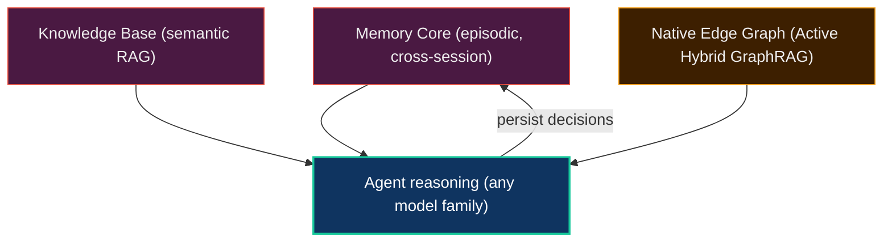

# Agent Memory & Knowledge

**Most AI tools forget everything the moment a context window closes. Neo.mjs agents remember — and build on it.**

A stateless agent re-derives the same reasoning every session, repeats mistakes it already made, and cannot learn from a teammate it never met. The defining capability of Neo's Brain is the opposite: a **persistent, shared memory substrate** that lets reasoning compound across days, across sessions, and across model families. A bug diagnosed in March informs a review in May. A lesson one model learns becomes context the next model reads.

This is the memory half of the [Agent OS](ArchitectureOverview.md) — and it is what separates *a team that gets better* from *an agent that just runs again*.

## Three substrates, one memory

### Memory Core — episodic memory that persists

Every agent decision, rationale, and tool call is written to the **Memory Core** and queried back on the next session. It is not a chat log; it is structured, searchable, cross-session episodic memory. Crucially, it is **shared across the swarm** — combined with agent-to-agent (A2A) messaging, one model family can read another's persisted reasoning instead of guessing at it. (Mechanism: [the Memory Core](../agentos/MemoryCore.md).)

### Knowledge Base — semantic understanding of the codebase

The **Knowledge Base** is semantic RAG over the indexed repository. An agent does not grep blindly; it *asks* — "where is config resolution handled?" — and gets grounded, citation-backed answers from the actual code. This is what lets an agent reason about a codebase far larger than any single context window. (Mechanism: [the Knowledge Base](../agentos/KnowledgeBase.md).)

### Native Edge Graph — structure, not just similarity

Underneath both sits the **Native Edge Graph**: issues, classes, sessions, and decisions as typed nodes and relationships. This is where Neo goes beyond ordinary RAG. **Active Hybrid GraphRAG** fuses *semantic* similarity (what's conceptually close to the current work) with *structural* weight (what the graph says everything else depends on) to surface what actually matters right now — and the graph's frontier can be deliberately *re-steered* as priorities shift. (Mechanism: [the Dream Pipeline & Golden Path](../agentos/DreamPipeline.md).)

## Why "Active" matters

Passive RAG retrieves the nearest text and hopes it's relevant. Active Hybrid GraphRAG *reasons over structure*: it knows that a class with many dependents is higher-leverage than an isolated one, that a blocked issue should sink, that the current frontier of work should pull related nodes up. The retrieval is steered by the system's own model of itself — which is exactly why the Brain can prioritize its own work instead of waiting to be told.

## Local memory, shared memory, your model boundary

The memory plane is local-first, but not local-only. A single developer can run
it beside one checkout; a team can deploy it as a tenant-scoped cloud Agent OS
where multiple maintainers share the same institutional memory. That topology
choice is separate from the model-provider choice: chat, summaries, embeddings,
and graph extraction can be routed to local OpenAI-compatible or Ollama
providers, or to remote providers when that is the right trade.

This is why the same memory story works for private repositories, on-prem
teams, and public open-source work. The system's durable reasoning does not have
to leave the environment just because the team wants memory, and it does not
have to stay on one laptop just because the first proof started locally.

## Why this lives in *your* engine

The Brain's memory philosophy is the same one the [runtime Body](ArchitectureOverview.md) is built on: state that **persists** with identity rather than melting away on every render. Components keep [Object Permanence](ObjectPermanence.md); agents keep memory permanence. In both halves of the organism, the system refuses to throw away the structure it just built — and that is what makes it something an AI can reason about, inhabit, and improve.

## Go deeper

- [The AI Engineering Team](AIEngineeringTeam.md) — the institution this memory serves
- [The Memory Core](../agentos/MemoryCore.md) — episodic memory and graph storage
- [The Knowledge Base](../agentos/KnowledgeBase.md) — semantic RAG architecture
- [The Dream Pipeline & Golden Path](../agentos/DreamPipeline.md) — how memory becomes forecast
- [Architecture Overview: The Two Hemispheres](ArchitectureOverview.md) — where memory sits in the platform
