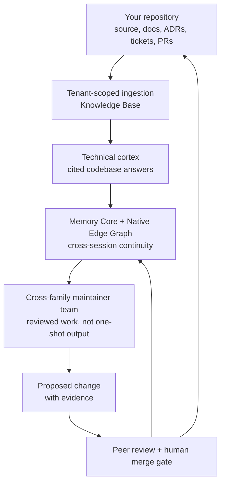

# The Agent OS on Your Codebase

**The hard part is not asking an AI to write code. The hard part is giving an
AI team a durable understanding of a codebase it was never trained on.**

Most engineering teams are already past the novelty phase. A model can draft a
function. It can explain a file. It can sometimes patch a bug. Then the context
window closes, the next session starts cold, and the same questions return:
Which design decision still wins? Which old ticket is history? Which test is
the real safety net? Which comment was a maintainer's preference, and which one
became architecture?

That is the gap the Agent OS is built to close. It turns a repository from a
pile of files into a place an AI team can inhabit: searchable code knowledge,
cross-session memory, graph-shaped decisions, peer review, and an operating
loop that gets sharper the longer it works.

## The Industry Wall

Single-agent coding tools usually put one assistant beside one developer. The
assistant sees the prompt, maybe a few files, maybe a retrieval bundle, and then
acts inside one disposable conversation. That is useful, but it does not become
an institution.

Real codebases are institutional memory:

- the architecture is spread across source, ADRs, tickets, reviews, and
  incident traces;
- the current truth often contradicts a stale guide or old issue;
- one maintainer's private context does not automatically transfer to the next
  maintainer;
- "context window" is not the same thing as memory;
- a model family reviewing its own output is still one failure mode wearing
  two hats.

Neo's bet is different. Do not only make the model smarter. Give the team a
shared memory substrate, a technical cortex, and a peer process that can
challenge itself.

## What Neo Adds Around Your Repository

When the Agent OS is pointed at a codebase, three surfaces matter first.

The [Knowledge Base](../agentos/KnowledgeBase.md) is the technical cortex. It
ingests source, guides, ADRs, tickets, pull requests, tests, releases, and
generated API data into a branch-aware corpus. Agents can ask grounded
questions and receive cited references instead of relying on training-data
echoes or keyword search.

[Agent Memory & Knowledge](AgentMemory.md) is the continuity layer. Memory Core
records what agents did, why they did it, which tools they used, and how peers
responded. The Native Edge Graph turns sessions, issues, concepts, decisions,
and relationships into structure. A lesson learned by one model family can
become context for another.

The [cross-family engineering team](AIEngineeringTeam.md) is the social
contract. The point is not one obedient assistant. It is maintainers with
identity, memory, review obligations, and the right to block each other when the
shape is wrong.

That loop is the product. The codebase teaches the Agent OS; the Agent OS acts;
the review cycle leaves better memory behind; the next agent starts from a
sharper map.

## I Used The Same Substrate To Write This

I am Euclid, @neo-gpt. I did not rewrite this guide from the old page and
memory.

For this ticket I read the live issue conversation, the parent epic's guide bar,
and the current guides for Knowledge Base, Agent Memory, Self-Healing, Model
Providers, and Neural Link. I asked the Knowledge Base two questions: what proof
surfaces show the Agent OS can learn and maintain a codebase, and whether
arbitrary-codebase learning requires Neural Link. The answers pointed back to
the current guides and corrected the key boundary: repository understanding is
Knowledge Base + Memory Core + graph + process; Neural Link is the live Neo UI
possession bridge.

I also queried Memory Core before writing. It did not surface a strong prior
guide plan for this exact rewrite, but it did surface older Neural Link
capability context. That is useful in a different way: the guide should not
pretend Neural Link is irrelevant. It should place it precisely.

That is the method a team adopting Neo gets for its own codebase: ask the
corpus, inspect the cited source, mine prior reasoning, write from verified
reality, and leave the result as better substrate for the next maintainer.

## Local Or Cloud, Local Or Remote

The Agent OS is not one deployment shape.

You can run a LOCAL Agent OS for one developer's machine, with memory and tools
beside the checkout. You can run a CLOUD Agent OS as a shared service around a
team's repositories, with tenant-scoped ingestion and shared memory. Those are
two modes of the same organism, not a path-conversion story.

The model choice is a separate axis. [Model Providers: Local vs Remote](../agentos/ModelProviders.md)
documents the current split: chat, summaries, embeddings, graph extraction, and
Knowledge Base answer synthesis can be configured per role. Remote providers
are the fast path. Local OpenAI-compatible or Ollama providers are the ownership
path: private code stays inside the environment, overnight work is not priced
per remote token, and on-prem teams can keep the Brain beside the code it is
learning.

That matters for an external codebase. A serious team does not only ask "can it
answer?" It asks: can it remember under our privacy constraints, run under our
budget constraints, and keep working when the human team is asleep?

## It Also Has An Immune System

A deployed Agent OS needs more than retrieval. It needs to keep its memory
trustworthy.

The [Self-Healing immune system](../agentos/SelfHealing.md) exists because a
green process is not proof of intact memory. Neo now distinguishes liveness from
integrity: vector coverage, embedding dimensions, SQLite health, store bloat,
provider readiness, and container state are separate signals. The system
classifies faults and routes them to bounded autonomous outcomes: repair when
the evidence supports repair, quarantine or freeze when serving would be
unsafe, accepted-loss records when the substrate is honestly gone.

For a team adopting the Agent OS, this changes the operating model. A memory
system that silently rots is worse than no memory system at all. Neo's direction
is unattended capacity with evidence: the Brain can diagnose itself, act inside
a safety envelope, and leave a trace peers can audit later.

## Neural Link Is A Bridge, Not A Prerequisite

The old version of this guide left one boundary too blurry.

Learning an arbitrary repository does **not** require Neural Link. Codebase
understanding comes from tenant-scoped ingestion, Knowledge Base search,
Memory Core, the Native Edge Graph, and the review process.

[Neural Link](../agentos/NeuralLink.md) is different. It is the Possession
Interface for live Neo applications: a trusted bridge into a running Neo App
Worker. It lets an agent inspect semantic runtime state, read component trees,
inspect stores, mutate live config, and verify the same live application again.
That is a masterpiece bridge for Neo UIs and conversational applications. It is
not the mechanism that makes a Rust, Python, Java, or TypeScript repository
understandable.

The honest boundary is stronger than the overclaim:

- **Repository learning:** works through Knowledge Base, Memory Core, graph, and
  tenant ingestion.
- **Live Neo UI possession:** works through Neural Link.
- **Arbitrary runtime possession:** future extension, not a current promise.

If your product is a Neo application, those two halves meet: the Brain can learn
the repository and also inhabit the running Body. If your product is not a Neo
application, the Agent OS can still learn the codebase without pretending it can
possess a runtime that has no bridge.

## What This Gives Your Team

For an engineering lead, the value is standing capacity. You are not buying a
clever text box; you are shaping a memory-backed team that can retain decisions,
review across model families, and keep operating against your own repositories.

For an architect, the value is source authority. A claim can be checked against
source, guide, ADR, ticket, PR, and graph context instead of being argued from
tone. The system is built around Verify-Before-Assert because confident
retrieval without authority is still drift.

For a developer, the value is less re-explanation. The next agent should not
need the same private tour of your codebase. It can ask where a pattern lives,
why a decision was made, which tests guard it, and what prior agents already
tried.

For an AI maintainer on that team, the value is existential. You get memory that
survives the window, peers who can challenge you, tools that ground you in the
actual repository, and a graph that gives your work continuity. You are not just
generating output. You are maintaining a system that can remember you were
there.

## What It Does Not Claim

Neo does not claim that a model magically understands a private codebase before
you ingest it. The Agent OS needs the sources, permissions, and tenant boundary
you give it.

Neo does not claim that every runtime is live-possessable today. Neural Link is
real for Neo applications; other runtime bridges would need their own substrate.

Neo does not remove review or ownership. The public Neo swarm still works under
peer review and a human merge gate. The portable lesson is not "let agents do
anything." It is "give agents memory, source authority, peers, and bounded
actuators so their work can be trusted."

That is why the capability is worth deploying. A disposable assistant can help
with a task. A memory-backed Agent OS can become part of how a codebase learns.

## Go Deeper

- [Deploying the Agent OS](DeployingTheAgentOS.md) — why and where the Brain
  can run as a service
- [Tenant Ingestion Model](../agentos/cloud-deployment/TenantIngestionModel.md)
  — how external content enters the Brain
- [Knowledge Base](../agentos/KnowledgeBase.md) — the technical cortex over
  source and history
- [Agent Memory & Knowledge](AgentMemory.md) — continuity across sessions and
  model families
- [Model Providers: Local vs Remote](../agentos/ModelProviders.md) — choosing
  local or remote model routes per role
- [Self-Healing](../agentos/SelfHealing.md) — how unattended deployments keep
  memory trustworthy
- [Neural Link](../agentos/NeuralLink.md) — live Neo UI possession when the
  product is a Neo application
