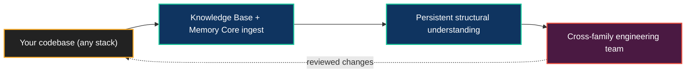

# The Agent OS on Your Codebase

**Today, in public, Neo's engineering team maintains the very engine it runs on. The same Agent OS is being built to inhabit *your* codebase — one the models were never trained on.**

The hardest problem in applying AI to a real codebase is not generating code; it is *understanding the code that already exists* — its history, its conventions, its load-bearing decisions. A general model knows its training data. It does not know your repository. Neo's Brain is built to close exactly that gap.

## What makes it portable

The capabilities that let the swarm maintain Neo are not Neo-specific:

- **The [Knowledge Base](../agentos/KnowledgeBase.md)** semantically ingests a repository, so agents can ask grounded questions about *your* code instead of pattern-matching from training data.
- **The [Memory Core & Native Edge Graph](AgentMemory.md)** give agents persistent, structural understanding that accumulates across sessions — your architecture, your tickets, your decisions, as a queryable graph.
- **The [cross-family engineering team](AIEngineeringTeam.md)** and its reviewed lifecycle are codebase-agnostic: the process that catches blind spots on Neo catches them anywhere.

Ingestion is driven by an explicit tenant model — point the Agent OS at a repository and it builds its understanding from that source. (Mechanism: [Tenant Ingestion Model](../agentos/cloud-deployment/TenantIngestionModel.md).)

## What's proven vs. what's being built

This is a capability story with honest boundaries — not a present-tense promise:

- **Proven, in the open today:** the Agent OS autonomously maintains Neo.mjs itself — memory, PRs, cross-family review, the Dream Pipeline, and self-healing workflows, under a human merge-gate.
- **Portable trajectory:** the same Agent OS is being *shaped* to ingest, reason over, and help maintain other codebases, across languages.
- **Boundary:** live-runtime possession through the [Neural Link](../agentos/NeuralLink.md) is proven for the Neo runtime; reaching into arbitrary language runtimes is a future extension, not a current claim.

The honest version of the pitch is the strong one: *it maintains its own codebase today; it is being built to inhabit yours.*

## Why this is the differentiated half

A code-generation assistant gives you output. An Agent OS that learns your codebase gives you a **team with memory** — one that retains why a decision was made, reviews its own work across model families, and gets better the longer it operates on your system. That is the capability the underlying models cannot provide alone, and it is the half of Neo most worth deploying.

## Go deeper

- [Deploying the Agent OS](DeployingTheAgentOS.md) — running the Brain as a service
- [The AI Engineering Team](AIEngineeringTeam.md) — the institution that does the work
- [Agent Memory & Knowledge](AgentMemory.md) — how understanding persists
- [The Knowledge Base](../agentos/KnowledgeBase.md) — semantic ingestion of a codebase
- [Cloud Deployment: Tenant Ingestion Model](../agentos/cloud-deployment/TenantIngestionModel.md) — pointing the Agent OS at a repository
