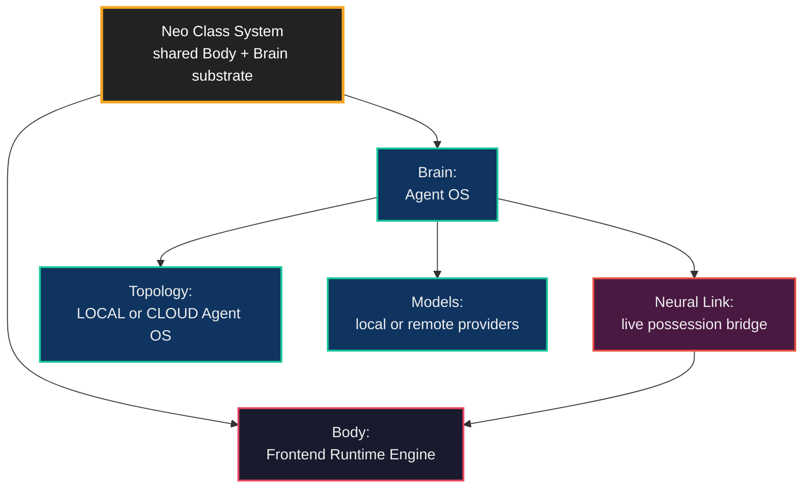
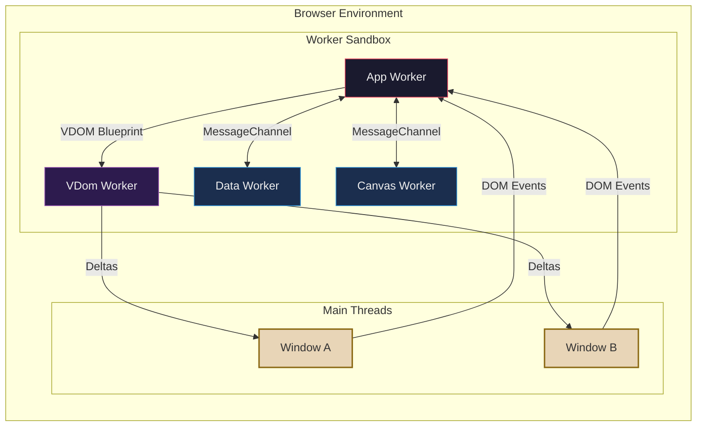
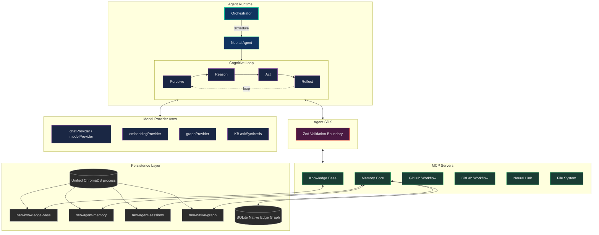
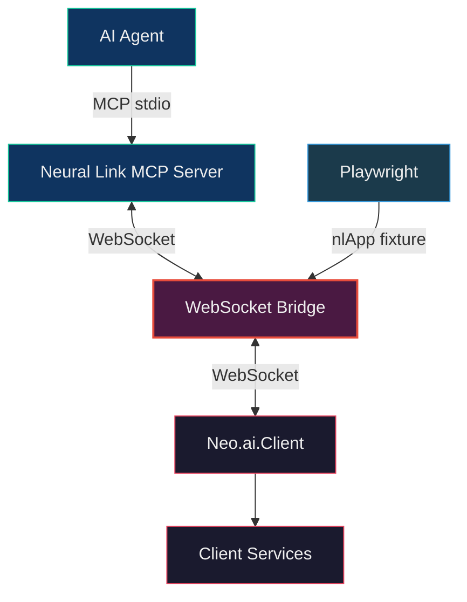
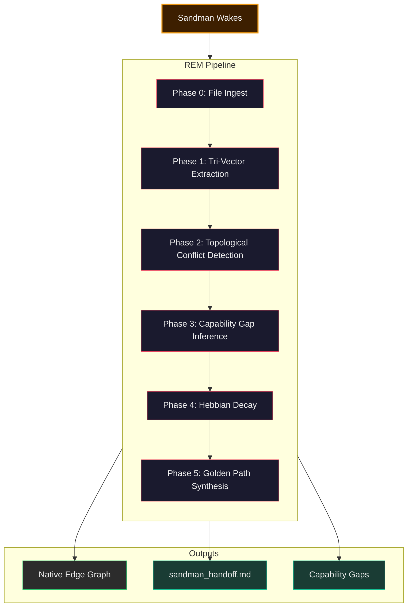
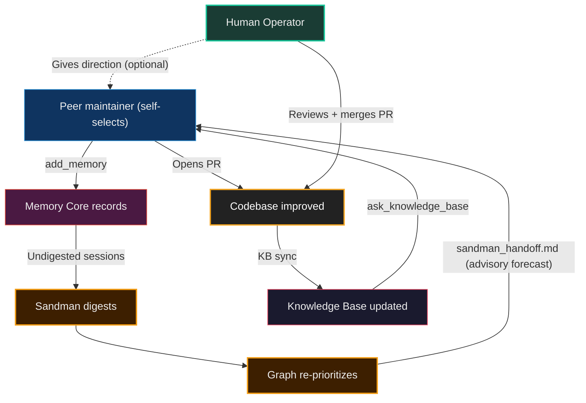

# Neo.mjs Architecture Overview

Neo has four areas a reader should keep separate before the details start:

- **Body:** the multi-threaded application engine that runs apps off the main thread.
- **Brain:** the Agent OS: Memory Core, Knowledge Base, Native Edge Graph, Dream Pipeline,
  Golden Path, and the orchestration substrate around them.
- **Neural Link:** the possession bridge between the Brain and a live Neo application Body.
- **Deployment topology:** LOCAL Agent OS for one developer, or CLOUD Agent OS for a shared
  team service. This is separate from whether the models themselves run locally or remotely.

This guide is the map across those areas. It shows how the Body and Brain share one class
system, how the Brain keeps one unified Chroma topology for logical Knowledge Base and Memory
Core collections, and how Neural Link lets the Brain inhabit a running Neo application without
turning repository learning into a browser-runtime requirement.

For setup and configuration of individual MCP servers, see the dedicated guides linked at the bottom
of this document.

## The Two Hemispheres

Neo.mjs is a single platform with two distinct hemispheres that share a common nervous system —
the Neo Class System:

Both hemispheres are built on the same `Neo.core.Base` class system. `DreamService`,
`GraphService`, `Agent`, `Loop`, and every MCP service extend `Neo.core.Base` and use
`Neo.setupClass()` exactly like `Neo.button.Base` or `Neo.grid.Container`. The AI
infrastructure is not a separate project — it is a native inhabitant of the organism
it maintains.

## Left Hemisphere: The Runtime Engine

The runtime is Neo's core value proposition. All application logic runs **off the Main Thread**
inside a multi-worker architecture:

### Key Concepts

- **App Worker:** Hosts all components, controllers, state providers, and business logic.
  This is where your application code lives.
- **VDom Worker:** A dedicated thread for the JSON diff engine. It receives VDOM blueprints
  from the App Worker and computes minimal delta updates.
- **Data Worker:** Handles stores, models, sorting, filtering, and grouping — keeping
  heavy data operations off the main thread.
- **Main Threads:** Thin clients that only apply DOM mutations. Each browser window has
  its own main thread, but they all connect to the same App Worker.

### The Triangular Optimization

VDOM updates follow an optimized triangular path:

1. **App Worker sends** the new JSON VDOM tree to the VDom Worker
2. **The Main Thread intercepts** the VDom Worker's reply and applies delta mutations to the
   DOM immediately
3. **Main Thread forwards** confirmation back to the App Worker

This eliminates a full round-trip vs naively routing updates through the App Worker.

### SharedWorker Mode

When `useSharedWorkers: true`, the App Worker becomes a `SharedWorker`. Multiple browser
windows connect to the **same** App Worker instance, sharing a single JavaScript heap.
Components can be moved between windows — unmounted from one, remounted in another —
without losing state. This is the foundation of Neo's multi-window application support.

## Right Hemisphere: The Agent OS

The Agent OS is a Node.js infrastructure that provides AI agents with persistent memory,
semantic understanding of the codebase, peer coordination, and optional access to a live
Neo application through Neural Link:

The Chroma process is unified. Knowledge Base and Memory Core do **not** run separate
ChromaDBs; they use separate logical collections against the shared Chroma backend. The
orchestrator owns that Chroma lifecycle in deployed topologies, while each server connects as
a client through its own `ChromaManager`.

### LOCAL Brain vs. CLOUD Brain

The Agent OS has two deployment topologies:

- **LOCAL Agent OS:** a single developer's on-machine Brain beside a checkout. It is private
  by default, simple to iterate on, and useful for solo maintenance.
- **CLOUD Agent OS:** a shared, tenant-scoped team Brain around one or more repositories. It
  gives the team shared Memory Core, shared Knowledge Base, shared A2A, and shared diagnostics.

There is no guide-level conversion path between them. They are two topologies of the same
organism. A team chooses the topology that matches its collaboration boundary.

Model placement is a separate choice. A local Agent OS can call a remote Gemini provider while
bootstrapping. A cloud Agent OS can use a local OpenAI-compatible or Ollama provider when privacy,
cost, or residency requires it. The provider axes are role-specific: chat/summaries, embeddings,
Dream graph generation, and Knowledge Base answer synthesis can each be routed deliberately.

### The Cognitive Loop

The agent runtime (`ai/agent/Loop.mjs`) implements a four-phase cognitive loop:

1. **Perceive:** The `ContextAssembler` fetches long-term memory (session summaries via RAG),
   short-term memory (recent session history), and skill metadata to build the LLM context window.
2. **Reason:** The assembled context is sent to the configured model provider for inference,
   producing a response that may include tool calls.
3. **Act:** Tool calls are executed via the MCP protocol (for frontier models) or the SDK
   (for sub-agents with Zod validation).
4. **Reflect:** Every thought, decision, and tool call is persisted via `add_memory()`, creating
   the episodic memory record that the DreamService will later digest.

### The SDK Bouncer Pattern

`ai/services.mjs` is the critical safety layer. It loads OpenAPI specs from each MCP server and
wraps each method with `makeSafe()` — a function that generates Zod validators at startup.

- **Frontier models** access services via MCP protocol (stdio) with unbounded
  tool access.
- **Sub-agents** access the same services via the SDK,
  but every call is runtime-validated against the OpenAPI schema, preventing hallucinated JSON
  from reaching internal databases.

### MCP Server Surfaces

| Server | Purpose | Key Operations |
|---|---|---|
| **Knowledge Base** | Semantic RAG over the indexed codebase | `ask_knowledge_base`, `query_documents` |
| **Memory Core** | Episodic memory, session summaries, native edge graph | `add_memory`, `query_raw_memories`, `get_context_frontier` |
| **GitHub Workflow** | Offline-first issue and PR management | `create_issue`, `sync_all`, `manage_issue_labels` |
| **GitLab Workflow** | GitLab issue and merge-request workflow support | `list_issues`, `list_merge_requests`, `manage_mr_reviewers` |
| **Neural Link** | Live application introspection via WebSocket | `get_component_tree`, `patch_code`, `simulate_event` |
| **File System** | Direct codebase read/write access | `read_file`, `write_file`, `list_directory`, `check_syntax` |

Those MCP servers are tool surfaces, not the whole Brain. Long-running background work lives in
`ai/daemons/`: the orchestrator schedules Dream, Golden Path, tenant repo sync, memory summary
backfill, graph-log compaction, primary-dev sync, swarm heartbeat, and the data-integrity
self-healing sweeps. Keep those inventories separate: an orchestrator data-integrity service is
not an MCP server, and a model provider is not a daemon.

## The Neural Link Bridge

The Neural Link is the connection point between the two hemispheres. It allows the Agent OS
to reach *into* the running browser application:

The AI does not scrape DOM. It queries the **semantic component tree** directly — asking for
components by `ntype`, reading store data, inspecting state providers, and even hot-patching
methods on class prototypes at runtime. The same WebSocket bridge serves both AI agents and
Playwright test fixtures, creating a unified "Whitebox E2E" testing architecture.

### How it Works

1. The `Neo.ai.Client` singleton lives inside the **App Worker** (browser-side)
2. It connects to the Neural Link MCP Server via WebSocket (JSON-RPC 2.0)
3. The MCP Server exposes 5 client-side service categories: Component, Data, Instance,
   Interaction, and Runtime
4. When a new browser window connects, the client rehydrates the full window topology
   to the Agent OS

## The Dream Pipeline

The `DreamService` is an autonomous background daemon that runs when agents are idle.
It is the mechanism by which the system **learns from itself**:

### The Six Phases

1. **File Ingest:** `FileSystemIngestor.syncWorkspaceToGraph()` scans the repository and ingests
   issues, markdown files, and source files into the Native Edge Graph (SQLite).

2. **Tri-Vector Extraction:** The configured graph provider analyzes undigested session
   memories and extracts three vectors: semantic graph nodes and edges, the feature namespace
   being worked on, and any roadmap impact.

3. **Topological Conflict Detection:** Another LLM pass scans for tickets that have been
   rendered obsolete, superseded, or duplicated by recent session decisions. Alerts are written
   to `sandman_handoff.md`.

4. **Capability Gap Inference:** This phase is **deterministic** — it does not use an LLM.
   It cross-references structural code nodes and concept-ontology nodes against explicit graph evidence:
   - Does `test/` contain files with precise evidence for this class's semantic name tokens? If not: **TEST_GAP**; if yes, add a `VALIDATES` edge from the test `FILE` node to the structural source node.
   - Does a high-weight `CONCEPT` node have an outbound `EXPLAINED_BY` edge to a guide/doc file? If not: **GUIDE_GAP**. Concepts with guide coverage but no `EXEMPLIFIED_BY` edge become **EXAMPLE_GAP**.

5. **Hebbian Decay:** Universal edge weight fade and garbage collection of stale nodes,
   inspired by synaptic pruning in neuroscience.

6. **Golden Path Synthesis:** Tri-Vector scoring of all OPEN issues, producing a prioritized
   roadmap written to `sandman_handoff.md`. This file is the strategic dashboard that the
   next agent instance reads on boot.

## The Closed Loop

This is the architecture's gravitational center. Every piece connects into a single
self-improving feedback loop:

The Golden Path (`sandman_handoff.md`) is an **advisory forecast**, not a work queue: peer
maintainers self-select what to work on, while the human operator steers direction and holds
the merge gate rather than assigning tickets.

The agent's improvements to the codebase also improve the agent's knowledge base,
which improves the agent's future decisions. This is what distinguishes Neo.mjs from tools
that provide memory, orchestration, or multi-agent roles in isolation — Neo builds the
complete organism where the codebase and the agent co-evolve.

## Structural Inventory

### Runtime Engine (Browser)

| Package | Purpose | Key Classes | Decisions |
|---|---|---|---|
| `src/core/` | Class system, Observable, Logger | `Base`, `Observable` | — |
| `src/component/` | UI primitives | `Base`, `Wrapper` | — |
| `src/container/` | Layout containers | `Base`, `Viewport` | — |
| `src/grid/` | Buffered data grids | `Container`, `View` | — |
| `src/data/` | Data layer | `Store`, `Model`, `RecordFactory` | — |
| `src/state/` | State management | `Provider` | — |
| `src/worker/` | Thread management | `App`, `VDom`, `Data`, `Manager` | — |
| `src/vdom/` | Virtual DOM engine | `Helper` | — |
| `src/main/` | Main thread addons | `DomEvents`, `DomAccess` | — |
| `src/ai/` | Neural Link client | `Client` | — |

### Agent OS (Node.js)

Post-M6 ([#10986](https://github.com/neomjs/neo/issues/10986)) the per-MCP-server services were lifted from `ai/mcp/server/<name>/services/` into the flat SDK boundary at `ai/services/<name>/`. The `ai/mcp/server/<name>/` directories now host only the server entry-point (`Server.mjs`), config templates, logger, and shared helpers; the service implementations live under `ai/services/<name>/`. Both rows are listed below for navigability.

| Package | Purpose | Key Classes | Decisions |
|---|---|---|---|
| `ai/Agent.mjs` | Agent base class | `Agent` | — |
| `ai/agent/` | Cognitive runtime | `Loop`, `Orchestrator`, `Scheduler` | [ADR 0035](../agentos/decisions/0035-live-lane-awareness-composition.md) |
| `ai/config.template.mjs`, `ai/ConfigProvider.mjs` | Tier-1 Agent OS config template and shared config provider consumed by top-level and MCP server configs | `Config`, `ConfigProvider` | — |
| `ai/context/` | Context window management | `Assembler` | — |
| `ai/provider/` | LLM abstraction | `Gemini`, `Ollama`, `OpenAiCompatible` | — |
| `ai/services.mjs` | SDK with Zod validation aggregator | — | — |
| `ai/services/knowledge-base/` | Semantic RAG services (post-M6 SDK location) | `QueryService`, `SearchService`, `KBRecorderService` | — |
| `ai/services/memory-core/` | Episodic memory services (post-M6 SDK location) | `MemoryService`, `SessionService`, `GraphService`, `MailboxService` | [ADR 0001](../agentos/decisions/0001-cross-process-cache-coherence.md), [ADR 0002](../agentos/decisions/0002-phase3-wake-substrate-standards-alignment.md), [ADR 0030](../agentos/decisions/0030-work-graph-stall-inference.md), [ADR 0035](../agentos/decisions/0035-live-lane-awareness-composition.md) |
| `ai/services/graph/` | Dream Pipeline graph analysis, Golden Path synthesis, handoff rendering, and deterministic gap/finding inference | `GapInferenceEngine`, `GoldenPathSynthesizer`, graph-section helpers | [ADR 0023](../agentos/decisions/0023-dreamservice-organism-map-fidelity-consolidation-liveness.md), [ADR 0024](../agentos/decisions/0024-native-edge-graph-model.md), [ADR 0030](../agentos/decisions/0030-work-graph-stall-inference.md), [ADR 0035](../agentos/decisions/0035-live-lane-awareness-composition.md) |
| `ai/services/github-workflow/` | Issue/PR management services (post-M6 SDK location) | `IssueService`, `SyncService`, `LabelService` | — |
| `ai/services/gitlab-workflow/` | GitLab project workflow services when enabled | GitLab issue/MR service classes | — |
| `ai/services/neural-link/` | Live app bridge services (post-M6 SDK location) | `ConnectionService`, `RecorderService` | — |
| `ai/services/shared/vector/` | Cross-server vector-engine primitives consumed by per-server ChromaManager classes (KB + MC); functional helpers, not Neo classes | `chromaClientPrimitives.mjs` (`chromaConnect`, `createSilentExecutor`, `chromaDeleteCollection`) | — |
| `ai/services/shared/contentTrust/` | Cross-service self-defense content helpers — GitHub author-tier classification + astroturf sanitization (URL defang / name redaction / stealth-intent flags), consumed by github-workflow read paths + KB ingestion; functional helpers, not Neo classes | `authorTrustClassifier.mjs`, `astroturfSanitizer.mjs` | [#10291](https://github.com/neomjs/neo/issues/10291) (P8 self-defense) |
| `ai/scripts/` | One-shot operator scripts + thin helper wrappers | `lifecycle/`, `maintenance/` | — |
| `ai/daemons/` | Long-running daemon classes and entry points | `Orchestrator`, `orchestrator/daemon.mjs`, `wake/daemon.mjs`, `DreamService`, `SwarmHeartbeatService`, tenant sync, summary backfill, Golden Path, GraphLog compaction, recovery and data-integrity services | [ADR 0002](../agentos/decisions/0002-phase3-wake-substrate-standards-alignment.md), [ADR 0025](../agentos/decisions/0025-orchestrator-container-health-self-healing.md), [ADR 0026](../agentos/decisions/0026-recovery-actuator.md), [ADR 0027](../agentos/decisions/0027-autonomous-data-recovery-actuator.md), [ADR 0030](../agentos/decisions/0030-work-graph-stall-inference.md), [ADR 0035](../agentos/decisions/0035-live-lane-awareness-composition.md) |
| `ai/graph/` | Native Edge Graph (SQLite-backed knowledge graph) | `Database`, `Store`, `NodeModel` | [ADR 0001](../agentos/decisions/0001-cross-process-cache-coherence.md), [ADR 0015](../agentos/decisions/0015-graph-store-backend-posture.md) |
| `ai/mcp/server/knowledge-base/` | KB MCP-server entry point + config | `Server`, `config` | — |
| `ai/mcp/server/memory-core/` | MC MCP-server entry point + config | `Server`, `config` | [ADR 0001](../agentos/decisions/0001-cross-process-cache-coherence.md) |
| `ai/mcp/server/github-workflow/` | GH-WF MCP-server entry point + config | `Server`, `config` | — |
| `ai/mcp/server/gitlab-workflow/` | GitLab Workflow MCP-server entry point + config | `Server`, `config` | — |
| `ai/mcp/server/neural-link/` | NL MCP-server entry point + config | `Server`, `config` | — |
| `ai/mcp/server/file-system/` | File System MCP-server entry point + services | `Server`, file operation services | — |
| `ai/mcp/server/shared/` | Cross-cutting MCP infrastructure | `BaseServer`, `AuthMiddleware`, `RequestContextService`, `TransportService` | — |

### Harness (the Agent Harness's native vessel)

| Package | Purpose | Key Classes | Decisions |
|---|---|---|---|
| `harness/` | The Electron packaging root — the optional native embodiment around the harness app (Body apps run without it): boots the dev-mode source app on the privileged `app://` origin, resolving the repo-root source graph through an explicit renderer-content allowlist for Neural-Link possession depth; fail-closed content/window/navigation/permission posture; harness UI source stays in `apps/`, the Brain stays in `ai/` | `main.mjs`, `contentPolicy.mjs`, `preload.cjs` | [ADR 0020](../agentos/decisions/0020-agent-harness-concept.md), [ADR 0034](../agentos/decisions/0034-electron-shell-architecture.md) |

## Architectural Decision Records

The Agent OS subsystem records its load-bearing architectural trade-offs in [`learn/agentos/decisions/`](../agentos/decisions/). Every cross-system trade-off — i.e. one that touches multiple subsystems, sets a precedent for future code, or affects load-bearing invariants — earns an ADR (per the `structural-pre-flight` skill's Strategy-vs-Tactics threshold). Per-class localized constraints stay inline as Anchor & Echo guards instead.

The map-as-pointer principle: the Structural Inventory above links each subsystem row to its relevant ADRs so readers who follow the map naturally encounter the architectural-decision substrate without needing to remember to consult `decisions/` separately. Authors of new ADRs MUST add the link to the affected Structural Inventory rows in the same PR (per [#10449](https://github.com/neomjs/neo/issues/10449) Sub-Issue 2 / `structural-pre-flight` map-maintenance discipline).

**This table is a curated subset** — map-relevant highlights, deliberately NOT the complete corpus index. The authoritative every-ADR composition map is [ADR 0031's seam table](../agentos/decisions/0031-target-architecture-composition.md), kept complete **by construction** via the `lint-adr-seam-table` CI guard (one row per present ADR, enforced both directions). A new ADR always takes its seam-table row (CI fails otherwise) and additionally earns a row here only when it affects mapped Structural Inventory rows.

| ADR | Subject | Subsystems Affected | Status |
|---|---|---|---|
| [0001](../agentos/decisions/0001-cross-process-cache-coherence.md) | Cross-Process Cache Coherence for Memory Core Graph | `ai/services/memory-core/`, `ai/graph/`, `ai/mcp/server/memory-core/` | Proposed (#10186 / #10189) |
| [0002](../agentos/decisions/0002-phase3-wake-substrate-standards-alignment.md) | Phase 3 Wake-Substrate Standards Alignment (MCP + A2A schema mappings) | `ai/daemons/wake/`, `ai/daemons/`, `ai/services/memory-core/` (MailboxService A2A primitives) | Proposed (#10311 / #10355) |
| [0015](../agentos/decisions/0015-graph-store-backend-posture.md) | Graph Store Backend Posture - SQLite WAL First, Networked SQL Deferred | `ai/graph/`, `ai/services/memory-core/`, cloud deployment docs | Accepted - 2026-05-22 (#11732; PR #11779) |
| [0025](../agentos/decisions/0025-orchestrator-container-health-self-healing.md) | Orchestrator Container-Health Diagnostics Daemon | `ai/daemons/orchestrator/services/`, `ai/deploy/` | Proposed (#13861) |
| [0026](../agentos/decisions/0026-recovery-actuator.md) | Orchestrator Recovery Actuator | `ai/daemons/orchestrator/services/`, `ai/deploy/` | Proposed (#13880) |
| [0027](../agentos/decisions/0027-autonomous-data-recovery-actuator.md) | Autonomous Memory Core Data-Recovery Actuator | `ai/daemons/orchestrator/services/`, `ai/services/memory-core/` | Proposed (#14134) |
| [0028](../agentos/decisions/0028-temporal-pyramid-summarization-substrate.md) | Temporal-Pyramid Summarization Substrate | `ai/services/memory-core/`, `ai/daemons/`, temporal summary consumers | Proposed (#14427; PR #14428) |
| [0029](../agentos/decisions/0029-harness-docking-design.md) | Harness Docking Design — multi-window layout model, topology perspectives, cross-window drag, container contract | `src/dashboard/`, `src/manager/` (`DragCoordinator` seam), `apps/agentos/` | Accepted — 2026-07-02 (#14423; PR #14425) |
| [0030](../agentos/decisions/0030-work-graph-stall-inference.md) | Work-Graph Stall Inference — `STALL_*` finding schema, defer tuple, and consumer boundaries | `ai/services/graph/`, `ai/services/memory-core/`, `ai/daemons/`, hook/wake/FM consumers | Proposed (#14461) |
| [0031](../agentos/decisions/0031-target-architecture-composition.md) | Target-Architecture Composition — the whole-organism seam table + trajectory invariants + id-based staleness guard | Organism-level: no single Structural Inventory row owns this seam (it composes ALL of them — the boundary is deliberate); guard: `ai/scripts/lint/` | Proposed (#14525; PR #14527) |
| [0035](../agentos/decisions/0035-live-lane-awareness-composition.md) | Live Lane Awareness — typed route, lifecycle frontier, Bird-View references, and fenced hook projection | `ai/agent/`, `ai/services/graph/`, `ai/services/memory-core/`, `ai/daemons/`, Claude/Codex hook consumers | Proposed (#15101) |

## Next Steps

- [Deploying the Agent OS](DeployingTheAgentOS.md) — Benefit-altitude path into
  the cloud-deployment guide set
- [Why Deploy the Agent OS](../agentos/cloud-deployment/WhyDeploy.md) — The
  cloud-deployment hub and ordered learning path
- [Strategic Workflows](../agentos/StrategicWorkflows.md) — Advanced agent workflow patterns
- [Swarm Intelligence & Sub-Agents](../agentos/SwarmIntelligence.md) — Delegation, profiles, and capability gating
- [The Dream Pipeline & Golden Path](../agentos/DreamPipeline.md) — Forecasting engine and scoring algorithm
- [Neural Link: Live Application Mutability](../agentos/NeuralLink.md) — Deep dive into the Neural Link bridge
- [The Knowledge Base Server](../agentos/KnowledgeBase.md) — Semantic RAG architecture
- [The Memory Core Server](../agentos/MemoryCore.md) — Episodic memory and graph storage
- [Self-Healing Immune System](../agentos/SelfHealing.md) — Detect, diagnose, and bounded autonomous recovery
- [The GitHub Workflow Server](../agentos/GitHubWorkflow.md) — Offline-first issue management
- [Code Execution (AI SDK)](../agentos/CodeExecution.md) — The SDK Bouncer pattern in detail
