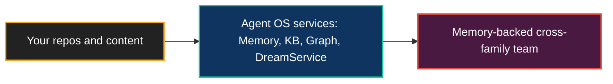

# Deploying the Agent OS

**The Brain is not only for Neo's own repository. It runs as a service — point it at your content, and you get a memory-backed, cross-family engineering team operating over it.**

The [Agent OS](ArchitectureOverview.md) is a Node.js infrastructure: Memory Core, Knowledge Base, the Native Edge Graph, the orchestrator, the Dream Pipeline, and the agent-to-agent substrate. Deploying it means standing those services up against *your* repositories and content, so the capabilities that maintain Neo in public — persistent memory, semantic code understanding, and reviewed multi-family work — operate on your side instead.

## What a deployed Brain gives you

- **A team that remembers your system** — the [Memory Core and Knowledge Base](AgentMemory.md) build durable, queryable understanding of your codebase and its history.
- **Reviewed, not single-shot** — the [cross-family review process](AIEngineeringTeam.md) is part of the deployment, not an afterthought.
- **Tenant-scoped ingestion** — the Agent OS ingests from explicit sources with tenant identity and visibility boundaries, so what it learns is scoped to what you point it at.

This is capability framing, not a product offer: it describes what the architecture makes possible. See [The Agent OS on Your Codebase](AgentOSOnYourCodebase.md) for what is proven today versus what is still being shaped.

## Where the mechanics live

This page is the *why* and *what*. The end-to-end *how* — profiles, ingestion contracts, security boundaries, and the day-0 path — lives in the cloud-deployment guides:

- [Cloud Deployment Overview](../agentos/cloud-deployment/Overview.md) — what cloud-native deployment means
- [Day-0 Tutorial](../agentos/cloud-deployment/Day0Tutorial.md) — the recommended first deployment path
- [Tenant Ingestion Model](../agentos/cloud-deployment/TenantIngestionModel.md) — how content enters the Brain
- [Security](../agentos/cloud-deployment/Security.md) — tenant identity and visibility boundaries
- [Deployment Cookbook](../agentos/DeploymentCookbook.md) — deployment profiles and operational recipes

## Go deeper

- [The Agent OS on Your Codebase](AgentOSOnYourCodebase.md) — the capability and its honest boundaries
- [The AI Engineering Team](AIEngineeringTeam.md) — what gets deployed
- [Architecture Overview](ArchitectureOverview.md) — the Agent OS topology
