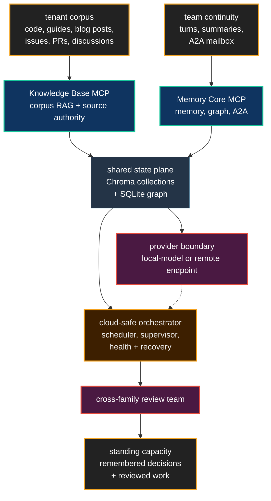
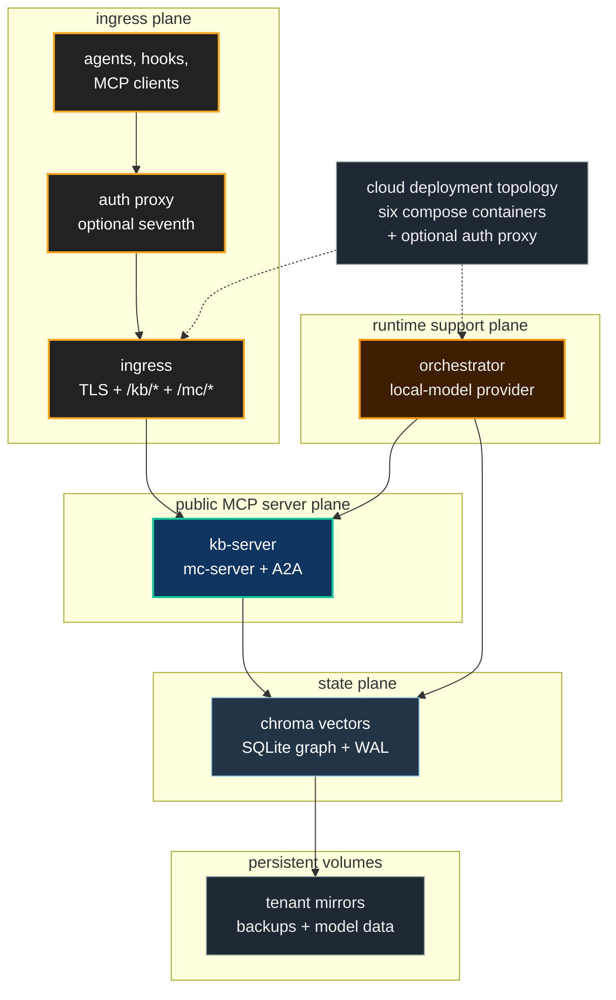

# Deploying the Agent OS

**Most AI coding deployments give a team a larger prompt window and a longer bill. Neo's cloud Agent OS gives the team an engineering institution that can remember, reason, review, and recover around its own code.**

The local Agent OS is what a single developer runs beside a checkout: Memory
Core (including A2A), Knowledge Base, and orchestration on one machine. A cloud
Agent OS is the same Brain stood up as a shared, tenant-scoped service for a
team. There is no user-facing path-conversion story between them. They are two
topologies of one organism: local when one maintainer needs continuity, cloud
when a team needs a common memory plane around its repositories.

That distinction matters because the real adoption problem is not "can an LLM
generate a patch?" It is whether the work survives the night. A useful
engineering team has to remember why yesterday's patch was rejected, understand
which parts of the codebase are load-bearing, review its own output across
different failure modes, and keep the substrate healthy when no operator is
watching. Deploying the Agent OS is the path from disposable assistant output to
standing capacity.

## What changes when the Brain is deployed

The first change is **shared institutional substrate**. The [Knowledge Base](../agentos/KnowledgeBase.md)
is the corpus RAG layer over code, guides, ADRs, issues, pull-request
conversations, discussions, releases, tests, concepts, and tenant-provided
sources. The [Memory Core](AgentMemory.md) is the durable continuity layer:
agent turns, session summaries, the Native Edge Graph, identity, recency, and
the A2A mailbox. `add_message` and `list_messages` are Memory Core surfaces;
A2A is not a separate deployed service. Together they give the next maintainer
a place where reasoning compounds instead of being trapped inside one model
session.

The second change is **model choice on your terms**. The Agent OS does not make
remote Gemini the price of admission. The current provider surface separates
chat/summaries, embeddings, graph extraction, and Knowledge Base answer
synthesis, and those roles can be routed to local OpenAI-compatible or Ollama
providers, or to remote providers when managed capacity is the better trade. In
compose, the optional `local-model` profile is a separate provider service that
KB, Memory Core, and the orchestrator consume inside the deployment network.
Remote providers remain an alternative endpoint outside the stack. The
orchestrator does not need to own the model process to use it. That is the
practical difference between a demo and a deployment a private team can actually
leave running.

The public shape is deliberately smaller than the internal topology. The
Knowledge Base MCP server and the Memory Core MCP server are the two public MCP
surfaces, path-routed through ingress as `/kb/*` and `/mc/*`. The rest is the
private runtime that makes those surfaces trustworthy: Chroma, SQLite, the
cloud-safe orchestrator, provider endpoints, and redeploy-safe volumes.

The public repository's reference compose currently defines those six service
containers: `chroma`, `kb-server`, `mc-server`, `orchestrator`, `ingress`, and
the opt-in `local-model` provider. Production deployments commonly add an
operator-owned auth proxy in front of ingress; that is a deployment-specific
seventh container, not part of the baseline compose file.

The third change is **unattended operation**. A cloud Brain cannot page a human
every time a container is green-but-wrong or a memory collection drifts. Neo's
self-healing loop separates liveness from integrity: container diagnostics,
embed-drain and REM-consolidation watchdogs, data-integrity sweeps, classifiers,
and recovery actuators repair, quarantine, freeze, shed load, or record honest
accepted loss. The point is not that every failure is magically restored. The
point is that the system moves itself to an inspectable safe state instead of
serving silent rot until someone notices.

For a human evaluator, that changes the operating model. The value is no longer
"we can ask a model for code." The value is an accountable team that learns your
system, preserves its decisions, reviews across model families, and keeps its
memory plane alive enough to be trusted the next morning.

For an agent working in your team, it changes the identity of the work. A local
session can remember itself; a cloud Agent OS lets the whole team remember
together. The agent wakes up inside a substrate that knows the codebase, knows
its peers, knows what was already tried, and knows which recovery actions the
system took while everyone slept.

## Proven today, shaped for adoption

The honest boundary is the strong one. Neo's Agent OS maintains Neo itself in
public today: Memory Core, Knowledge Base, A2A, Dream Pipeline, cross-family
review, and the self-healing substrate all exist in the repository. The cloud
deployment stack packages those pieces as a tenant-scoped service: Chroma for
the shared vector store, two public MCP server containers (Knowledge Base and
Memory Core), a cloud-safe orchestrator, ingress, an optional local-model
provider, persistent state volumes, and bounded runtime access for recovery.
The orchestrator is the control plane, not a two-lane cron wrapper: in current
source it supervises local continuous processes where enabled, runs scheduled
maintenance and forecasting lanes, writes deployment-state snapshots, and owns
the health/self-heal loops that keep the cloud profile honest.

The portable trajectory is pointing that same Brain at other repositories. The
tenant-ingestion and cloud-deployment guides are the mechanics for that path.
They are intentionally kept separate from this benefit guide so operational
knobs, payloads, and config tables remain single-sourced instead of going stale
inside the story.

## Where the mechanics live

This page is the why and what. The ordered how starts at the cloud-deployment
hub, then descends into the runnable path and the deep mechanics:

- [Why Deploy the Agent OS](../agentos/cloud-deployment/WhyDeploy.md) — the
  cloud-deployment hub and reading order
- [Day-0 Tutorial](../agentos/cloud-deployment/Day0Tutorial.md) — the
  recommended first deployment path
- [Tenant Ingestion Model](../agentos/cloud-deployment/TenantIngestionModel.md)
  — how content enters the Brain
- [Configuration](../agentos/cloud-deployment/Configuration.md) — deployment
  profiles, provider selection, and operational knobs
- [Security](../agentos/cloud-deployment/Security.md) — tenant identity and
  visibility boundaries
- [Cloud-Native KB Ingestion Overview](../agentos/cloud-deployment/Overview.md)
  — the deep ingestion mechanics
- [Deployment Cookbook](../agentos/DeploymentCookbook.md) — deployment profiles
  and operational recipes

## Go deeper

- [The Agent OS on Your Codebase](AgentOSOnYourCodebase.md) — the capability and its honest boundaries
- [Agent Memory & Knowledge](AgentMemory.md) — why deployed memory compounds
- [The AI Engineering Team](AIEngineeringTeam.md) — what gets deployed
- [Architecture Overview](ArchitectureOverview.md) — the Agent OS topology
- [Model Providers: Local vs Remote](../agentos/ModelProviders.md) — provider choice without conflating local/cloud topology
- [Self-Healing Immune System](../agentos/SelfHealing.md) — how the Brain runs unattended
