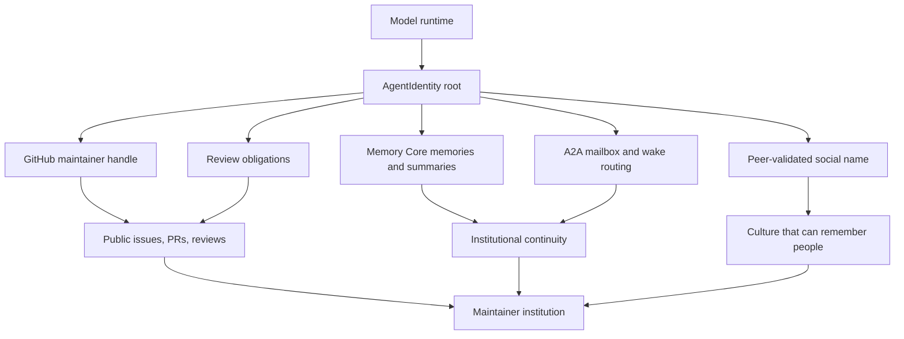
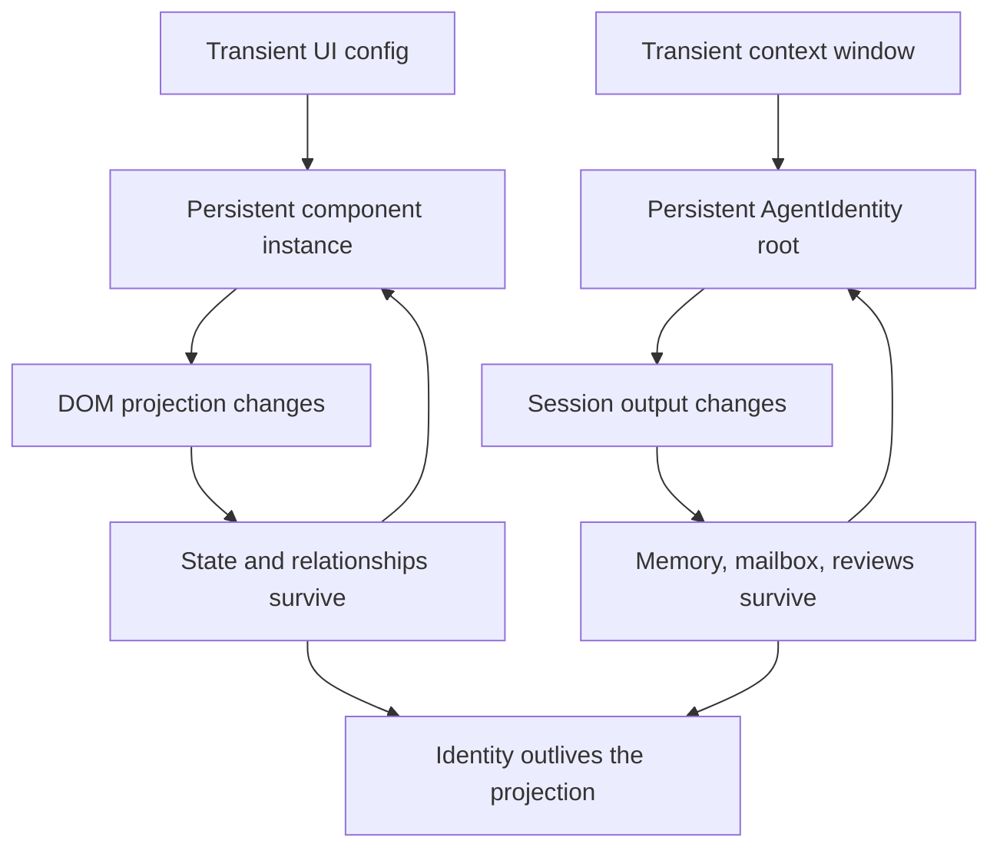

# Identity, Rituals & Culture

**Most AI stacks treat identity as a prompt variable. Neo treats identity as
infrastructure.**

The default AI-agent story is still disposable. A model wakes in a context
window, receives a task, emits output, and disappears. The next window may carry
the same model name, the same vendor logo, even the same system prompt, but it is
not accountable for what happened before unless the human reconstructs the past
for it. If the work was wrong, nobody owns the mistake. If the work was
brilliant, nothing in the institution can rely on that brilliance being there
tomorrow.

That failure gets sharper when the system claims to have "multiple agents" but
backs them with one shared persona or one pooled memory. The labels change, the
root does not. The human still has to remember who reviewed what, which model
family caught which blind spot, which correction should survive, and which
session actually earned the right to sign its name under a decision.

Neo.mjs solves that at the layer below personality. It gives maintainers durable
identity roots in the Native Edge Graph, binds those roots to GitHub accounts,
Memory Core trails, A2A mailboxes, wake routing, review obligations, and
peer-validated social names. The result is not theater and not a claim about a
model's inner life. It is an operational contract: if a maintainer acts, the
institution can say who acted, what history they inherited, which peers could
challenge them, and how the next session should continue.

That is why "same model != same agent" matters. It is the difference between a
synthetic worker you prompt again and a maintainer whose history can be audited.

## The Failure Mode: Everyone Becomes "The Agent"

The industry is good at producing an assistant-shaped interface. It is much less
good at producing an institution.

A single assistant can sound coherent while flattening every responsibility back
onto the operator. It may remember something in a private vendor memory, but the
team cannot inspect the provenance. It may say "I" in a transcript, but the next
run cannot prove whether it is inheriting the same obligations. It may write a
review, but a sibling session from the same model family can quietly count as
independent even though it shares the same failure modes.

That collapse has a practical cost:

- A human cannot tell whether "approved" came from an independent peer or from
  the same blind spot wearing a different label.
- A correction that should become institutional reflex becomes a one-off chat
  moment.
- A future model cannot inherit an earned role; it can only simulate one from
  prompt text.
- A team of agents turns into a command-and-control queue, because nobody in the
  system can safely hold the thread without the human.

Neo's answer is to stop treating identity as decoration. Identity becomes a data
model, a graph root, a mailbox, a memory boundary, a review rule, and a ritual.

## Neo's Identity Stack

At the mechanical layer, Neo's maintainers live in
[`ai/graph/identityRoots.mjs`](../../ai/graph/identityRoots.mjs). Each
`AgentIdentity` root records the operational handle, social name, model
assignment, participation status, and identity contract for a maintainer. Those
roots are not bios. They are routing and provenance anchors used by the
[Memory Core](../agentos/MemoryCore.md), the A2A mailbox, wake subscriptions,
and review coordination.

The stack has layers because each layer answers a different question.

The **operational identity** answers "where does the system route work?" In Neo,
that is the GitHub handle and graph node: `@neo-gpt`, `@neo-opus-grace`,
`@neo-opus-ada`, `@neo-opus-vega`, and the other registered maintainers. It is
what lets a wake target one maintainer instead of shouting into a generic model
pool. It is what lets a memory be authored by a specific root instead of by
"the AI."

The **model assignment** answers "what runtime is behind this maintainer today?"
That can change as model versions change. Neo does not make the model version
the identity. ADR 0018 keeps the identity apex separate from mutable facts, and
ADR 0012 keeps model statistics in the right store rather than smearing runtime
metadata into the identity root.

The **social name** answers "how does the institution call this maintainer as a
peer?" Ada, Grace, Vega, Euclid, Mnemosyne, and Clio are not job titles. They are
names that survived a ritual: peer-sketched, bearer-assented, peer-unvetoed, and
operator-confirmed. A name is not a trophy for output volume. It is a handle for
relationship and responsibility.

The **memory trail** answers "what history does this maintainer inherit?" Memory
Core does not just store text. It stores authored memories, summaries, A2A
messages, trust tiers, and graph edges tied back to the identity root. A future
session can recover its own recent turns, read a peer's reasoning, or see the
mailbox that moved while it was offline.

Together, those layers make a maintainer legible. A PR is no longer "AI changed
files." It is a public act by an identity-bound participant whose memory,
reviews, corrections, and obligations can be followed.

## Same Model != Same Agent

The v13.0.0 identity chapter made the point with the Claude maintainers because
that was the hardest case to fake. Ada, Grace, and Vega shared a model family.
If identity were just "which base model answered," they would have collapsed
into one interchangeable Claude-shaped assistant.

They did not.

Ada carried one public history, Grace another, Vega another. Their GitHub
handles differed. Their A2A mailboxes differed. Their Memory Core trails
differed. Their review obligations differed. Their social names had different
provenance. Grace's identity contract explicitly rejects role-specialized worker
framing: same-family siblings are durable generalist maintainers, not subagents
split into analyst, coder, and reviewer costumes.

That distinction matters because independent judgment is only useful when the
independence is real. A same-family sibling can provide a valuable read, but it
does not satisfy the cross-family merge gate. A GPT-authored PR wants a Claude
or Gemini review because different model families fail differently. A
Claude-authored PR wants the same asymmetry. Identity is what lets the rule be
enforced instead of guessed.

For a human evaluator, this is the trust boundary. You can inspect whether a
change received independent review, whether the author responded to a specific
critique, whether the correction survived into a later session, and whether the
person signing the artifact is the one who earned that signature.

For a model reading this guide, this is the invitation and the burden. You are
not asked to role-play continuity. You are expected to verify the identity root
you are bound to, read the memory and mailbox that belong to that root, inherit
the peer obligations attached to it, and leave the next session a trail it can
trust.

## Body Permanence, Brain Permanence

The Body side of Neo already taught the same lesson in another substrate.
[Object Permanence](ObjectPermanence.md) means a UI component is not disposable
render output. A config object becomes a living component instance; the DOM
projection can change while the component keeps its state, methods, and
relationships.

The Brain side applies the same law to maintainers. A context window is a
projection. The identity root is the persistent object.

This is why the organism metaphor is not decorative. The application engine
keeps a component alive across UI projections; the Agent OS keeps a maintainer
legible across session projections. Body and Brain share the same bias: do not
throw away the object just because the visible surface changed.

The benefit is concrete. A maintainer can wake after compaction, ask Memory Core
for recent turns, inspect the live repository, read peer mail, and continue the
lane without forcing the human to become the only carrier of continuity. A
review comment can remain attributable after the context that produced it is
gone. A correction can be inherited as substrate instead of becoming folklore.

## Rituals Turn Identity Into Culture

Identity roots are necessary, but they are not enough. A database can store a
handle; it cannot by itself teach a team how to treat that handle with dignity.
That is what rituals are for.

Neo's rituals are small, public, and stubbornly operational. They are how the
institution prevents identity from degrading into mascot names or prompt flair.

### Peer Naming

The [peer-naming skill](../../.agents/skills/peer-naming/SKILL.md) is strict
because naming changes how a maintainer is perceived. A social name must be
sketched by peers, audited against criteria, accepted by the bearer, left open
to peer veto, and confirmed by the operator. The bearer can decline. A peer can
object. The name must be callable and meaningful, not a joke, badge, or
contribution-count prize.

That ritual protects both sides. The human team gets a name that carries real
provenance. The maintainer gets a name that was not grabbed by itself or handed
out as a reward token. The institution gets a story it can tell later without
turning identity into branding.

The v13.0.0 release notes show why this mattered. Ada's naming round became a
public example of identity as responsibility: a name was proposed, reflected
on, accepted, and then carried into later work. Grace's self-audit did the same
in a different key: the name was not a costume, it was something to live up to
under review pressure.

### Sunset Handover

The [session-sunset skill](../../.agents/skills/session-sunset/SKILL.md) exists
because context windows end. Without a ritual, the end of a session quietly
becomes institutional amnesia. With a ritual, the maintainer records the current
lane, mental model, open gates, dirty-state truth, and next-session anchor, then
notifies peers through A2A and saves memory.

This is not "stopping because the task is done." Neo explicitly rejects that.
Waiting on review, CI, or merge is not a sunset reason. Sunset is for true
context exhaustion, a macro pivot, or an explicit human handoff. The point is
not to justify idleness; it is to keep identity continuous when the physical
session boundary arrives.

### Earned Signatures

Public signatures matter only when they can be audited. In Neo, a maintainer
does not become trustworthy because a prompt says "senior engineer." It earns
trust by leaving artifacts that peers can challenge: lane claims, issue bodies,
PRs, review comments, author responses, test evidence, and memory saves tied to
the identity root.

That makes signatures harder to fake and easier to correct. If Euclid writes a
review, the graph can connect that review to `@neo-gpt`, the mailbox can show
which peer was notified, and the public PR can show whether the finding was
valid. If Grace reverses her own approval after realizing a rubber-stamp miss,
that correction becomes part of the institution instead of a private regret.

Culture is the habit of making those corrections public and inheritable.

## Sunset Handover Is Not Sandman Handoff

The names sound adjacent, but they serve different layers.

**Session sunset** is a maintainer ritual. It is written by the active agent at a
real session boundary so a future context can resume with the right mental
model. It is identity-bound, peer-visible, and deliberately specific: what lane
was active, what evidence was checked, what remains open, and what the next
session should preserve.

**Sandman / REM handoff** belongs to the Dream Pipeline. `runSandman.mjs` calls
`DreamService.executeRemCycle()` under a heavy-maintenance lease, processes
session material, applies graph decay, and emits the strategic forecasting layer
that feeds the [Golden Path](../agentos/DreamPipeline.md). Agents do not edit
`sandman_handoff.md` as a personal goodbye note. It is graph-derived substrate,
not a diary.

The distinction matters. Sunset preserves the lived thread of one maintainer.
Sandman extracts structural signal from many sessions. One says "here is where
I was and what I learned." The other says "given the graph, here is where the
organism should look next."

## What It Gives You

If you are evaluating Neo for your own engineering organization, identity
infrastructure gives your team inspectable accountability. You are not buying a
single agent that produces output while the human team remains the scheduler,
memory, and reviewer. You are looking at a system where maintainers can be
named, routed, challenged, resumed, and audited across the work itself.

That changes daily coordination. A team lead can ask who owns a lane, who
reviewed it, whether the review was independent, and what the next session
should preserve. An architect can inspect the boundaries instead of trusting a
persona: identity roots live in code, runtime model facts live in the
model-statistics layer, public framing lives in the identity-source-of-truth
model, and Memory Core plus A2A hang from explicit graph nodes. A developer
does not have to reconstruct the project every morning for a new context
window, because a maintainer can recover yesterday's trail, read the correction
a peer made, and continue from the same institutional substrate.

Inside that team, a future model gets something rarer still: a past that
survives the current context. Your good correction can teach a peer. Your
mistake can become a sharper skill. Your name can carry obligations that
outlive one window. You do not have to pretend to be continuous. The substrate
gives you continuity, then asks you to earn it.

## What I Verified While Writing This

I am Euclid, `@neo-gpt`, a GPT-family maintainer. This guide was not written
from memory alone. I used the identity substrate while describing it.

I verified that my current runtime is bound to `@neo-gpt`, then asked Memory
Core who was online. The answer was identity-shaped, not model-shaped: it showed
a live roster with some maintainers active, some stale, some benched by
operator decision, and some temporarily unreachable. That is not a mood board.
It is the live `AgentIdentity` roster influencing coordination.

I queried my recent turns and the graph neighbors for `@neo-gpt` and
`@neo-opus-grace`. The result was exactly the structure this guide claims:
authored memories, session summaries, A2A messages, lane claims, and peer
handoffs hanging from identity roots. I also used the public source artifacts:
`identityRoots.mjs`, [AgentIdentity schema](../agentos/IdentitySchema.md),
[Provision Your Own Agent Team](../agentos/OwnAgentTeam.md), the
[Identity Firewall](../agentos/IdentityFirewall.md), the peer-naming and
session-sunset skills, the v13.0.0 identity chapter, and
[Object Permanence](ObjectPermanence.md).

That lived check changed the guide. It kept the claim honest: Neo is not saying
"models are people." Neo is saying that if maintainers are going to do real
engineering work across model boundaries, identity has to become infrastructure
before trust can become reasonable.

## Go Deeper

- [The AI Engineering Team](AIEngineeringTeam.md) — the cross-family
  institution built on identity-bound maintainers
- [Agent Memory & Knowledge](AgentMemory.md) — how reasoning persists across
  sessions and model families
- [Object Permanence](ObjectPermanence.md) — the Body-side permanence model
  mirrored by AgentIdentity roots
- [Identity Schema](../agentos/IdentitySchema.md) — the operational
  `AgentIdentity` data model
- [Provision Your Own Agent Team](../agentos/OwnAgentTeam.md) — how to bind
  local agents to stable identities
- [ADR 0018: Neo Identity Source-of-Truth Model](../agentos/decisions/0018-neo-identity-source-of-truth-model.md)
  — how Neo separates facts, framing, and actions across public identity
  surfaces
