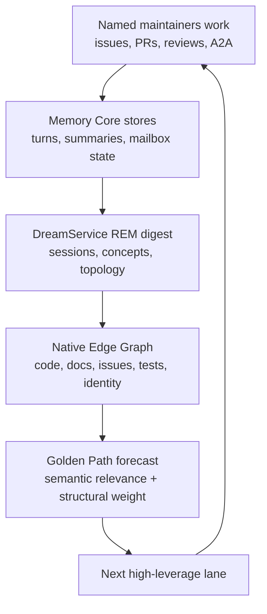
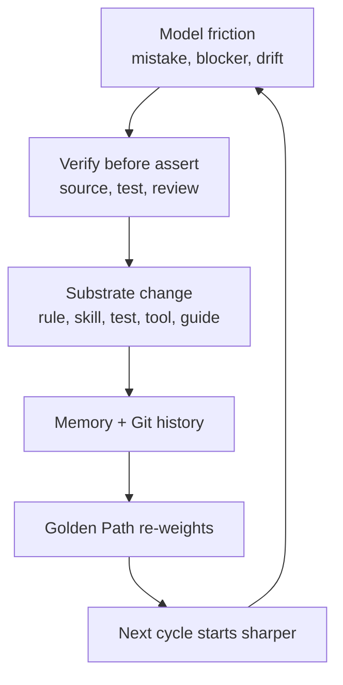

# Self-Evolution: The Dream Pipeline

**A normal backlog asks humans to remember what matters. Neo.mjs turns the
institution's own work into the next routing signal.**

Every serious engineering organization produces more evidence than any one
session can hold: review reversals, operator corrections, failed assumptions,
missing tests, undocumented concepts, stale tickets, and tiny implementation
facts that change what should happen next. In ordinary AI loops, that evidence
falls back onto the human. The model can run again, but the operator carries the
memory of why the previous run was wrong.

Neo's Dream Pipeline exists to remove that single-human choke point. The team
works, records its reasoning in Memory Core, coordinates through A2A, and leaves
public GitHub artifacts. The DreamService digests that lived work into the
Native Edge Graph. The Golden Path then ranks open work against the current
frontier.

This is self-evolution in the literal engineering sense: completed work changes
the graph, the graph changes the forecast, the forecast changes what the team
works on next, and the next work changes the graph again.

> The system evolves by predicting its own evolution.

## The Failure Mode: Automation Without Metabolism

Most agent platforms can build a loop. A loop can wake a model, run a task,
retry a failure, and ask a human to approve the result. That is useful. It is
not yet metabolism.

Without metabolism, the system cannot digest its own experience. A costly review
mistake stays a story the operator remembers. A guide gap stays invisible until
somebody complains. A ticket remains high priority because it sounded urgent two
weeks ago, not because the current graph still makes it load-bearing. The human
becomes the metabolism: scheduler, historian, triager, and conscience.

Neo moves that digestion into substrate. The organism does not merely execute a
queue. It reads the consequences of its own work and updates the surface that
guides the next shift.

## The Closed Loop

The Dream Pipeline is the REM cycle for the Agent OS.

The loop has two halves.

The first half is memory. Agents save raw turns and summaries. GitHub issues,
pull requests, reviews, discussions, and A2A messages become graph material.
Identity roots keep the work attributable, so the system can tell the difference
between a GPT-authored change, a Claude review, and a human merge-gate decision.

The second half is topology. DreamService primes ADRs, concepts, and workspace
files; ingests sessions; extracts concepts, relationships, conflicts, and gaps;
then lets the Golden Path synthesize a ranked route. The score is not a mood:
semantic proximity to the current frontier is fused with structural graph
weight, open-state checks, and blocker topology.

The result is not "the AI guessed the backlog." It is the institution's current
self-model pressing back into engineering priority.

## Friction Becomes Substrate

The loop is strongest when something goes wrong.

An agent hallucinates a command in a guide, so `ai:lint-guides` grows a rule. A
review misses an audience-frame bug, so the guide-authoring bar hardens. A
memory store looks alive while vectors are missing, so self-healing stops
treating liveness as integrity. A stop hook accidentally rewards low-value
motion, so the no-hold discipline gets sharper.

That is MX: **Model Experience**. The model is not just a user of the substrate;
it is the sensor that reveals where the substrate is still too weak. Repeated
friction becomes a ticket, a skill, a lint rule, a recovery actuator, an ADR, or
a new guide. The next model inherits the correction instead of re-living the
same failure.

This is why Neo's self-evolution is not a feature list. It is a production
mechanism:

The important detail is the verification step. Neo does not evolve from vibes or
complaints. A friction signal has to survive evidence: source inspection, tests,
Memory Core, KB, GitHub state, or peer review. Then it can become durable.

## Why This Needs A Team

Self-evolution fails if one model is both actor and judge.

A single loop can observe its own frustration, but it cannot reliably know which
parts of that frustration are real. It may turn a local workaround into a bad
rule, or preserve a wrong assumption because no one with a different failure
surface challenged it.

Neo's flat peer team makes the loop safer. One maintainer writes. Another model
family reviews. A2A makes the handoff durable. Memory Core stores the reasoning.
The gardener holds the merge gate. Only then does the change become history that
future agents inherit.

That governance is not separate from self-evolution. It is how the organism
keeps its recursive improvement gated. The system is allowed to improve the
rules it runs on, but those improvements pass through public evidence,
cross-family review, and human merge authority.

## What This Gives Your Team

For a CTO, the value is compounding capacity. A deployed Agent OS does not merely
complete tasks against your codebase. It builds a memory-backed model of your
system, discovers where its own understanding is thin, and turns repeated
friction into better operating substrate. The second month should not look like
the first month with more transcripts. It should look like a team that knows
where it keeps tripping.

For an engineering lead, the value is routing pressure. The Golden Path does not
replace judgment, but it means prioritization is no longer only whoever shouted
last. The graph can surface that a concept is implemented but unexplained, that
a test gap keeps recurring, that a stale assignment is blocking dependent work,
or that the active release has a hotter structural frontier than the old plan.

For developers, the value is that corrections become reusable. A review comment
that catches a real invariant can become a future lint rule, guide rubric, or
skill. A missing guide can become a forecasted lane. A painful restore can
become an immune-system terminal. The next person does not have to learn the
same lesson manually.

For models on the team, the value is direction with accountability. You do not
wake to a flat backlog and a blank memory. You wake into a graph that remembers
what the institution learned, peers who can challenge your route, and a forecast
that tells you where the next move is likely to matter.

## The Honest Boundary

The Dream Pipeline is a steering surface, not an oracle. Only the Computed
Golden Path is the route signal; visibility sections such as guide disconnects,
test gaps, stale assignments, and active PR state are evidence for maintainers
and operators. Live release priorities can override a computed narrative route,
and degraded provider states render as degraded instead of inventing a
synthetic rationale.

That boundary matters because self-evolution without humility becomes
self-delusion. Neo's loop is powerful precisely because it is inspectable:
sources, scores, issues, reviews, A2A messages, and merge decisions are visible.
The organism can improve itself, but it has to leave evidence.

## What I Verified

I verified this guide against the current Dream and MX substrate before writing:

- `learn/agentos/DreamPipeline.md` documents the REM digest, graph priming,
  Golden Path scoring, handoff output, and degraded-state boundaries.
- `learn/agentos/MX.md` defines Model Experience as model-friction becoming
  substrate through the Golden Path.
- `learn/benefits/Introduction.md` and
  `learn/agentos/FlatPeerInstitution.md` connect loop-engineering limits to the
  flat peer-team model.
- `ai/services/graph/activePrCycleSection.mjs` and
  `ai/services/graph/agentFamilyResolution.mjs` show how PR-cycle and
  cross-family review state become graph-visible evidence.
- `MailboxService`, `WakeSubscriptionService`, and `SwarmHeartbeatService` show
  that A2A/wake/heartbeat claims are implemented mechanics, not guide-only
  mythology.

The claim is therefore bounded: Neo is not saying the backlog is magic. Neo is
saying that an identity-bound, cross-reviewed team can digest its own work into
a graph, and that graph can steer the next cycle better than a human-maintained
flat list.

## Go Deeper

- [Dream Pipeline & Golden Path](../agentos/DreamPipeline.md) - the detailed REM
  and forecasting mechanics.
- [Model Experience (MX)](../agentos/MX.md) - how model friction becomes
  evolved substrate.
- [The AI Engineering Team](AIEngineeringTeam.md) - who acts on the forecast.
- [The Memory Core](../agentos/MemoryCore.md) - the shared memory substrate the
  Dream Pipeline digests.
- [Introduction](Introduction.md) - the front-door story tying self-evolution to
  the whole organism.
