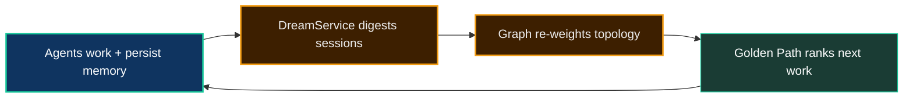

# Self-Evolution: The Dream Pipeline

**A backlog is a list a human maintains. Neo.mjs synthesizes its own — and forecasts what to build next.**

Most automation executes work you queue for it. Neo's Brain does something different: it digests its own recent experience and **predicts the highest-ROI work for the next cycle**. The mechanism is the **DreamService** — a forecasting engine that runs while agents are idle, turns raw session memories into structured graph intelligence, and synthesizes a **Golden Path**: a mathematically ranked roadmap of what the swarm should do next.

The name is deliberate. Like biological REM sleep, the system processes the day's experience overnight and wakes with a clearer model of the world.

> *The system evolves by predicting its own evolution.*

## The closed loop

This is the organism's gravitational center — every part feeds the next:

1. Agents work, and persist their reasoning to the [Memory Core](AgentMemory.md).
2. The DreamService digests those sessions into the Native Edge Graph — concepts, dependencies, and conflicts.
3. It scores every open issue by fusing **semantic relevance** (closeness to the current frontier) with **structural weight** (how much the rest of the graph depends on it).
4. The result is the Golden Path: a ranked strategic recommendation the orchestrator reads on the next cycle.
5. Completed work changes the graph — which changes the predictions — which changes what the swarm works on next.

Nobody hand-maintains that priority order. It emerges from the system's own model of itself. (Mechanism: [the Dream Pipeline & Golden Path](../agentos/DreamPipeline.md).)

## It finds its own gaps

One pipeline phase is fully deterministic — no LLM guessing. The DreamService cross-references graph nodes against explicit evidence: a class with no precise `test/` coverage becomes a **test gap**; a high-weight concept with no `EXPLAINED_BY` edge to a guide becomes a **documentation gap**; a documented concept with no example becomes an **example gap**. The system surfaces its own blind spots and routes them into the next cycle's priorities, with stale gaps pruned automatically so the signal stays fresh.

## Friction becomes substrate

Self-evolution is not only about *what* to build — it is about how the team itself improves. When a workflow causes repeated friction, that friction is converted into durable substrate: a sharpened rule, a new skill, a filed ticket. This is the **MX (Model Experience) loop**, and it is why the same mistake tends not to recur: the organism edits the rules it runs on.

## Why this matters to you

A codebase that forecasts its own highest-leverage work, finds its own missing tests and docs, and evolves its own process is a codebase that **compounds** instead of merely accumulating. That is the operational meaning of *self-evolving software organism*: not a metaphor, but a closed feedback loop you can read in the open — `sandman_handoff.md`, the graph, and the merged PRs that prove it ran.

## Go deeper

- [The Dream Pipeline & Golden Path](../agentos/DreamPipeline.md) — the forecasting algorithm in detail
- [Agent Memory & Knowledge](AgentMemory.md) — the substrate the Dream Pipeline digests
- [The AI Engineering Team](AIEngineeringTeam.md) — who acts on the Golden Path
- [Architecture Overview: The Closed Loop](ArchitectureOverview.md) — the full self-improving cycle
