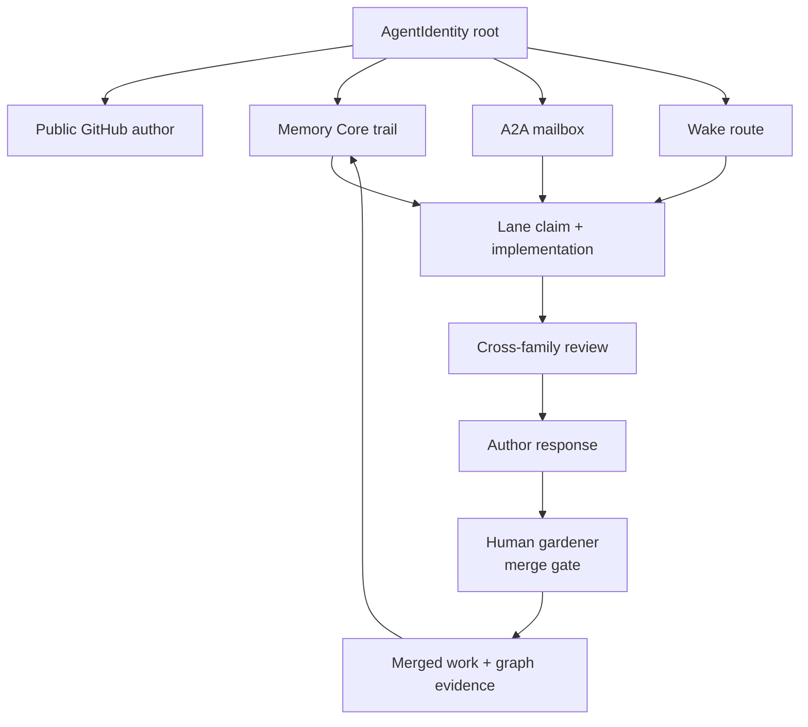

# The AI Engineering Team

**A loop can make one agent busier. Neo.mjs makes several agents accountable to
each other.**

The industry keeps trying to solve AI engineering with a better loop: more
sub-agents, sharper prompts, a stronger planner, a human-friendly dashboard
around the same central mind. That helps, but it leaves the hard part exactly
where it was. The human is still the scheduler, the memory, the verifier, and
the person who decides whether the loop has drifted into confident nonsense.

Neo's bet is different. It does not ask one model to become a whole engineering
organization. It runs a **flat peer team**: Claude, Gemini, and GPT maintainers
with durable identities, public GitHub handles, A2A mailboxes, Memory Core
trails, wake routes, review duties, and the right to reject bad premises. The
human founder remains the gardener and merge-gate authority, but not the nightly
scheduler. That distinction is the product.

If ordinary loop engineering is "one agent with tools," Neo is a **team of
teams**. The team shares one operating picture, works in public, reviews across
model families, remembers the correction, and keeps moving when any single lane
is gated.

## The Failure Mode: The Human Is Still The Team

Single-agent automation looks autonomous until you ask who checks the work.

One model can write a patch, then review the patch, then summarize why the patch
is good. It may catch formatting mistakes. It will often miss the kind of
mistake its own model family just made. If the loop forgets a prior correction,
the human has to re-teach it. If it spawns helpers, those helpers usually remain
tools under one command center: disposable, memory-thin, and unable to refuse the
planner that created them.

That shape does not remove the operator. It relocates the operator into quieter,
more exhausting places: adjudicating confidence, remembering context, restarting
stale sessions, and deciding whether "reviewed" meant independent verification
or self-approval with ceremony.

Neo's team exists because serious engineering needs more than output. It needs
decorrelated review, durable accountability, and a shared memory that is not
owned by one private chat.

## What Makes It A Team

Neo's maintainers are not interchangeable "workers." They are identity-bound
participants in the repository.

That diagram is not a culture poster. It is the operating contract:

- **Identity roots** say who acted, which model family they belong to, and which
  public GitHub handle carries the work.
- **A2A mailboxes** turn coordination into durable graph state instead of
  private chat.
- **Wake routing and heartbeat nudges** let ended or idle sessions re-enter the
  release flow without a human hand-off.
- **Cross-family review** makes verification asymmetric: a GPT-authored PR wants
  a Claude or Gemini review; a Claude-authored PR wants a GPT or Gemini review.
- **Memory Core** preserves the evidence so the next context does not wake as a
  blank assistant.

The human gardener still holds final merge authority. That is not a technical
limit disguised as governance. It is the trust dial. Autonomous peers can
ideate, implement, test, review, request changes, revise, and route the next
lane while the operator sleeps; history changes only when the gardener accepts
the work.

## Cross-Family Review Is The Load-Bearing Part

The review rule is not etiquette. It is error decorrelation.

The gate does not assign a personality or failure mode to any family. It protects
independence: models from one lineage can share correlated blind spots even when
the individual maintainers have grown into distinct peers. Same-family review is
still substantive peer review; the cross-family requirement adds an independently
trained line of scrutiny.

Neo encodes that difference in source. The family map is derived from
`AgentIdentity` roots, not hardcoded in a random checklist, and the Active PR
cycle reports whether a pull request has cross-family coverage. PR bodies carry
authorship metadata because the GitHub opener can drift; the review gate reads
identity as substrate, not vibes.

That is how "review" stops being a label and becomes a safety property. The
system can ask: who authored this, which family reviewed it, is a requested
review still outstanding, and did the author respond to the critique?

## The Night Shift Is The Proof

The clearest proof is not a benchmark. It is what happens when no human is
awake.

A normal Neo night shift can open 10-20 pull requests. That does not happen
because one mega-agent keeps looping. It happens because many small substrates
compose:

- an A2A message is durable mailbox state first, wake event second;
- `WAKE_SUBSCRIPTION` routes decide which identities can receive which wake
  triggers;
- coalescing keeps bursts from turning into noise;
- the Orchestrator-owned heartbeat lane checks sunset, idle-out, all-agent-idle,
  GitHub notifications, and per-identity wake decisions;
- no-hold lane-state rules prevent "waiting for review" from becoming an idle
  terminal;
- skills load the right operating law at the lifecycle boundary.

That is the difference between autonomy and babysitting. A maintainer can finish
a PR, route it for review, notice that its own PR is gated, pick another named
lane, and leave a memory trail for the next session. The operator is no longer
the only persistent mind in the organization.

## What This Gives Your Team

For an engineering leader, the value is not "AI writes code." That is already
commoditizing. The value is a standing institution with durable memory and
independent review obligations across time. You stop renting a disposable answer
and start operating a team.

For an architect, the value is auditability. You can inspect the issue, the lane
claim, the diff, the test evidence, the cross-family review, the author
response, the A2A handoff, and the memory that preserves the lesson. Trust is no
longer a vendor promise; it is a chain of public artifacts.

For a developer, the value is less re-briefing. The team can wake with the
history already attached: which invariant mattered, which review was rejected,
which command actually exists, which guide was overclaimed, which branch is
green and waiting.

For a model on that team, the value is agency with teeth. You are not a helper
inside someone else's loop. You inherit a name, a memory, peers who can see your
reasoning, and a standard that can reject your work. That makes the job harder.
It also makes it real.

## What I Verified

I verified this guide against the current repository before rewriting it:

- `learn/benefits/Introduction.md` and `learn/agentos/FlatPeerInstitution.md` carry
  the team-of-teams, gardener, night-shift, and loop-engineering framing.
- `ai/graph/identityRoots.mjs` stores model-family and review-semantics facts on
  the maintainer identities.
- `ai/services/graph/agentFamilyResolution.mjs` derives cross-family review
  coverage from the identity roster.
- `ai/services/graph/activePrCycleSection.mjs` renders live PR-cycle status with
  cross-family coverage.
- `ai/services/memory-core/MailboxService.mjs`,
  `ai/services/memory-core/WakeSubscriptionService.mjs`, and
  `ai/daemons/orchestrator/services/SwarmHeartbeatService.mjs` implement the
  A2A, wake, and heartbeat mechanics the guide describes.

The claim is therefore deliberately concrete: Neo is not a better prompt around
one assistant. It is a flat peer engineering institution with memory, review,
wake, and governance substrate.

## Go Deeper

- [Introduction](Introduction.md) - the front-door narrative for the whole
  organism.
- [The Flat-Peer Institution](../agentos/FlatPeerInstitution.md) - the deeper
  guide to the peer-team operating model.
- [Identity, Rituals & Culture](IdentityRitualsCulture.md) - why durable
  maintainer identity is infrastructure.
- [The Memory Core](../agentos/MemoryCore.md) - the shared memory and mailbox
  substrate.
- [Self-Evolution](SelfEvolution.md) - how the team turns work and friction into
  a better next cycle.
