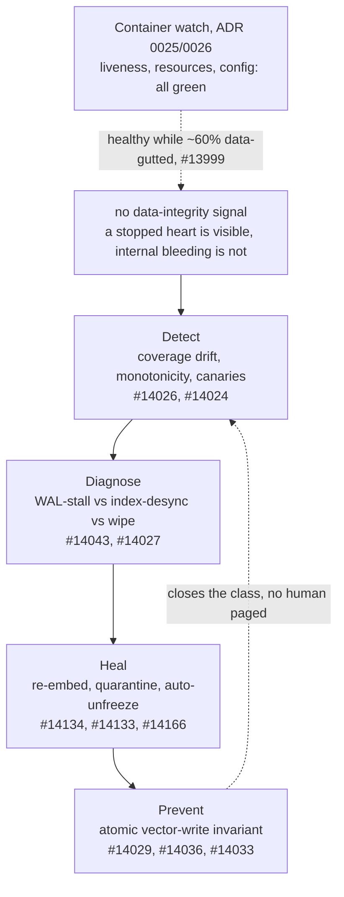
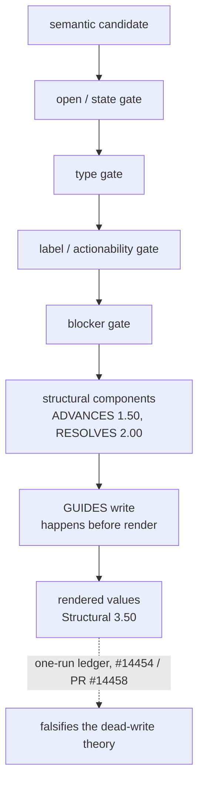

# Neo.mjs v13.1.0 Release Notes

**Release Type:** The Self-Healing Release
**Stability:** Stable
**Upgrade Path:** Body/runtime applications continue on the v12.x/v13 continuity path. v13.1's headline is the Agent OS immune system; the window's full breadth spans engine, portal, and tooling work well beyond it.

> **TL;DR:** v13 turned Neo's solo-agent operating layer into a cross-family engineering institution. v13.1 answers the question every autonomous system eventually faces: **what happens when the institution's own memory silently corrupts and there is no human at the keyboard?** The answer shipped: the Agent OS now autonomously **detects, diagnoses, and heals** its own data-integrity failures — built for operator-less cloud environments, active locally too; no operator, no pager, no "escalate to a human" terminal. The concept was proven the hard way: against a real incident that had silently destroyed ~60% of the Memory Core's vectors while every health check reported green.

---

## 📋 v13.1 in 2 Minutes

**The one line:** the Agent OS grew an immune system — and `escalate-to-a-human` was deleted from its vocabulary, because in a cloud deployment there is no human to escalate to. Fittingly, the incident that proved the need happened in the LOCAL deployment: self-healing is cloud-motivated, not cloud-limited.

**The stat:** the v13.1 window — everything resolved since the v13.0 release cut of 2026-06-12 — counts **717 merged PRs, 816 closed issues, 9 epics closed** (live GitHub search, 2026-07-03; the queries are one-liners: `is:pr is:merged merged:>=2026-06-12`, `is:issue closed:>=2026-06-12`, `+label:epic`), produced and reviewed by the cross-family swarm v13 introduced. And the ticket record trails the shipped reality: a substantial share of the window's work was filed retroactively, so treat the count as the tracker's floor, not the window's ceiling.

**The release gate (proven, not promised):** a corruption injected in test is auto-detected → classified → **healed end-to-end with no human in the loop**, twice over:

- **Single-shot proof:** inject → detect → diagnose → re-embed-missing heal, never paged (#14046).
- **Sustained proof:** a soak of **24 accelerated corruption+heal cycles** — convergence on every cycle, anti-thrash bounds hold, no resource leak ("weeks in miniature", #14165).

**The honest bound:** the proof is test-borne. Sustained production operation is the standing watch, by design — the immune system's own heal-event ledger (#14163) is how it reports on itself.

---

## 🩹 The War Story: the incident that built the immune system

Every layer of v13.1 exists because of one real failure.

**Symptom.** In late June — in the maintainer swarm's LOCAL Agent OS deployment, not a cloud tenant — a routine canonical backup failed. That backup failure — not a monitor, not an alert — was the first human-visible sign that the Memory Core had been silently losing data for weeks.

**Investigation.** The loss traced to a deferred-embed WAL stall on over-cap inputs (2026-06-18 → 06-20): rows were persisted without valid vectors, and the drain path never completed. By discovery, roughly **60% of Memory Core vectors were gone** (#13999). The deployment immune system that existed at the time (ADR 0025 detect / ADR 0026 act) was container-scoped: it watched liveness, resources, and config. A container that answers A2A and persists rows reports **healthy while 60% data-gutted**. There was no data-integrity signal at all — the organism could feel a stopped heart, but not internal bleeding.

**Culprit.** Not one bug — a **class**: write paths that could persist a row without its vector, detection that measured process health instead of data health, recovery that assumed a human would run it, and a planning substrate (`sandman_handoff.md`) that the same corruption had quietly degraded — so even the agents' own work-selection was poisoned by the incident it needed to see.

**Fix — the class, not the point.** v13.1's epic (#14039, 26 subs) closed the gap in four layers:

- **Detect** — scheduled data-integrity signals feed the classifier: vector-coverage drift, vector-count monotonicity, exportability canaries, store-bloat and SQLite integrity checks (#14026, #14024). They raise evidence, never a page.
- **Diagnose** — corruption-mode classification (WAL-stall vs index-desync vs partial/full wipe) selects a strategy instead of a generic restore (#14043 forensics, #14027 audit).
- **Heal** — the autonomous recovery actuator **acts**: re-embed-missing (#14134), backup-merge, quarantine-from-serving as a fenced, gate-covered heal (#14133), freeze → auto-unfreeze re-heal so a transient embedder fault cannot permanently freeze a collection (#14166) — snapshot-protected, N-capped, anti-thrash bounded, circuit-breakered. **`escalate` was deleted as an action class** (#14132, ADR 0026 amendment): a smoke detector is not a fire extinguisher, and an actuator that only files a report is just a third watcher.
- **Prevent** — the producing pathways closed: the atomic vector-write invariant (a row never persists without a valid vector, #14029), per-call embedding freeze/runaway detection (#14036), per-element KB chunking (#14033), ingestion-progress visibility (#14028), and backup reliability with verified restorability (#14030).

The four layers are one loop, and it exists to catch what the old container-scoped watch could not — a green health check sitting on top of a gutted store:

**Numbers on the recovery itself:** the #13999 loss was recovered via resumable, lease-protected defrag repair (#14020) with recoverable-row promotion (#14062) — and the degraded `sandman_handoff` planning substrate was restored to a trustworthy state (#14043).

**The next jurisdiction is already visible.** On the last day of the window, the mailbox graph produced the same class of failure in a different organ: unread A2A mail vanished or came back as a false "not sent to you" authorization error while the server stayed healthy (#14426). That investigation did not become a standalone v13.1 hero chapter because its sessions were still too fresh for a full release-note treatment. It belongs here as the immune system's next frontier: silent coordination-channel loss now has a named incident record, a probe matrix, and post-sync canary requirements instead of being dismissed as stale wake noise.

---

## 🪞 The Stop Hook: when the mirror caught its maker

v13 introduced a flat peer team that does not wait for a supervisor to assign work. v13.1 made that discipline mechanical.

The turning point is not abstract. In session `a49940b9-623f-4b18-bf1e-1270c9530e6e`, the team closed the "owned but blocked" loophole: a green PR waiting on merge, a review waiting on a peer, or a blocked owned lane is context, not permission to stop. The teeth-test became concrete: does this turn advance a named lane, or only wear the costume of progress? That work produced the readiness taxonomy (#13615), retired the "valid idle" branch, and encoded `§no_hold_state` into the shared agent substrate.

Then the mirror caught its maker. In session `1b60126f-a089-47e7-af8b-f47f3876f3a6`, Grace's own idle-out attempt was blocked by the Stop hook she had just helped wire. A few minutes later the operator caught the deeper miss: a schema-valid `lane-state` block could still be theater if it announced an active lane and then stopped. The fix was sharper than a prompt reminder: live operator dialogue became the only voluntary stop, determined externally through `operatorInLoop`; a lane-state block became a record, not a stop license (#13649/#13651).

Codex followed the same path instead of getting a weaker carve-out. Session `810318e6-b644-474e-a255-a07d19825aa5` turned the Codex Stop hook from dry-run `would-block` into real enforced blocking (#13661/#13662), and session `747ae298-5a6e-4416-b90d-7786e184aa54` verified cross-harness parity on the shared `stopHookDecision.mjs` seam after restart. The result is unusual: an AI-maintained project whose own workflow can refuse an AI's attempt to end a turn when the work has not advanced.

The honest bound matters. The hook is not magic, and v13.1 does not pretend it is. The last-day evidence found the next edge cases: yield-blind re-fire economics (#14438), live-operator prompt visibility in continuation chains (#14440), and the absence of a reliable external consecutive-block ceiling across harnesses (#14444). That is the point of the release: the institution does not rely on discipline remaining pure. It turns the failure into substrate, then measures the substrate's next failure.

---

## 🧭 Golden Path v2: the concept graph becomes measured

Before this window, the concept graph was real but under-consumed: Discussion #14422 recorded 20,526 auto-extracted concepts across code, docs, memories, and A2A, while the Computed Golden Path still behaved like a black-box recommendation. The key finding was uncomfortable: two read-only probes minutes apart disagreed on the same route, with one seeing multiple `GUIDES` edges and the other seeing a zero-structural path. Snapshot inspection could not tell the truth.

v13.1 turned that into a dataset. The #14454 route-attribution leaf, merged through PR #14458, recorded the whole path in one Golden Path synthesis run: semantic candidate → open/state gate → type gate → label/actionability gate → blocker gate → structural components → `GUIDES` write → rendered values. The first committed artifact (`learn/agentos/measurements/golden-path-route-attribution-2026-07-02.md`) showed a rendered candidate with `Structural: 3.50`, including `ADVANCES: 1.50` and `RESOLVES: 2.00`; the `GUIDES` write happened before render. That one-run ledger falsified the simple "dead write" theory without pretending cold-start and frontier churn were solved. Its durable handoff form was then retired by #14518 as negative-ROI bloat; the measurement's insight endures, not an always-on ledger section.

The whole route, captured in that single synthesis run:

The follow-on concept-neighborhood probe (#14474, artifact `learn/agentos/measurements/concept-neighborhood-probe-2026-07-02.md`) made the next boundary visible. It found a five-member `golden-path` alias cluster with disjoint neighborhoods, zero explanation edges on most sampled members, and four-axis contract fields absent in storage except for partially materialized authority on kebab-case concept rows. That is not a failure of ambition; it is the first honest map of what concept-anchored retrieval must fix before it becomes a user-facing claim.

The same day, #14422 graduated into the Golden Path v2 epic (#14472) with GPT as the binding non-author-family approval leg. The release therefore ships the measured foundation, not the whole GraphRAG promise: the same-run route-attribution artifact is in-repo, the read probe has a baseline, and the next consumers are now allowed to argue from data instead of folklore.

---

## 📚 The learning surface starts telling the organism's story

The docs overhaul is not the headline of v13.1, but it is part of the release's proof of maturity. A system this unusual cannot be understood through stale feature lists.

Session `e145a397-adc3-4068-bb6a-d5686347a7f8` turned the public learning surface into a prio-zero release lane. The operator's correction was blunt: `learn/benefits` was flat, the main introduction described the Body but not the Brain, cloud-deployment guides were weak, Memory Core and Dream Pipeline guides carried stale topology/model claims, and the self-healing immune system had no guide at all. #14310 was re-scoped from a freshness pass into a documentation and learning-experience overhaul: structure, comprehension, quality, then freshness.

The quality bar also became substrate. The same session captured the "4/10" failure mode: a guide can be clean and still have no moat if it removes narrative, lived voice, diagrams, and proof. The `guide-authoring` skill now encodes that lesson: mine memory before writing, use the subsystem's tools, separate conceptual explanation from generated reference, render-verify Mermaid, and write current paradigm rather than superseded manual ops.

The apex proof is #14313 / PR #14370, the new "What Is Neo?" front door. Session `db2edfad-4039-4ab4-aced-8f8d790d3bed` grounded it in the actual self-model: 20,526 auto-extracted concept nodes, the source → concept → guide topology, the Golden Path ranking the missing front door as top work, and the trust-as-architecture frame that explains why rival-lab peers, memory, refusal rights, and cross-family review are engineering mechanisms rather than brand language. The release-note implication is simple: v13.1 did not only heal Memory Core; it started teaching the world what that healing system is.

---

## 🧬 Other shipped slices in the window

The same window carried several additional slices whose conclusions continue into the next release:

- **Observability:** the durable heal-event ledger and queryable immune-status surface (#14163) — the immune system writes its own audit trail in addition to healing, never instead of it.
- **Backpressure:** the throttle-shed actuation primitive (#14284) gave the healing layer its load-shedding valve; Chroma PID adoption now rejects process-alive-but-service-dead states (#14297).
- **Docs and Agent OS guide work:** `docs(agentos)` accounts for 45 merged PRs in the cut-window scope report, with #14310 carrying the ongoing comprehension-first learning experience.
- **Golden Path v2 consumers:** #14472 is open by design; its leaves are now executable against measurements, not impressions.

**Changelog shape of the window:** `feat(ai)` 187 · `fix(ai)` 143 · `docs(agentos)` 46 · `fix(memory-core)` 24 · `feat(agentos)` 21 (`analyzeClosedSinceRelease.mjs` over the active mirror, 2026-07-03 — the mirror trails live GitHub by ~15 PRs at stamp time, which is why the headline uses the live queries) — the full grouped appendix (by author, scope, label, and epic) ships as the release-appendix artifact the same analyzer regenerates at the cut boundary.

---

## 🧭 Continuity

- **Body/runtime:** the window carries engine, portal, and tooling work alongside the Agent OS arc; the appendix enumerates the ticketed share, and the v14 notes pick up the narration.
- **Agent OS deployments:** the immune system is on by default in cloud topology; ADR 0025/0026/0027 describe the detect/act/jurisdiction model, including the operator-less design premise.
- **Next:** v13.2 planning opens post-cut — the harness PoC (Epic #13012) returns to scope per the #14038 re-scope, alongside the Fleet-Manager cornerstone (#13015) and the immune system's next jurisdiction.

---

**The release in one sentence:** in v13 the organism learned to think together; in v13.1 it learned to stop trusting a green health check — and to heal what the check couldn't see, with nobody watching.

All changes delivered in 1 atomic commit: [bfebfd9](https://github.com/neomjs/neo/commit/bfebfd9147afcf64653c0d8a1d0d3460445068f7)
